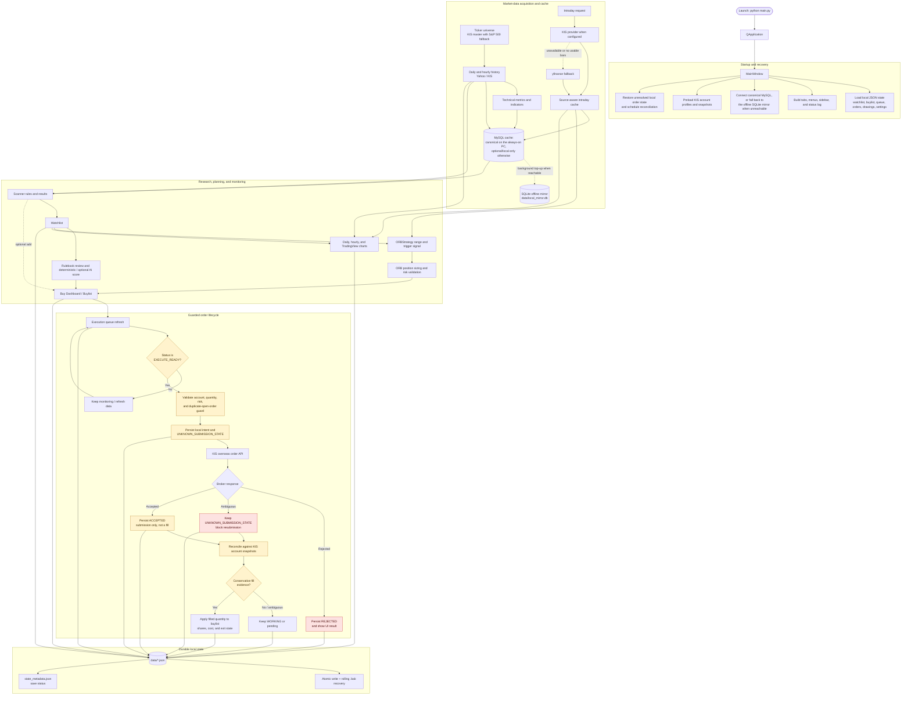
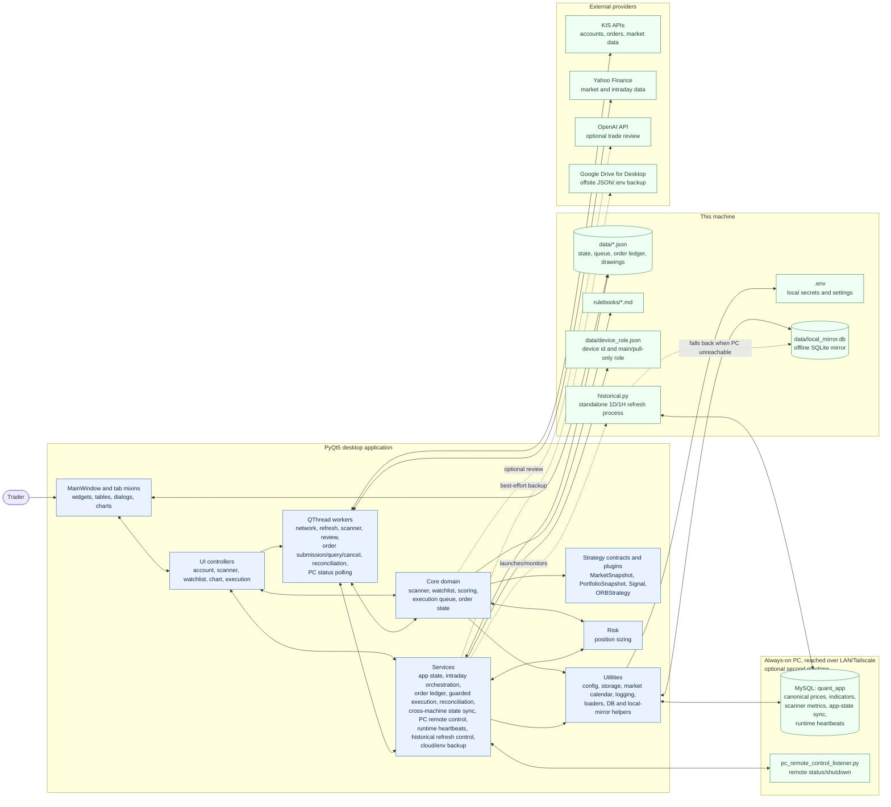

# Quant App Architecture

This document describes the current architecture of the PyQt5 trading dashboard as implemented by `main.py` and `src/`. It is the maintenance map for the live codebase.

## Product Scope

Quant App is a desktop trading dashboard for US-market swing trading, scanner review, watchlist analysis, ORB planning, KIS account visibility, and guarded KIS order submission.

The application is not a headless service. `main.py` creates a `QApplication`, installs a small Qt warning filter, imports `src.ui.main_window.MainWindow`, and starts the PyQt event loop.

## Runtime Entry Flow

```text
main.py
  -> QApplication
  -> src.ui.main_window.MainWindow
      -> load local JSON state
      -> load local device role (data/device_role.json) and connect MySQL,
         falling back to the offline SQLite mirror (data/local_mirror.db)
         when MySQL is unreachable
      -> initialize UI workflow controllers
      -> build tabs, sidebar, status log, and menus
      -> preload KIS profiles and account data
      -> run scanner/watchlist/chart workers through QThread
      -> reconcile any open broker orders from the local order ledger
      -> start cross-machine state sync and background PC-to-laptop
         mirror top-up when MySQL is reachable
```

Long-running work runs in `QThread` workers so the PyQt UI remains responsive.

## Overall Workflow

The diagram below is the high-level operational map. It distinguishes market-data
and review work from the guarded broker-order lifecycle: an `ACCEPTED` broker
response is deliberately **not** a fill. Only reconciliation can update a
buylist position as filled.



Reading guide:

- Solid arrows are the normal flow; dashed arrows are explicit fallbacks (KIS-to-yfinance intraday, and MySQL-to-local-mirror data).
- MySQL improves freshness and speed and is optional for a single-machine setup: Yahoo/KIS sources and local state keep the desktop application usable without it. In the two-machine setup (see [Two-Machine Data Pipeline](#two-machine-data-pipeline-pc-sync) below) it is the one canonical database, and the local SQLite mirror is a disposable safety copy, not a peer.
- The persistence area is shared by user edits, the execution queue, chart drawings, and every meaningful order-status transition.

## System Architecture

This companion diagram shows the code-level boundaries behind the workflow. UI
controllers coordinate work; core modules contain trading rules; services own
cross-cutting lifecycle behavior; and adapters isolate external systems.



Peer-machine roles, the SQLite fallback/backup mechanics, and the always-on-PC automation scripts are described in full in [docs/pc_sync_data_pipeline.md](docs/pc_sync_data_pipeline.md); this diagram only shows how they attach to the desktop app's own layers. A single machine works the same way with the `PC` subgraph absent and MySQL either unset (Yahoo/KIS-only) or pointed at a local instance.

## Directory Layout

```text
quant_app/
  main.py                         Application entry point
  historical.py                   Standalone 1D/1H historical-data refresh process (not Qt)
  src/
    ui/                           PyQt windows, UI controllers, workers, chart bridge, UI constants
    core/                         Trading domain models and pure business logic
    strategy/                     Strategy-neutral snapshots/signals and built-in strategy plugins
    infrastructure/              Database engines, schemas, refresh orchestration, mirrors, and repositories
    risk/                         Pre-trade risk/sizing checks (position sizing today)
    services/                     App-state persistence, order lifecycle, PC sync, and backup services
    utils/                        Storage, configuration, market-data, market-calendar, logging, and DB/local-mirror helpers
    api/                          KIS API adapters and order/account helpers
  scripts/                        PC automation, setup, and one-off maintenance scripts (see docs/pc_sync_data_pipeline.md)
  data/                           Local JSON state, ticker universe files, SQLite mirror, and refresh status/logs
  docs/                           Architecture-adjacent design docs (PC sync, cloud backup, historical refactor plan)
  rulebooks/                      Markdown trading rules used by review workflows
  tests/                          Pytest regression suite
  config/                         Non-secret configuration template
  md_archive/                     Historical implementation notes and completed plans
```

Generated files such as `__pycache__/` and `.pytest_cache/` are not part of the architecture and should remain ignored.

## UI Layer

`src/ui/main_window.py` owns the `MainWindow` shell: application state, startup ordering, tab registration, menus, status/progress helpers, persistence entry points, and shared parsing/formatting helpers. Domain-heavy UI behavior is split into plain Python mixins inherited by `MainWindow`; the mixins do not inherit Qt classes and do not import `MainWindow`.

Workflow orchestration that can be tested outside the full PyQt window lives in focused UI packages and `src/ui/controllers/`. Mixins keep widget construction, event parsing, table refreshes, logging, and state-save side effects close to the UI while delegating account, scanner, watchlist, chart-data, and buylist execution workflows to controllers.

Current inheritance shape:

```text
MainWindow(
  SidebarMixin,
  DashboardMixin,
  ScannerMixin,
  WatchlistMixin,
  BuylistMixin,
  ChartsControllerMixin,
  ChartsRenderMixin,
  QMainWindow,
)
```

Supporting UI modules:

| Module | Responsibility |
|---|---|
| `src/ui/main_window.py` | Main shell, startup ordering, local state loading/saving, tab registration, menus, status log, shared helpers |
| `src/ui/dialogs.py` | Settings dialog and scanner filter dialog |
| `src/ui/controllers/` | Workflow controllers for account sync, scanner runs, watchlist ORB refreshes, chart data loading, and buylist execution queue actions |
| `src/ui/buylist/` | Static buy-dashboard view, action, monitoring, and order mixins plus thin policy and execution-queue adapters |
| `src/ui/charts/` | Static chart controller/render composites, focused controller and renderer modules, deterministic render-option/interaction models, and chart-data service |
| `src/ui/mixins/sidebar_mixin.py` | Left sidebar source switching, selected-symbol routing, and sidebar actions |
| `src/ui/mixins/dashboard_mixin.py` | Dashboard tab, KIS account snapshot UI, profile selection widgets, FX/account-size display, summary widgets |
| `src/ui/mixins/scanner_mixin.py` | Scanner tab, scanner setup/rule UI, worker signal wiring, scanner result table actions |
| `src/ui/mixins/watchlist_mixin.py` | Watchlist tab, breakout-price persistence, ORB planning UI, AI review UI, move-to-buylist flow |
| `src/ui/mixins/buylist_mixin.py` | Compatibility import for `src/ui/buylist/`; existing imports and monkeypatch-based tests continue to work |
| `src/ui/mixins/charts_render_mixin.py` | Compatibility import for `src/ui/charts/renderer.py` |
| `src/ui/mixins/charts_controller_mixin.py` | Compatibility import for `src/ui/charts/controller.py` |
| `src/ui/workers.py` | `QThread` workers for KIS snapshots, intraday fetches, scanner runs, review jobs, and PC status polling |
| `src/ui/order_workers.py` | `QThread` workers for KIS order submission, query, cancel, and reconciliation |
| `src/ui/chart_bridge.py` | `QWebChannel` bridge used by chart JavaScript to persist drawings and breakout-price markers |
| `src/ui/filter_catalog.py` | Default scanner setups, scanner metric labels, tab defaults, and settings defaults |

### UI Workflow Controllers

Controllers are ordinary Python objects that receive the `MainWindow` only as a dependency boundary. They keep workflow code out of tab rendering methods while preserving the existing UI side effects in the mixins. `src/ui/controllers/base.py` provides `WindowController`, a thin base that forwards otherwise-unhandled attribute access back to the owning `MainWindow`, plus a `get_controller()` helper that lazily constructs and caches a controller instance on the window.

| Controller | Responsibility |
|---|---|
| `AccountController` | KIS account snapshot/profile sync, FX/account-size application, and account refresh commands |
| `ScannerController` | Scanner setup persistence, scanner worker orchestration, and result action coordination |
| `WatchlistController` | Watchlist ORB status refreshes and watchlist-to-buylist workflow helpers |
| `ChartDataController` | `src/ui/charts/data_service.py`; chart data loading and refresh coordination for daily, hourly, TradingView, and intraday views |
| `BuylistController` | `src/ui/buylist/controller.py`; thin UI adapter that exposes the framework-neutral exit rules owned by `src/core/exit_policy.py` |
| `BuylistExecutionController` | `src/ui/buylist/execution_controller.py`; execution queue refresh and guarded order-command coordination. `ExecutionQueueRefreshRequest` carries parsed UI inputs and callbacks, and `ExecutionQueueRefreshResult` returns missing symbols, failures, refreshed count, and status counts |

Current tab construction in `_setup_tabs()`:

| Tab key | Label | Builder |
|---|---|---|
| `dashboard` | Dashboard | `_build_dashboard_tab()` |
| `scanner` | Scanner | `_build_scanner_tab()` |
| `watchlist` | Watchlist | `_build_watchlist_tab()` |
| `buylist` | Buy Dashboard | `_build_buylist_tab()` |
| `charts` | Charts | `_build_charts_tab()` |
| `tradingview` | TradingView Chart | `_build_tradingview_tab()` |
| `intraday_charts` | Intraday Charts | `_build_intraday_charts_tab()` |

`data/tab_options.json` persists tab visibility. The legacy `_build_trade_plan_tab()` method still exists for compatibility and tests, but it is not currently added by `_setup_tabs()`.

## Worker Layer

Most workers live in `src/ui/workers.py`; KIS order submission/query/cancel and reconciliation workers live in `src/ui/order_workers.py`. Daily/hourly history refresh is no longer an in-process worker -- see [Historical Data Refresh](#historical-data-refresh).

| Worker | Module | Purpose |
|---|---|---|
| `KisAccountWorker` | `workers.py` | Fetch one KIS account snapshot |
| `KisStartupAccountsWorker` | `workers.py` | Preload configured KIS production account profiles |
| `FxRateWorker` | `workers.py` | Resolve USD/KRW from KIS snapshot data or fallback sources |
| `IntradayFetchWorker` | `workers.py` | Fetch one symbol's intraday bars |
| `IntradayBulkFetchWorker` | `workers.py` | Fetch intraday bars for multiple symbols |
| `ScannerWorker` | `workers.py` | Run scanner rules over loaded metrics |
| `WatchlistAiWorker` | `workers.py` | Review watchlist items in batch |
| `SingleStockAiWorker` | `workers.py` | Review one stock/setup |
| `PcRemoteStatusWorker` | `workers.py` | Check database, remote-control listener, and remote `main.py` health independently |
| `KisOrderWorker` | `order_workers.py` | Submit KIS overseas orders and emit broker acceptance/rejection state |
| `OrderReconciliationWorker` | `order_workers.py` | Fetch position snapshots through an injected `Broker` and reconcile open orders against holdings deltas |
| `KisOrderQueryWorker` | `order_workers.py` | Query and reconcile unresolved orders through an injectable `Broker` |
| `KisOrderCancelWorker` | `order_workers.py` | Cancel a locally tracked order through an injectable `Broker` and reconcile the result |

## Service Layer

| Module | Responsibility |
|---|---|
| `src/services/app_state.py` | `StateSaveManager`, save-result tracking, metadata writes, and compatibility helpers for watchlist, buylist, trade plans, scanner setups, drawings, and tab options |
| `src/services/intraday_provider.py` | Provider-neutral request/result contracts and OHLCV normalization/resampling helpers |
| `src/services/intraday_data_service.py` | KIS-first intraday orchestration, yfinance fallback, and best-source cache loading |
| `src/services/kis_intraday_provider.py` | KIS intraday provider wrapper using production account config |
| `src/services/yfinance_intraday_provider.py` | yfinance intraday fallback provider preserving existing retry behavior |
| `src/services/order_ledger.py` | Persistent local order ledger stored at `data/orders.json` |
| `src/services/trading_state.py` | In-memory `TRADING_ENABLED` kill switch -- disabled by default on every launch, no persistence; blank, falsy, or malformed configured values lock it off, while a truthy value only permits the per-session UI toggle |
| `src/services/broker.py` | `Broker` protocol (`submit_order`/`cancel_order`/`get_order`/`get_positions`/ambiguous-error classification), normalized `BrokerSubmissionResult`, and `KisBroker`; all KIS response-field parsing stays at this adapter boundary |
| `src/services/order_execution_service.py` | Broker-neutral guarded order submission with durable idempotency before and after API calls; gated by `trading_state`, an entry-only `PreTradeRiskDecision`, and an injectable `Broker` (defaults to `KisBroker`) |
| `src/services/order_reconciliation.py` | Conservative account-snapshot reconciliation plus injectable broker order query/cancel for accepted/working orders |
| `src/services/historical_refresh_control.py` | Launches, polls, and terminates the standalone `historical.py` subprocess; owns its status-file schema and PID liveness checks |
| `src/services/state_sync.py` | Conflict-safe cross-machine sync of user-managed state (watchlist/buylist/trade plans) through a revision-tracked MySQL table; only the `main` device pushes, others pull-only |
| `src/services/runtime_status.py` | Database-backed runtime heartbeats so any device can see whether `main.py` is currently running elsewhere |
| `src/services/pc_remote_control.py` | Tailscale-reached client for the always-on PC's remote-control listener: status ping and shared-secret-authenticated shutdown request |
| `src/services/cloud_backup.py` | Best-effort offsite backup of gitignored `data/*.json` state files to a local Google Drive for Desktop folder (current + rolling daily snapshots) |
| `src/services/env_backup.py` | Passphrase-encrypted (PBKDF2 + Fernet) offsite backup/restore of `.env` secrets, kept separate from the automatic JSON backup cycle |

The service layer contains persistence and lifecycle logic that is not specific to one widget.

## Core Domain Modules

| Module | Responsibility |
|---|---|
| `src/core/scanner.py` | `StockScanner`, `ScanRule`, and comparison operators for rule-based filtering |
| `src/core/watchlist.py` | `Watchlist`, `TradePlanManager`, `BuylistManager`, and persistence-ready dataclasses |
| `src/core/orb.py` | Static compatibility surface for strategy-owned ORB range/entry helpers, plus legacy display signals and intraday resampling |
| `src/core/execution_queue.py` | Dynamic execution workflow for the built-in ORB plugin: queue item/candidate state, risk planning, environment-symbol keys, duplicate-pending rejection, and display-state helpers |
| `src/core/trade_reviewer.py` | Rulebook-backed trade setup review model |
| `src/core/scoring.py` | Deterministic scoring, optional OpenAI review, fallback analysis, and HTML rendering |
| `src/core/order_state.py` | Broker order lifecycle enums and `BrokerOrder` persistence model |

The buylist is the local monitoring model. Broker orders are now tracked separately in the order ledger and only applied back to buylist positions after fill evidence is confirmed.

## Strategy

`src/strategy/` is independent of PyQt, risk enforcement, order services, brokers, and persistence. It defines the stable boundary intended for live, paper, and future backtest use:

```text
MarketSnapshot + PortfolioSnapshot
  -> Strategy.generate_signal()
  -> Signal | None
  -> risk plan / PreTradeRiskDecision
  -> OrderIntent
  -> guarded execution
  -> Broker
```

| Module | Responsibility |
|---|---|
| `src/strategy/base.py` | Immutable `MarketSnapshot`, `PortfolioSnapshot`, and `Signal` contracts plus the runtime-checkable `Strategy` protocol |
| `src/strategy/orb/config.py` | Existing ORB window, buffer, market-open, completion, and probe configuration |
| `src/strategy/orb/signals.py` | ORB range and fail-closed entry assessment models plus the combined strategy evaluation |
| `src/strategy/orb/strategy.py` | `ORBStrategy`, opening-range calculation, and the existing buffered breakout/entry classification |

The live execution queue calls `ORBStrategy.evaluate()` and requires its generic entry `Signal` before an ORB candidate can become `EXECUTE_READY`. `src/core/orb.py` re-exports the same calculation functions so older UI and test imports do not create a second implementation. ORB remains one plugin; generic contracts do not depend on ORB, risk, execution, or KIS.

## Risk

| Module | Responsibility |
|---|---|
| `src/risk/position_sizer.py` | `PositionSizer` -- fixed-risk, fixed-percent, volatility-based, and Kelly position sizing calculations |
| `src/risk/orb_position.py` | Shared ORB sizing metrics, 10%/30% capital-allocation limits, 15%/66% stop-to-ADR limits, validation warnings, and recommendation score used by the queue, worker, and watchlist UI |
| `src/risk/pre_trade.py` | Immutable, short-lived `PreTradeRiskDecision` bound to the complete entry-order fingerprint, final approval enforcement, and immediate ORB-candidate/plan revalidation |

`PositionSizer` and the duplicated ORB position-plan checks now live under `src/risk/` with their existing formulas and thresholds. `src/core/position_sizer.py` is a compatibility import for older scripts; new code imports from `src.risk`. Immediately before an entry is submitted, the selected ORB candidate is revalidated into a `PreTradeRiskDecision`. Candidate symbol and plan fingerprint must match the requested order. The decision binds environment, account, symbol, side, intent, quantity, reference price, exchange, execution policy, strategy ID, and plan ID, and expires within 30 seconds. `submit_guarded_overseas_order()` verifies it before ledger reservation and again after reservation. Exit intents deliberately do not require entry-risk approval, so protective liquidation remains available. The duplicate-open-order guard remains in `src/services/order_ledger.py` (`reserve_order_if_no_matching_open`) rather than moving here, since it is inherently coupled to the order ledger's file I/O rather than being a standalone calculation.

## Data and Persistence

Local JSON state is read/written through `src/utils/storage.py` and service helpers. Writes use a temp file followed by atomic replace. When an existing JSON file is overwritten, `save_json()` first keeps a rolling `.bak` copy; `load_json()` falls back to that backup if the main file is missing or malformed.

| File | Purpose |
|---|---|
| `data/watchlist.json` | User watchlist items |
| `data/buylist.json` | Buy dashboard and monitoring items |
| `data/execution_queue.json` | Dynamic ORB execution queue items, selected candidates, status, and warnings |
| `data/legacy_non_prod_buylist.json` | One-time archive of non-production buylist rows removed from actionable state |
| `data/legacy_non_prod_execution_queue.json` | One-time archive of non-production execution queue rows removed from actionable state |
| `data/trade_plans.json` | Saved trade plans |
| `data/scanner_setups.json` | Named scanner rule presets |
| `data/chart_drawings.json` | Saved chart line drawings; watchlist breakout prices are persisted in `data/watchlist.json` |
| `data/tab_options.json` | Tab visibility settings |
| `data/orders.json` | Local broker-order ledger, created when the first order is recorded |
| `data/state_metadata.json` | Optional sidecar with last successful/failed app-state save time, last error, and files written |
| `data/us_kis_tickers.csv` | Cached KIS-registered US stock universe used by scanner refreshes |
| `data/sp500_tickers.csv` | Cached S&P 500 fallback universe |
| `data/device_role.json` | This device's id, hostname, and `is_main` cross-machine state-sync role (see [Two-Machine Data Pipeline](#two-machine-data-pipeline-pc-sync)) |
| `data/local_mirror.db` (+ `-shm`/`-wal`) | Offline SQLite mirror of MySQL market data, runtime-only, never committed |
| `data/refresh_status_1d.json`, `data/refresh_status_1h.json` | Live status of the standalone `historical.py` refresh subprocess (see [Historical Data Refresh](#historical-data-refresh)) |
| `data/refresh_lock_1d.lock`, `data/refresh_lock_1h.lock` | Lock files preventing overlapping `historical.py` runs per mode |

`data/settings.json` may be created when settings or shortcuts are saved.

Critical local state files keep one rolling `.bak` backup beside the JSON file, including watchlist, buylist, trade plans, orders, and execution queue state. The app does not wrap existing JSON payloads in a schema envelope, so legacy loaders keep their current formats.

The production-only migration archives legacy non-production buylist and execution queue rows before filtering them. Archived rows are never relabeled as `PROD` and cannot submit live orders. Historical non-production broker orders remain in `data/orders.json` for audit history but are excluded from startup reconciliation.

`MainWindow.closeEvent()` requests interruption for active background workers, waits with one shared bounded shutdown budget, then attempts a final synchronous app-state save and waits briefly for pending background saves. Normal UI save calls still schedule background saves through `save_app_state()`, but those threads are tracked and non-daemon.

## Market Data Layer

`src/utils/data_loader.py` provides Yahoo Finance based market data:

- KIS overseas master loading/caching for the default US stock universe, with S&P 500 fallback.
- Price history download through Yahoo chart endpoints.
- Multi-symbol history normalization.
- Technical metric calculation used by scanning and charts.

Database behavior is split by responsibility under `src/infrastructure/database/`:

- `settings.py` owns stable constants and validation patterns; `engine.py` owns validated MySQL configuration and engine construction.
- `schema.py` owns SQLAlchemy table definitions and schema setup.
- `refresh.py` owns history refresh orchestration.
- `mirror.py` is a static compatibility facade. `mirror_engine.py`, `mirror_freshness.py`, `mirror_copy.py`, and `mirror_reconciliation.py` separately own local SQLite construction/handoff, freshness, checkpointed copying, and reconciliation.
- `repositories/market_data.py` is a static compatibility facade. `market_bars.py`, `chart_indicators.py`, and `market_watermarks.py` own the focused market-data operations; `repositories/scanner.py` owns scanner persistence queries.

`src/utils/db_loader.py` is a static legacy compatibility module built from explicit imports. It performs no runtime namespace synchronization, and production code imports the focused owners instead. Together these modules provide:

- `price_history` for daily and interval-aware historical data.
- `hourly_price_history` for hourly chart data.
- `intraday_price_history` for 1m/5m intraday bars, keyed by `source`.
- `chart_indicators` for RS/TI65-style chart overlays.
- `scanner_metrics` for scanner-ready metrics.
- `init_local_mirror_engine()` / `sync_local_mirror_from_pc_checkpointed()` and related helpers manage `data/local_mirror.db`, its checkpointed top-up from PC MySQL, and staleness checks (`local_mirror_is_stale`, `local_mirror_hourly_is_stale`).

The app can run without MySQL. When MySQL is configured (whether local or the always-on PC's canonical instance), refresh and scanner workflows use cached tables for speed and freshness checks; see [Two-Machine Data Pipeline](#two-machine-data-pipeline-pc-sync) for the multi-device case.

Supporting utility modules:

- `src/utils/market_calendar.py` -- NYSE holiday/session calendar helpers shared by refresh automation and the UI's market-status widget.
- `src/utils/logging_config.py` -- configures console + rotating-file logging (`data/logs/quant_app.log`) once at each entry point (`main.py`, `historical.py`, scripts).
- `src/utils/intraday_helpers.py` -- small intraday DataFrame helpers shared by UI code and workers.

## Historical Data Refresh

1D and 1H history refresh runs as a standalone OS subprocess, not an in-process `QThread` (the earlier `RefreshWorker`/`HourlyRefreshWorker` workers were removed), so closing/reopening the dashboard has no effect on an in-flight refresh:

```text
main.py "Update 1D/1H Data" action or scripts/run_daily_refresh.py
  -> src.services.historical_refresh_control.launch_refresh()
  -> detached `python historical.py --mode 1d|1h [...]` subprocess
  -> historical.py writes progress to data/refresh_status_{mode}.json
     (idle -> starting -> running -> completed | error | terminated)
  -> historical_refresh_control polls the status file and PID liveness
  -> UI can request termination independent of subprocess ownership
```

`historical.py` and `scripts/run_daily_refresh.py` write to canonical MySQL when reachable and to the local SQLite mirror otherwise; laptop-only bars written while the PC is unreachable are never uploaded back to MySQL once it returns. `scripts/run_daily_refresh.py` is the freshness-gated entry point (checks every symbol/table against the expected latest NYSE session before refreshing) used by the PC's morning routine; calling `historical.py` directly re-fetches unconditionally. See `docs/historical_refactor_plan.md` for the original design rationale.

## Two-Machine Data Pipeline (PC Sync)

An optional second machine -- an always-on PC reachable over LAN or Tailscale -- can host the single canonical MySQL database while a laptop does development and live trading. This is fully documented in [docs/pc_sync_data_pipeline.md](docs/pc_sync_data_pipeline.md); summary:

- **Roles**: the always-on PC only hosts MySQL and runs `historical.py` on a schedule (BIOS wake -> auto-login -> `scripts/pc_morning_routine.ps1` -> freshness-gated refresh -> auto-shutdown). The laptop is where development and trading happen; `data/local_mirror.db` is its offline safety copy, not a peer database.
- **Device identity**: `data/device_role.json` (device id, hostname, `is_main`) determines which device is allowed to push cross-machine app state; other devices are pull-only. `src/services/state_sync.py` syncs watchlist/buylist/trade-plan state through a revision-tracked MySQL table so a stale device can't clobber a newer remote copy.
- **Runtime visibility**: `src/services/runtime_status.py` writes a heartbeat to MySQL from every running `main.py`; combined with `src/services/pc_remote_control.py` (status ping / shared-secret shutdown over Tailscale to `scripts/pc_remote_control_listener.py`), the dashboard shows independent `PC` / `DB` / `Listener` signals.
- **Fallback behavior**: connection to MySQL is checked once at startup/reconnect; a success routes reads/writes to MySQL immediately, a failure routes to the local SQLite mirror with cross-machine sync and heartbeats disabled. The mirror top-up afterward is incremental and checkpointed (row-count/revision signatures first, full comparison only on mismatch).
- **Automation scripts** live in `scripts/` (`pc_morning_routine.ps1`, `run_daily_refresh.py`, `sync_local_mirror_from_pc.py`, `setup_pc_autologin.ps1`, `setup_pc_morning_task.ps1`, `setup_mysql_lan_access.ps1`, `setup_mysql_tailscale_access.ps1`, `pc_remote_control_listener.py`, `Configure-AutomaticShutdown.ps1`, WinRM setup/log-tailing scripts, and the one-time `backfill_hourly_history_200d_once.py` repair).

A single-machine setup is unaffected: `data/device_role.json` still exists but `is_main` is irrelevant with no peer, and MySQL is simply the optional local cache described in [Market Data Layer](#market-data-layer).

## Cloud Backup

Best-effort offsite backup of local state, separate from the MySQL sync above and from git. Documented in full in [docs/cloud_backup.md](docs/cloud_backup.md); summary:

- `src/services/cloud_backup.py` copies the gitignored `data/*.json` state files (11 files, listed in `STATE_BACKUP_FILENAMES`) into a local folder synced by Google Drive for Desktop (or any similar sync client), keeping a `current/` copy plus rolling `daily/<date>/` snapshots. It never calls a cloud API directly.
- `src/services/env_backup.py` separately backs up `.env` secrets, encrypted with a user-chosen passphrase (PBKDF2-HMAC-SHA256 + Fernet) that is never stored anywhere; this is a manual, explicit action, not part of the automatic cycle.
- `QUANT_BACKUP_DIR` (see [Configuration](#configuration)) points at the synced folder; auto-detected if unset and a Google Drive for Desktop folder is present.

## Intraday Source Architecture

Intraday data is provider-based and source-explicit:

```text
IntradayFetchWorker / IntradayBulkFetchWorker
  -> IntradayRequest
  -> fetch_intraday_with_fallback()
      -> KIS provider if enabled/configured/working
      -> yfinance provider if KIS is disabled, unavailable, or returns no usable bars and fallback is allowed
  -> save_intraday_history_to_db(..., source="kis" or "yfinance")
  -> ORB/chart workflows load best cached source
```

Source priority for cached ORB/chart reads:

1. `source="kis"`
2. `source="yfinance"`
3. legacy/unfiltered rows for backward compatibility

KIS intraday is disabled by default. `src/api/kis_intraday.py` does not hardcode unverified endpoint paths, TR IDs, raw output names, or raw OHLCV field names. Enabling it requires explicit `.env` endpoint/TR ID/field mappings verified from official KIS documentation or a successful manual API test.

`src/strategy/orb/` remains source-agnostic. It consumes normalized `Open`, `High`, `Low`, `Close`, `Volume` DataFrames for the existing 1m, 5m, and 30m live windows. `src/core/orb.py` retains compatible imports and resampling helpers for existing callers.

## KIS Integration

| Module | Purpose |
|---|---|
| `src/api/kis_account_snapshot_dual.py` | PROD config, token handling, domestic/overseas snapshots, account profile discovery |
| `src/api/kis_fetch_all_daily.py` | KIS daily price fetches and domestic master parsing |
| `src/api/kis_intraday.py` | Configuration-gated KIS intraday adapter and raw-row normalization |
| `src/api/kis_order.py` | Overseas regular-order and broker-held reservation submission/query/cancel wrappers |
| `src/api/kis_order_status.py` | Explicit placeholders for direct order status/cancel endpoints until verified TR IDs are implemented |
| `src/api/kis_config.py` | Compatibility loader for legacy PROD env variable access |

KIS credentials are loaded from `.env`, for example:

```text
KIS_PROD_APP_KEY
KIS_PROD_APP_SECRET
KIS_PROD_ACCOUNT_NO
```

Multiple accounts can be configured with numbered variables such as `KIS_PROD_ACCOUNT_NO_2`. Token caches are local runtime files and are ignored by git.

KIS intraday activation keys:

```text
KIS_INTRADAY_ENABLED=false
KIS_OVERSEAS_INTRADAY_ENDPOINT=
KIS_OVERSEAS_INTRADAY_TR_ID=
KIS_OVERSEAS_INTRADAY_TIME_FIELD=
KIS_OVERSEAS_INTRADAY_OPEN_FIELD=
KIS_OVERSEAS_INTRADAY_HIGH_FIELD=
KIS_OVERSEAS_INTRADAY_LOW_FIELD=
KIS_OVERSEAS_INTRADAY_CLOSE_FIELD=
KIS_OVERSEAS_INTRADAY_VOLUME_FIELD=
KIS_OVERSEAS_INTRADAY_OUTPUT_FIELD=output2
```

Optional:

```text
KIS_OVERSEAS_INTRADAY_PARAMS_JSON={"SYMB":"{symbol}","EXCD":"{exchange}","DATE":"{date}"}
```

Only enable KIS intraday after the endpoint, TR ID, request params, output field, and OHLCV field names have been verified.

## KIS Order Lifecycle

KIS order handling is intentionally split into submission, local ledgering, and fill reconciliation.

```text
Buy/Sell UI action or EXECUTE_READY execution queue submit action
  -> BuylistExecutionController submit command validation
  -> KisOrderWorker
  -> submit_guarded_overseas_order()
  -> ENTRY only: require a fresh complete-fingerprint PreTradeRiskDecision before ledger creation
  -> duplicate-open-order check in data/orders.json by environment, account, symbol, side, and intent
  -> BrokerOrder(status=CREATED) written to data/orders.json before KIS API call
  -> BrokerOrder(status=UNKNOWN_SUBMISSION_STATE) written before request is sent
  -> KisBroker.submit_order() -> normalized BrokerSubmissionResult + src.api.kis_order placement endpoint
  -> BrokerOrder(status=ACCEPTED or REJECTED) written with raw submit response/error
  -> UI status becomes BUY_SUBMITTED / SELL_SUBMITTED / PARTIAL_EXIT_SUBMITTED
  -> OrderReconciliationWorker compares Broker.get_positions() snapshots
  -> confirmed fills update buylist shares, cost, sold status, and partial-exit stop behavior
```

Important safety rules:

- Execution queue submit actions are gated to `EXECUTE_READY` queue rows before KIS order submission starts.
- Queue-backed entries are identified by their persisted `execution_queue...` strategy marker, not by an ambiguous display status such as `WATCHING`. Legacy non-queue `ACTIVE` entry automation is retired and blocked before worker creation; existing position exits remain available.
- Entry orders require an approved `PreTradeRiskDecision` matching the full submitted command and ORB plan. Missing, rejected, stale, or mismatched approvals fail before ledger reservation or a broker call; exits are exempt so risk controls cannot block liquidation.
- Manual PROD partial/full exits outside the U.S. regular session use KIS's
  reserved U.S. sell endpoint with market-on-open execution. The selected
  quantity and `RESERVED_MOO` policy are persisted before the broker call, so
  accepted reservations survive desktop-app shutdown.
- A successful KIS API order response means broker acceptance only. It does not mean filled.
- Buylist positions are not marked `BOUGHT`, `SOLD`, or partially exited from submission responses.
- Open-order duplicate checks prevent repeated submission for the same environment, account, symbol, side, and intent.
- Startup loads unresolved orders from `data/orders.json`, marks matching buylist rows as submitted/pending, and blocks duplicate execution after restart.
- Only `PROD` records are actionable; legacy non-production records are ignored rather than migrated into live state. Multiple accounts remain isolated by `account_no`.
- Account snapshot deltas are used as fill evidence. Ambiguous cases remain `WORKING` rather than being treated as filled.
- Partial fills are idempotent through `BrokerOrder.applied_filled_quantity`, so repeated reconciliation cannot double-apply the same fill.
- Order query and cancellation run through the injected `Broker`; `KisBroker` owns the KIS request/response mapping, while local status remains conservative when the broker result is ambiguous. A credentialed KIS SIM submit/query/cancel remains a separate operational contract check.

## Charting

The chart experience is generated by `MainWindow` and coordinated with `ChartBridge`:

- TradingView Lightweight Charts HTML/JavaScript is generated locally.
- Controllers inject normalized shortcut and pan settings into both renderers; renderer functions do not read settings persistence and are deterministic for their arguments.
- `QWebEngineView` is used when PyQtWebEngine is installed.
- Fallback text is shown when WebEngine is unavailable.
- Chart drawings are saved through `QWebChannel` into `data/chart_drawings.json`.
- Breakout prices are user-entered daily structural levels persisted on watchlist items. Legacy `target_price` JSON values are migrated into `breakout_price` only when no breakout price exists.
- ORB entry validation uses `entry_trigger = max(orb_high, breakout_price * (1 + buffer_pct))`; profit management uses rule-based exits rather than fixed take-profit targets.
- Daily, hourly, and intraday views use normalized OHLCV DataFrames.
- RS/TI65 and growth overlays load from MySQL indicators when available, with local fallbacks.

## Scanner Flow

```text
Ticker universe
  -> Yahoo/KIS/MySQL history sources
  -> compute_stock_metrics / scanner_metrics cache
  -> StockScanner rules
  -> scanner results table
  -> optional add to watchlist or buylist
```

Scanner setups are persisted in `data/scanner_setups.json`. Rules use labels from `src/ui/filter_catalog.py`.

## Watchlist, ORB, and Buylist Flow

```text
Watchlist symbol
  -> latest daily/hourly/intraday history
  -> deterministic score and optional AI review
  -> ORBStrategy receives one MarketSnapshot per 1m/5m/30m window
  -> common Signal or no actionable signal
  -> account/risk-aware position plan
  -> BuylistMixin builds ExecutionQueueRefreshRequest for queued or selected symbols
  -> BuylistExecutionController.refresh_execution_queue()
  -> ExecutionQueueManager builds/updates queue items without changing core strategy rules
  -> ExecutionQueueRefreshResult drives logs, table refreshes, and state saving
  -> optional guarded KIS order submission from EXECUTE_READY queue rows
```

Account value comes from the selected KIS profile when a snapshot is available. Otherwise the UI falls back to manual/default account-size values. USD/KRW conversion is tracked in the UI and refreshed separately.

## AI and Rulebooks

Rulebooks live under `rulebooks/` and are loaded by `TradeReviewer`. `src/core/scoring.py` can call OpenAI when `OPENAI_API_KEY` is present. If the key is missing or a request fails, deterministic fallback analysis keeps the UI workflow functional.

Current rulebook files:

- `rulebooks/QULLAMAGGIE_EXACT_SETUPS.md`
- `rulebooks/fundamental_rules.md`
- `rulebooks/risk_management.md`
- `rulebooks/technical_rules.md`

## Configuration

Runtime configuration is environment-driven:

| Key family | Used by | Purpose |
|---|---|---|
| `MYSQL_*` | `src/utils/config.py`, `src/infrastructure/database/` | MySQL connection; optional for a single machine, canonical for the two-machine setup |
| `TRADING_ENABLED` | `src/services/trading_state.py` | Administrative order-submission lock; false/blank/invalid locks off, true only permits the separately confirmed in-app session toggle |
| `KIS_PROD_*` / `KIS_SIM_*` | KIS account/order modules | KIS production/simulation account snapshots and order workflows |
| `KIS_INTRADAY_ENABLED`, `KIS_OVERSEAS_INTRADAY_*` | `src/api/kis_intraday.py` | Configuration-gated KIS intraday endpoint/field mapping |
| `PC_REMOTE_CONTROL_HOST`, `PC_WAKE_URL`, `REMOTE_CONTROL_TOKEN` | `src/services/pc_remote_control.py` | Always-on PC remote status/shutdown over Tailscale (see [Two-Machine Data Pipeline](#two-machine-data-pipeline-pc-sync)) |
| `QUANT_BACKUP_DIR` | `src/services/cloud_backup.py`, `src/services/env_backup.py` | Optional offsite backup target folder (see [Cloud Backup](#cloud-backup)) |
| `OPENAI_API_KEY` | `src/core/scoring.py` | Optional AI review |

The `.env` file is local-only and ignored by git. See `.env.example` for the full list of variables with placeholder values. `config/template_config.py` remains a non-secret example configuration file for the legacy `kis_config.py` loader.

## Tests

The test suite is pytest-based:

```text
python -m compileall main.py src tests -q
pytest -q
```

`.github/workflows/ci.yml` runs both commands on `windows-latest` with Python 3.11 and 3.12 for every push/PR to `master` (Windows matches the app's actual runtime platform, avoiding Qt/PyQt5 Linux system-library setup). CI installs the hash-verified `requirements.lock`, runs `pip check`, and expects zero failed or xfailed tests on `master` -- no "green except known failures". GitHub must separately require the two matrix checks; the repository-side setup and exact check names are documented in `.github/BRANCH_PROTECTION.md`.

Coverage includes scanner rules, scoring, position sizing, strategy protocol/ORB characterization and layer boundaries, execution queue behavior, watchlist and buylist persistence, local JSON backup/recovery and shutdown flushing, MySQL helper behavior, KIS account config/profile parsing, selected `MainWindow` formatting/helpers, refactor boundaries, buylist execution queue refresh request/result behavior, and KIS order lifecycle safety.
Buylist execution controller coverage includes selected-symbol queueing, missing symbols, unavailable queue manager failures, duplicate pending/open-order propagation, callback failures, refreshed counts, and result status counts.
Intraday provider coverage includes KIS disabled/configuration errors, yfinance fallback behavior, source-priority cache loading, ORB invariance across normalized provider data, 1m-to-5m resampling, and worker signal payload shape.
Two-machine/backup coverage includes the local SQLite mirror (`test_local_mirror.py`), cross-machine state sync (`test_state_sync.py`), runtime heartbeats (`test_pc_runtime_status.py`), the standalone refresh subprocess (`test_historical_refresh_control.py`, `test_run_daily_refresh.py`), selective/derived refresh caching (`test_historical_selective_refresh.py`, `test_derived_refresh_cache.py`), hourly backfill policy (`test_hourly_backfill_policy.py`), broker order query/cancel (`test_broker_order_query_cancel.py`), and cloud/env backup (`test_cloud_backup.py`, `test_env_backup.py`).

## Production Safety Notes

- Keep secrets out of source. `.env` and `.kis_token_cache*.json` are local runtime files.
- Guarded order submission is gated behind the `TRADING_ENABLED` kill switch (`src/services/trading_state.py`, toolbar toggle top-right of the main window). It starts disabled on every launch with no persistence; enabling requires an explicit click-through confirmation in the UI. Blank, falsy, or malformed configured values lock it off, and truthy configuration only permits the UI toggle. The service checks before ledger creation and again after reservation; `KisBroker` and the low-level KIS POST boundary also re-check defensively.
- KIS PROD order paths require valid credentials. Keep monitoring off until account snapshots, order review, and reconciliation have been verified.
- KIS intraday remains configuration-gated. Do not enable it until endpoint/TR ID/request params/raw field mappings are verified.
- yfinance fallback remains available for intraday/ORB workflows when KIS intraday is disabled or unavailable.
- Do not treat KIS order acceptance as a fill. Confirm fills through verified order status endpoints or conservative account snapshot reconciliation.
- MySQL is optional for a single machine, but production workflows that depend on scanner/cache freshness should configure `MYSQL_*` and validate refresh jobs. In the two-machine setup, MySQL is canonical and only the always-on PC should run with `QUANT_LOCAL_MIRROR_ENABLED=0` so an outage fails visibly there instead of silently falling back.
- Treat MySQL as authoritative over the local SQLite mirror: the background PC-to-laptop sync is strictly one-directional, and laptop-only data written while the PC was unreachable is never uploaded back.
- `REMOTE_CONTROL_TOKEN` and the WinRM trust set up for remote log access grant real remote-execution capability on the always-on PC; treat them with the same care as any other admin credential.
- `data/` files are local state unless intentionally replaced with sanitized sample data.
- Keep generated `.bak` files, `data/state_metadata.json`, `data/local_mirror.db*`, and `data/device_role.json` out of source control with the rest of local runtime state.
