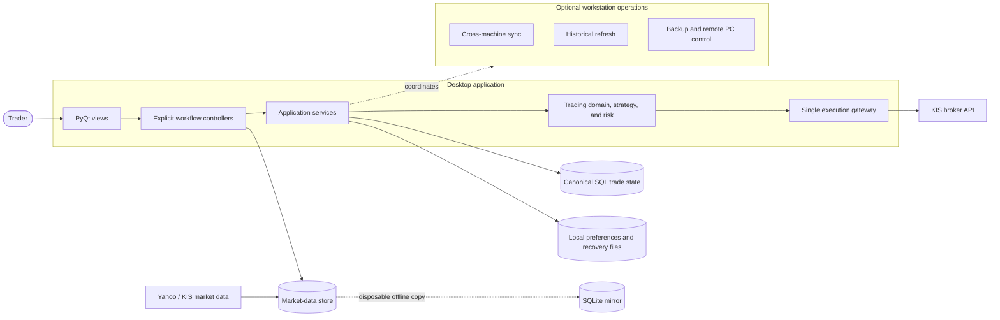
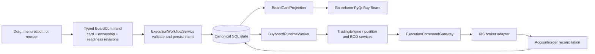

# Quant App Architecture

This document describes the current architecture of the PyQt5 trading dashboard as implemented by `main.py` and `src/`. It is the maintenance map for the live codebase.

For the exact automatic-entry, Entry Pending, ORB replacement, fill, rejection,
and end-of-day rules, see [Current Order Logic](docs/current_order_logic.md).
For the cumulative production qualification logic and current closure status,
see the normative
[Activation Gate Specification](docs/activation_gate_specification.md).

## Product Scope

Quant App is a desktop trading dashboard for US-market swing trading, scanner review, passive Watchlist planning, Buy Board ORB planning, KIS account visibility, and guarded KIS order submission. The Watchlist remains available through lightweight sidebar, Scanner, and TradingView actions; only its former dedicated tab was removed.

The application is not a headless service. `main.py` creates a `QApplication`, installs a small Qt warning filter, imports `src.ui.main_window.MainWindow`, and starts the PyQt event loop.

## Runtime Entry Flow

```text
main.py
  -> QApplication
  -> src.ui.main_window.MainWindow
      -> load local JSON state
      -> load local device role (data/device_role.json) and connect MySQL,
         falling back to the offline SQLite mirror (data/local_mirror.db)
         when MySQL is unreachable
      -> initialize UI workflow controllers
      -> build tabs, sidebar, status log, and menus
      -> preload KIS profiles and account data
      -> bootstrap only missing Kanban trade cards from legacy planning state,
         Buylist compatibility state, and fresh cached KIS holdings
      -> render the Buy Board from canonical card/order/ownership projections
      -> when explicitly enabled, start the BuyboardRuntimeWorker in active
         or standby/read-only mode according to device role and execution lease
      -> run scanner, chart, account, and execution workers through QThread
      -> reconcile any open broker orders from the local order ledger
      -> start cross-machine state sync and background PC-to-laptop
         mirror top-up when MySQL is reachable
```

Long-running work runs in `QThread` workers so the PyQt UI remains responsive.

## Architecture at a Glance

The application has one core responsibility: turn reviewed trading intent into a
broker mutation through a single guarded path. UI rendering, market-data
acquisition, persistence, and optional workstation operations support that path
but are not alternate execution systems.



The boundaries are deliberate:

- UI gestures create typed intent; they never call KIS directly.
- Broker mutations cross one execution gateway. Broker acceptance is not a fill;
  reconciliation alone applies fills and positions.
- SQL is authoritative for the Kanban execution lifecycle. JSON files are local
  preferences, compatibility state, audit/recovery material, or exports. The
  SQLite mirror is a disposable market-data fallback, not a peer database.
- Blocking database, synchronization, and broker work runs in focused QThread
  workers outside `main_window.py`.
- Optional two-machine, backup, and refresh operations attach at the application
  boundary and do not own trading rules.

The guarded order sequence is intentionally small at this level:

```text
reviewed intent
  -> validate ownership, readiness, duplicates, and risk
  -> persist durable command / unknown-submission state
  -> call the broker once
  -> reconcile broker truth
  -> project confirmed order and position state
```

Detailed state transitions belong in
[Current Order Logic](docs/current_order_logic.md),
[Kanban Architecture](docs/kanban_architecture.md), and the
[Activation Gate Specification](docs/activation_gate_specification.md), rather
than in the top-level system diagram.

### Transitional debt

The repository still carries a legacy Buylist/execution-queue compatibility
model beside canonical Trade Cards. Compatibility code may project into the
canonical model, but it must not become a second broker boundary or a second
source of fills. Removal of that compatibility model is the next major
simplification milestone.

`MainWindow` remains the desktop composition root and still has an oversized
orchestration surface. It no longer implements database, synchronization,
ownership, or readiness worker logic; those dependencies are imported from
focused modules. New workflow logic must not be added directly to the window.

## Kanban Buy Board Architecture

The **Buy Board** is the operator planning and execution workflow. It renders six columns from `TradeCardState.board_status`:

```text
Buylist -> Buy Today -> Entry Pending -> Open Positions
Open Positions -> Partial Sell -> Open Positions
Open Positions / Partial Sell -> Sell All
```

`WATCHLIST` and `CLOSED` remain hidden durable values for non-destructive
migration and history compatibility. They are not tabs or board columns and do
not receive execution subscriptions.

The visible column is only one axis of the aggregate. Entry runtime state, broker position/order state, stop state, capital reservation correlation, warnings, and optimistic `version` are stored independently. The database enforces one card for each `(environment, account_no, symbol)`; the current model accepts production cards only.

The active entry is a confirmed-breakout passive-pullback order. A fresh trade
strictly above both the completed ORB high and structural breakout authorizes a
resting BUY limit at the candidate execution price (ORB high by default). A
later, strictly higher-scoring ORB can replace a zero-fill working generation
only through authoritative cancel-then-submit; it never overlaps two BUYs.

The central boundary is `ExecutionWorkflowService`:



Important boundaries:

- Drag/drop never calls the broker and never moves a card on screen optimistically. After a command succeeds or fails, the UI reloads an authoritative projection.
- `ENTRY_PENDING` is a visible system-only target and `CLOSED` is hidden. Entry fills, partial fills, cancellations, sell fills, and flat positions are applied from reconciliation.
- Durable intent commands can atomically claim a previously `LEGACY` symbol for the configured Kanban strategy. `MANUAL` ownership and ownership by another Kanban strategy fail closed.
- Card version, ownership version/strategy, and runtime readiness generation fence stale actions across refreshes and devices.
- Active ambiguous, cancelling, external, or unlinked orders block conflicting actions. External orders remain separately visible and require explicit audited adoption.
- `BuyboardRuntimeWorker` runs off the Qt thread. It reconciles accounts, synchronizes ORB plans from the existing execution queue, manages execution-grade quote subscriptions and stop rules, evaluates entries/exits, persists changed cards, and emits board refreshes/critical alerts.
- A runtime can mutate only after the device/lease, startup and fresh account reconciliation, canonical database, KIS WebSocket/subscriptions/quote freshness, and accumulator-drain checks pass. Standby devices construct a read-only broker facade.
- All Kanban broker mutations use `ExecutionSource.KANBAN_BOARD` through `ExecutionCommandGateway`; no Kanban UI or domain module imports a KIS order endpoint.

See [docs/kanban_architecture.md](docs/kanban_architecture.md) for the full state graph, command mappings, entry/exit flows, persistence model, module map, and operating gates. The exhaustive production invariants and rollout evidence remain in [docs/kanban_production_readiness.md](docs/kanban_production_readiness.md).

## Directory Layout

```text
quant_app/
  main.py                         Application entry point
  historical.py                   Standalone 1D/1H historical-data refresh process (not Qt)
  src/
    ui/                           PyQt views, explicit controllers, presenters, and background workers
    core/                         Trading domain models, Kanban commands/transitions, and pure business logic
    strategy/                     Strategy-neutral snapshots/signals and built-in strategy plugins
    infrastructure/              Database engines, schemas, refresh orchestration, mirrors, and repositories
    risk/                         Pre-trade risk/sizing checks (position sizing today)
    services/                     App-state persistence, Kanban/execution lifecycle, PC sync, and backup services
    utils/                        Storage, configuration, market-data, market-calendar, logging, and DB/local-mirror helpers
    api/                          KIS API adapters and order/account helpers
  scripts/                        PC automation, setup, and one-off maintenance scripts (see docs/pc_sync_data_pipeline.md)
  data/                           Local JSON state, ticker universe files, SQLite mirror, and refresh status/logs
  docs/                           Kanban, PC sync, cloud backup, runbooks, and design documentation
  rulebooks/                      Markdown trading rules used by review workflows
  tests/                          Pytest regression suite
  config/                         Non-secret configuration template
  md_archive/                     Historical implementation notes and completed plans
```

Generated files such as `__pycache__/` and `.pytest_cache/` are not part of the architecture and should remain ignored.

## UI Layer

`src/ui/main_window.py` owns the `MainWindow` shell: application state, startup ordering, tab registration, menus, status/progress helpers, persistence entry points, and shared parsing/formatting helpers. Domain-heavy UI behavior is split into plain Python mixins inherited by `MainWindow`; the mixins do not inherit Qt classes and do not import `MainWindow`.

Workflow orchestration that can be tested outside the full PyQt window lives in focused UI packages and `src/ui/controllers/`. Mixins keep widget construction, event parsing, table refreshes, logging, and state-save side effects close to the UI while delegating account, scanner, chart-data, and execution workflows to controllers.

Current inheritance shape:

```text
MainWindow(
  SidebarMixin,
  HealthPanelMixin,
  DashboardMixin,
  MarketPulseMixin,
  ScannerMixin,
  WatchlistActionsMixin,
  PlanningSupportMixin,
  BuylistMixin,
  ChartCommandRoutingMixin,
  BuyboardMixin,
  ChartsControllerMixin,
  ChartsRenderMixin,
  QMainWindow,
)
```

Supporting UI modules:

| Module | Responsibility |
|---|---|
| `src/ui/main_window.py` | Main shell, startup ordering, local state loading/saving, tab registration, menus, status log, shared helpers |
| `src/ui/dialogs.py` | Settings dialog and scanner filter dialog |
| `src/ui/controllers/` | Workflow controllers for account sync, scanner runs, chart data loading, and execution-queue actions |
| `src/ui/buylist/` | Headless compatibility, monitoring, order, and execution-queue adapters used by Buy Board/runtime paths; no Buy Dashboard tab is built |
| `src/ui/buyboard/` | Six visible Kanban columns and card widgets, ORB planning dialogs, drag/menu-to-command translation, asynchronous projections, and the background execution runtime worker |
| `src/ui/charts/` | Static chart controller/render composites, focused controller and renderer modules, deterministic render-option/interaction models, and chart-data service |
| `src/ui/health/` | Separate Health tab, background read-only probe, status rendering, and redacted event-journal viewer |
| `src/ui/mixins/sidebar_mixin.py` | Left sidebar source switching, selected-symbol routing, and sidebar actions |
| `src/ui/mixins/dashboard_mixin.py` | Dashboard tab, KIS account snapshot UI, profile selection widgets, FX/account-size display, summary widgets |
| `src/ui/mixins/scanner_mixin.py` | Scanner tab, scanner setup/rule UI, worker signal wiring, scanner result table actions |
| `src/ui/mixins/watchlist_actions_mixin.py` | Lightweight passive Watchlist add/view/remove actions, TradingView shortcut/button, and nonblocking Watchlist-to-Buylist handoff; it does not build the retired tab, AI, bulk table, or ORB monitor |
| `src/ui/mixins/planning_support_mixin.py` | Neutral account sizing, cached-intraday, ORB-risk, and chart refresh helpers; it contains no Watchlist widgets, actions, AI, or table projection |
| `src/ui/mixins/chart_command_routing_mixin.py` | Routes visible chart target, queue, and activation gestures through version-fenced canonical Buy Board commands; legacy persisted targets are never execution authority |
| `src/ui/mixins/buylist_mixin.py` | Compatibility import for `src/ui/buylist/`; existing imports and monkeypatch-based tests continue to work |
| `src/ui/mixins/charts_render_mixin.py` | Compatibility import for `src/ui/charts/renderer.py` |
| `src/ui/mixins/charts_controller_mixin.py` | Compatibility import for `src/ui/charts/controller.py` |
| `src/ui/workers.py` | `QThread` workers for KIS snapshots, intraday fetches, scanner runs, and PC status polling |
| `src/ui/order_workers.py` | `QThread` workers for KIS order submission, query, cancel, and reconciliation |
| `src/ui/database_workers.py` | Database discovery, freshness, recovery, and local-mirror synchronization workers |
| `src/ui/coordination_workers.py` | Planning sync, Live Trading control, execution/operator ownership, and plan-publish workers |
| `src/ui/readiness_presenter.py` | Pure conversion of runtime readiness into labels, progress, and operator guidance |
| `src/ui/chart_bridge.py` | `QWebChannel` bridge used by chart JavaScript to persist drawings and breakout-price markers |
| `src/ui/filter_catalog.py` | Default scanner setups, scanner metric labels, tab defaults, and settings defaults |

The retired Watchlist-backed Intraday Charts view is not constructed. Startup creates
only an empty hidden symbol combo as a temporary compatibility target for one shared
chart-fetch completion callback; it has no tab, chart engine, controls, shortcuts, or
symbols and cannot start work by itself.

### UI Workflow Controllers

Controllers are ordinary Python objects with an explicit `window` host reference.
They keep workflow code out of tab rendering methods while preserving required UI
side effects in the mixins. `WindowController` does not implement `__getattr__`
or `__setattr__` forwarding: every host dependency is visible as
`self.window.<name>`, and controller-local state cannot silently mutate the
window namespace. `get_controller()` only handles lazy construction/caching.

| Controller | Responsibility |
|---|---|
| `AccountController` | KIS account snapshot/profile sync, FX/account-size application, and account refresh commands |
| `ScannerController` | Scanner setup persistence, scanner worker orchestration, and result action coordination |
| `ChartDataController` | `src/ui/charts/data_service.py`; chart data loading and refresh coordination for daily, hourly, TradingView, and intraday views |
| `BuylistController` | `src/ui/buylist/controller.py`; thin UI adapter that exposes the framework-neutral exit rules owned by `src/core/exit_policy.py` |
| `BuylistExecutionController` | `src/ui/buylist/execution_controller.py`; execution queue refresh and guarded order-command coordination. `ExecutionQueueRefreshRequest` carries parsed UI inputs and callbacks, and `ExecutionQueueRefreshResult` returns missing symbols, failures, refreshed count, and status counts |

Current tab construction in `_setup_tabs()`:

| Tab key | Label | Builder |
|---|---|---|
| `dashboard` | Dashboard | `_build_dashboard_tab()` |
| `scanner` | Scanner | `_build_scanner_tab()` |
| `buyboard` | Buy Board | `_build_buyboard_tab()` |
| `tradingview` | TradingView Chart | `_build_tradingview_tab()` |
| `health` | Health | `_build_health_tab()` |

`data/tab_options.json` persists active tab visibility. The Watchlist builder is
deleted. A legacy Trade Plan builder remains dormant inside the shared chart
controller, but `_setup_tabs()` never calls or exposes it. Startup keeps only
one empty, hidden symbol combo for a shared fetch-completion callback; it does
not construct the retired intraday chart, actions, shortcuts, or symbol source,
and an old `tab_options.json` cannot restore that view.

## Worker Layer

Workers are grouped by the external boundary they serve. General KIS/data-fetch
workers live in `src/ui/workers.py`; order workers live in
`src/ui/order_workers.py`; database/mirror workers live in
`src/ui/database_workers.py`; shared-control workers live in
`src/ui/coordination_workers.py`; and Kanban projection/runtime workers live in
`src/ui/buyboard/`. `main_window.py` coordinates these workers but implements no
`QThread` subclass. Daily/hourly history refresh is a separate process -- see
[Historical Data Refresh](#historical-data-refresh).

| Worker | Module | Purpose |
|---|---|---|
| `KisAccountWorker` | `workers.py` | Fetch one KIS account snapshot |
| `KisStartupAccountsWorker` | `workers.py` | Preload configured KIS production account profiles |
| `FxRateWorker` | `workers.py` | Resolve USD/KRW from KIS snapshot data or fallback sources |
| `IntradayFetchWorker` | `workers.py` | Fetch one symbol's intraday bars |
| `IntradayBulkFetchWorker` | `workers.py` | Fetch intraday bars for multiple symbols |
| `ScannerWorker` | `workers.py` | Run scanner rules over loaded metrics |
| `PcRemoteStatusWorker` | `workers.py` | Check database, remote-control listener, and remote `main.py` health independently |
| Database/mirror workers | `database_workers.py` | Discover databases, read freshness, recover MySQL, and top up the disposable SQLite mirror |
| Coordination/control workers | `coordination_workers.py` | Synchronize planning state and update Live Trading, operator, and execution ownership controls |
| `KisOrderWorker` | `order_workers.py` | Submit KIS overseas orders and emit broker acceptance/rejection state |
| `OrderReconciliationWorker` | `order_workers.py` | Fetch position snapshots through an injected `Broker` and reconcile open orders against holdings deltas |
| `KisOrderQueryWorker` | `order_workers.py` | Query and reconcile unresolved orders through an injectable `Broker` |
| `KisOrderCancelWorker` | `order_workers.py` | Cancel a locally tracked order through an injectable `Broker` and reconcile the result |
| `HealthProbeWorker` | `health/panel.py` | Run local read-only production checks and load recent redacted journal events without blocking Qt |
| `BuyboardProjectionWorker` | `buyboard/controller.py` | Bootstrap missing cards and build read-only card/order/ownership projections without blocking Qt |
| `BuyboardRuntimeWorker` | `buyboard/runtime_worker.py` | Run active or standby Kanban startup reconciliation, readiness/lease checks, account refresh, market-data drain, trading heartbeat, persistence, shutdown reconciliation, and alerts |
| `PlanningMembershipWorker` | `planning_membership_worker.py` | Apply one passive Watchlist/Buylist membership change without blocking the Qt thread; completion merges only that symbol back into current UI state |

## Service Layer

| Module | Responsibility |
|---|---|
| `src/services/app_state.py` | `StateSaveManager`, save-result tracking, metadata writes, and compatibility helpers for watchlist, buylist, trade plans, scanner setups, drawings, and tab options |
| `src/services/intraday_provider.py` | Provider-neutral request/result contracts and OHLCV normalization/resampling helpers |
| `src/services/intraday_data_service.py` | KIS-first intraday orchestration, yfinance fallback, and best-source cache loading |
| `src/services/kis_intraday_provider.py` | KIS intraday provider wrapper using production account config |
| `src/services/kis_ws_symbol_keys.py` | Gitignored, atomically updated KIS WebSocket symbol-key store with strict validation, last-known-good recovery, and intraday hot reload; process environment values are never consulted for symbols |
| `src/services/yfinance_intraday_provider.py` | yfinance intraday fallback provider preserving existing retry behavior |
| `src/services/order_ledger.py` | Persistent local order ledger stored at `data/orders.json` |
| `src/services/trading_state.py` | Process projection of Live Trading: `TRADING_ENABLED` is the per-machine administrative lock, while the desktop attaches a fail-closed provider for the durable shared ON/OFF control at broker boundaries |
| `src/services/broker.py` | `Broker` protocol (`submit_order`/`cancel_order`/`get_order`/`get_positions`/ambiguous-error classification), normalized `BrokerSubmissionResult`, and `KisBroker`; all KIS response-field parsing stays at this adapter boundary |
| `src/services/order_execution_service.py` | Broker-neutral guarded order submission with durable idempotency before and after API calls; gated by `trading_state`, an entry-only `PreTradeRiskDecision`, and an injectable `Broker` (defaults to `KisBroker`) |
| `src/services/order_reconciliation.py` | Conservative account-snapshot reconciliation plus injectable broker order query/cancel for accepted/working orders |
| `src/services/execution_workflow_service.py` | Shared legacy/Kanban execution facade and sole board-command boundary; validates card/runtime/ownership revisions and conflicts, persists board intent, and routes destructive work through the execution gateway |
| `src/services/buyboard_runtime.py` | Kanban composition root wiring the broker-neutral trading engine, entry/position/EOD services, market data, risk revalidation, capital reservations, lease, and shared gateway |
| `src/services/trading_engine.py` | One-second Kanban decision pipeline for retry recovery, entries, order reconciliation, entry completion, partial/full exits, stale quotes, stops, and EOD cleanup |
| `src/services/trade_card_repository.py` | Canonical SQL trade-card rows with unique account/symbol identity, optimistic versions, and an atomic `data/trade_cards.json` recovery snapshot |
| `src/services/trade_card_bootstrap.py` | Create-only bridge from loaded Watchlist/Buylist state into missing cards; may project fresh cached holdings before the runtime owns reconciliation |
| `src/services/planning_membership_service.py` | Canonical-safe, passive Watchlist add/remove and explicit Watchlist-to-Buylist promotion; never selects an ORB, arms Buy Today, subscribes quotes, or touches the broker |
| `src/services/trade_card_orb_bridge.py` | Copies the existing execution queue's selected ORB candidate into pre-entry card fields without duplicating ORB calculations |
| `src/services/execution_ownership_repository.py` | Durable `LEGACY`/`KANBAN`/`MANUAL` ownership assignment and optimistic ownership revision per account and symbol |
| `src/services/entry_attempt_manager.py` | Per-symbol serialized entry attempts, durable attempt identity/cooldown, capital reservations, and deadline/cancel handling |
| `src/services/position_manager.py` | Broker-position projection, first-fill protection, stop evaluation, partial/sell-all flows, and flat-position confirmation |
| `src/services/stop_change_coordinator.py` | Per-card lock and pending-stop handoff so newly durable stops are installed in the live feed before becoming active |
| `src/services/eod_trading_service.py` | End-of-day entry cancellation/reset, remaining-target completion policy, and unresolved-order protection |
| `src/services/event_journal.py` | Append-only JSONL trading audit events with cross-thread/process locking, account/free-text/secret redaction, runtime write-error telemetry, 25 MB rotation with the newest 20 archives retained, and a best-effort execution adapter |
| `src/services/health.py` | Framework-neutral read-only health model for KIS configuration/token metadata and response age, a current MySQL `SELECT 1`, journal storage/write health, local-mirror freshness, and unresolved-order reconciliation state |
| `src/services/historical_refresh_control.py` | Launches, polls, and terminates the standalone `historical.py` subprocess; owns its status-file schema and PID liveness checks |
| `src/services/state_sync.py` | Conflict-safe cross-machine sync of the complete planning snapshot (watchlist, buylist, trade plans, execution queue, scanner setups, and settings) plus the revisioned, durable Live Trading control and its audit trail; only the planning `main` device pushes planning collections |
| `src/services/runtime_status.py` | Legacy/fallback database process lifecycle rows; the guarded runtime's canonical `runtime_device_state` readiness heartbeat supplies steady `main.py` visibility when available |
| `src/services/pc_remote_control.py` | Tailscale-reached client for the always-on PC's remote-control listener: status ping and shared-secret-authenticated shutdown request |
| `src/services/cloud_backup.py` | Best-effort offsite backup of gitignored `data/*.json` state files to a local Google Drive for Desktop folder (current + rolling daily snapshots) |
| `src/services/env_backup.py` | Passphrase-encrypted (PBKDF2 + Fernet) offsite backup/restore of `.env` secrets, kept separate from the automatic JSON backup cycle |

The service layer contains persistence and lifecycle logic that is not specific to one widget.

## Core Domain Modules

| Module | Responsibility |
|---|---|
| `src/core/scanner.py` | `StockScanner`, `ScanRule`, and comparison operators for rule-based filtering |
| `src/core/watchlist.py` | `Watchlist`, `TradePlanManager`, `BuylistManager`, and persistence-ready dataclasses |
| `src/core/orb.py` | Static compatibility surface for strategy-owned ORB range/entry helpers, plus legacy display signals and intraday resampling |
| `src/core/execution_queue.py` | Dynamic execution workflow for the built-in ORB plugin: queue item/candidate state, risk planning, environment-symbol keys, duplicate-pending rejection, and display-state helpers |
| `src/core/trade_card_state.py` | Authoritative Kanban aggregate: visible column, entry runtime, broker position/order correlation, stop/exit state, retries, warnings, timestamps, and version |
| `src/core/kanban_transitions.py` | Pure legal user-transition graph, closed-card membership restore, legacy-state migration, and one-card-per-account/symbol invariant |
| `src/core/board_workflow.py` | Frontend-neutral typed board commands, optimistic fences, action/projection contexts, and read-only projection result types |
| `src/core/execution_ownership.py` | Durable execution owner and strategy-instance value types plus frontend-source-to-owner policy |
| `src/core/execution_request.py` / `execution_order_record.py` | Guarded command/order identities and canonical execution lifecycle records used by the shared gateway |
| `src/core/trade_reviewer.py` | Rulebook-backed trade setup review model |
| `src/core/scoring.py` | Deterministic scoring, optional OpenAI review, fallback analysis, and HTML rendering |
| `src/core/order_state.py` | Broker order lifecycle enums and `BrokerOrder` persistence model |

The buylist is the local monitoring model. Broker orders are now tracked separately in the order ledger and only applied back to buylist positions after fill evidence is confirmed.

## Strategy

`src/strategy/` is independent of PyQt, risk enforcement, order services, brokers, and persistence. It defines the stable boundary intended for live, paper, and future backtest use:

```text
MarketSnapshot + PortfolioSnapshot
  -> Strategy.generate_signal()
  -> Signal | None
  -> risk plan / PreTradeRiskDecision
  -> OrderIntent
  -> guarded execution
  -> Broker
```

| Module | Responsibility |
|---|---|
| `src/strategy/base.py` | Immutable `MarketSnapshot`, `PortfolioSnapshot`, and `Signal` contracts plus the runtime-checkable `Strategy` protocol |
| `src/strategy/orb/config.py` | Existing ORB window, buffer, market-open, completion, and probe configuration |
| `src/strategy/orb/signals.py` | ORB range and fail-closed entry assessment models plus the combined strategy evaluation |
| `src/strategy/orb/strategy.py` | `ORBStrategy`, opening-range calculation, and the existing buffered breakout/entry classification |
| `src/core/orb_entry_logic.py` | Finalized passive execution zone, U.S. tick validation, timeframe rank, and strict score comparison for active Kanban entry generations |

The live execution queue calls `ORBStrategy.evaluate()` for the completed
opening range, then applies the finalized passive-zone rules from
`src/core/orb_entry_logic.py`. `TradeCardOrbEvaluator` latches a fresh
post-range KIS breakout event and projects the selected generation onto the
card; `TradingEngine` performs the final quote, session, risk, and capital
checks. The older buffered classification remains characterized for strategy
compatibility, but it is not the active broker-order trigger. `src/core/orb.py`
re-exports the strategy calculations for older imports. ORB remains one plugin;
generic contracts do not depend on risk, execution, or KIS.

## Risk

| Module | Responsibility |
|---|---|
| `src/risk/position_sizer.py` | `PositionSizer` -- fixed-risk, fixed-percent, volatility-based, and Kelly position sizing calculations |
| `src/risk/orb_position.py` | Shared ORB sizing metrics, 10%/30% capital-allocation limits, 15%/66% stop-to-ADR limits, validation warnings, and recommendation score used by the queue, worker, and Buy Board ORB dialogs |
| `src/risk/pre_trade.py` | Immutable, short-lived `PreTradeRiskDecision` bound to the complete entry-order fingerprint, final approval enforcement, and immediate ORB-candidate/plan revalidation |

`PositionSizer` and the duplicated ORB position-plan checks now live under `src/risk/` with their existing formulas and thresholds. `src/core/position_sizer.py` is a compatibility import for older scripts; new code imports from `src.risk`. Immediately before an entry is submitted, the selected ORB candidate is revalidated into a `PreTradeRiskDecision`. Candidate symbol and plan fingerprint must match the requested order. The decision binds environment, account, symbol, side, intent, quantity, reference price, exchange, execution policy, strategy ID, and plan ID, and expires within 30 seconds. `submit_guarded_overseas_order()` verifies it before ledger reservation, after reservation, and once more after synchronous `ORDER_SUBMISSION_STARTED` journaling at the immediate broker boundary. Exit intents deliberately do not require entry-risk approval, so protective liquidation remains available. The duplicate-open-order guard remains in `src/services/order_ledger.py` (`reserve_order_if_no_matching_open`) rather than moving here, since it is inherently coupled to the order ledger's file I/O rather than being a standalone calculation.

## Data and Persistence

Local JSON state is read/written through `src/utils/storage.py` and service helpers. Writes use a temp file followed by atomic replace. When an existing JSON file is overwritten, `save_json()` first keeps a rolling `.bak` copy; `load_json()` falls back to that backup if the main file is missing or malformed. The frequently changing KIS WebSocket symbol map lives only at `data/kis_ws_symbol_keys.json`, not in `.env` or `.env.pc`; its runtime reader deliberately retains the in-memory last-known-good map rather than switching feeds during a malformed or interrupted intraday edit.

| File | Purpose |
|---|---|
| `data/watchlist.json` | User-managed passive Watchlist membership and planning metadata, synchronized between devices; removing membership does not delete an independent Buylist card, stop, order, or position, and there is no dedicated Watchlist tab |
| `data/buylist.json` | Buy dashboard and monitoring items |
| `data/execution_queue.json` | Dynamic ORB execution queue items, selected candidates, status, and warnings |
| `data/trade_cards.json` | Atomic local recovery snapshot of canonical Kanban trade cards; not authoritative while the database is reachable |
| `data/legacy_non_prod_buylist.json` | One-time archive of non-production buylist rows removed from actionable state |
| `data/legacy_non_prod_execution_queue.json` | One-time archive of non-production execution queue rows removed from actionable state |
| `data/trade_plans.json` | Saved trade plans |
| `data/scanner_setups.json` | Named scanner rule presets; revision-synchronized and included in atomic full-plan publishes |
| `data/chart_drawings.json` | Saved chart line drawings; authoritative breakout targets live on canonical trade cards, including passive Watchlist cards |
| `data/tab_options.json` | Tab visibility settings |
| `data/orders.json` | Local broker-order ledger, created when the first order is recorded |
| `data/event_journal.jsonl` | Append-only, gitignored trading lifecycle journal; timestamped archives preserve earlier events when the active file rotates |
| `data/emergency_execution_journal.jsonl` | Local emergency-only guarded command evidence used by narrowly fenced protective actions during a bounded canonical-database outage |
| `data/state_metadata.json` | Optional sidecar with last successful/failed app-state save time, last error, and files written |
| `data/us_kis_tickers.csv` | Cached KIS-registered US stock universe used by scanner refreshes |
| `data/sp500_tickers.csv` | Cached S&P 500 fallback universe |
| `data/device_role.json` | This device's id, hostname, and `is_main` cross-machine state-sync role (see [Two-Machine Data Pipeline](#two-machine-data-pipeline-pc-sync)) |
| `data/local_mirror.db` (+ `-shm`/`-wal`) | Offline SQLite mirror of MySQL market data, runtime-only, never committed |
| `data/refresh_status_1d.json`, `data/refresh_status_1h.json` | Live status of the standalone `historical.py` refresh subprocess (see [Historical Data Refresh](#historical-data-refresh)) |
| `data/refresh_lock_1d.lock`, `data/refresh_lock_1h.lock` | Lock files preventing overlapping `historical.py` runs per mode |

`data/settings.json` may be created when settings or shortcuts are saved. It is
revision-synchronized and included in atomic full-plan publishes so both
devices use the same ORB bounds and buffer; the file contains preferences only,
never credentials.

Critical local state files keep one rolling `.bak` backup beside the JSON file, including watchlist, buylist, trade plans, orders, and execution queue state. The app does not wrap existing JSON payloads in a schema envelope, so legacy loaders keep their current formats.

Kanban's authoritative lifecycle is row-oriented SQL state, not the legacy whole-file collection model. The main tables cover trade cards, execution ownership, execution commands and order records, capital reservations, discovered external orders, account reconciliation, execution leases, runtime-device/readiness state, and related journal/recovery metadata. Trade-card writes use optimistic compare-and-swap on `version`; ownership and runtime readiness have independent revisions. `data/trade_cards.json` mirrors successful card writes only as a recovery/migration aid.

The production-only migration archives legacy non-production buylist and execution queue rows before filtering them. Archived rows are never relabeled as `PROD` and cannot submit live orders. Historical non-production broker orders remain in `data/orders.json` for audit history but are excluded from startup reconciliation.

## Production Observability

The Health tab is registered immediately after TradingView Chart. Opening it starts a background, read-only probe and hides the stock-selection sidebar. It reports KIS token metadata (never the token), age of the last verified KIS account response (warning after 15 minutes), a current MySQL `SELECT 1` result, daily/hourly local-mirror freshness, unresolved or unknown broker orders, event-journal writability/write errors/lock state/file sizes/archive count/free space/latest event, and an application heartbeat. Daily mirror health uses the full configured stock universe; hourly health uses the separate relevant-symbol scope shared with the selective hourly copy. Mirror SQL, the MySQL probe, journal inspection, and universe loading run in the worker; the Qt event loop is not blocked. A health refresh deliberately does not contact KIS, place/cancel orders, or mutate database state.

Live execution emits correlated lifecycle records from `SIGNAL_CREATED`, `RISK_APPROVED`/`RISK_REJECTED`, and `ORDER_INTENT_CREATED` through durable reservation/submission/acceptance, reconciliation, confirmed fills, and position updates/closure. Strategy signal outcome and risk outcome remain separate events. Every record has a UTC timestamp and event ID; order, broker-order, signal/plan, symbol, strategy, price, and quantity fields make a trade reconstructable. Full account numbers are scrubbed from every field (including client order IDs), secret-like payload keys and string values are redacted, free-text reasons are scrubbed, and raw broker responses are never journaled. `record_event()` is best effort, and the guarded order service also isolates an injected recorder exception, so an unavailable journal cannot change an order outcome or provoke a retry. After `ORDER_SUBMISSION_STARTED` is durably written, the service performs one final kill-switch and short-lived risk-approval check immediately before calling the broker.

`MainWindow.closeEvent()` requests interruption for active background workers, waits with one shared bounded shutdown budget, then attempts a final synchronous app-state save and waits briefly for pending background saves. Normal UI save calls still schedule background saves through `save_app_state()`, but those threads are tracked and non-daemon.

The Kanban runtime adds durable execution/device heartbeats, per-card warnings, critical native notifications, and optional out-of-process alert/heartbeat delivery. Lease loss, unreconciled broker orders, stalled liquidation cancellation, trading halts, stale execution-grade data, and high/low market-data outage states are surfaced independently of the board refresh itself.

## Market Data Layer

`src/utils/data_loader.py` provides Yahoo Finance based market data:

- KIS overseas master loading/caching for the default US stock universe, with S&P 500 fallback.
- Price history download through Yahoo chart endpoints.
- Multi-symbol history normalization.
- Technical metric calculation used by scanning and charts.

Database behavior is split by responsibility under `src/infrastructure/database/`:

- `settings.py` owns stable constants and validation patterns; `engine.py` owns validated MySQL configuration and engine construction.
- `schema.py` owns SQLAlchemy table definitions and schema setup.
- `refresh.py` owns history refresh orchestration.
- `mirror.py` is a static compatibility facade. `mirror_engine.py`, `mirror_freshness.py`, `mirror_copy.py`, and `mirror_reconciliation.py` separately own local SQLite construction/handoff, freshness, checkpointed copying, and reconciliation.
- `repositories/market_data.py` is a static compatibility facade. `market_bars.py`, `chart_indicators.py`, and `market_watermarks.py` own the focused market-data operations; `repositories/scanner.py` owns scanner persistence queries.

`src/utils/db_loader.py` is a static legacy compatibility module built from explicit imports. It performs no runtime namespace synchronization, and production code imports the focused owners instead. Together these modules provide:

- `price_history` for daily and interval-aware historical data.
- `hourly_price_history` for hourly chart data.
- `intraday_price_history` for 1m/5m intraday bars, keyed by `source`.
- `chart_indicators` for RS/TI65-style chart overlays.
- `scanner_metrics` for scanner-ready metrics.
- `stock_profiles` for one basic KIS-master profile per configured US symbol,
  progressively enriched with Yahoo sector/industry metadata.
- `earnings_events` and `fundamental_sync_state` for cached chart earnings and
  positive/negative provider freshness state.
- `init_local_mirror_engine()` / `sync_local_mirror_from_pc_checkpointed()` and related helpers manage `data/local_mirror.db`, its checkpointed top-up from PC MySQL, and staleness checks (`local_mirror_is_stale`, `local_mirror_hourly_is_stale`). Daily reconciliation covers the full universe; hourly reconciliation is limited to symbols relevant to current Scanner, Watchlist, and Buylist work.

The app can run without MySQL. When MySQL is configured (whether local or the always-on PC's canonical instance), refresh and scanner workflows use cached tables for speed and freshness checks; see [Two-Machine Data Pipeline](#two-machine-data-pipeline-pc-sync) for the multi-device case.

Supporting utility modules:

- `src/utils/market_calendar.py` -- NYSE holiday/session calendar helpers shared by refresh automation and the UI's market-status widget.
- `src/utils/logging_config.py` -- configures console + rotating-file logging (`data/logs/quant_app.log`) once at each entry point (`main.py`, `historical.py`, scripts).
- `src/utils/intraday_helpers.py` -- small intraday DataFrame helpers shared by UI code and workers.

## Historical Data Refresh

1D and 1H history refresh runs as a standalone OS subprocess, not an in-process `QThread` (the earlier `RefreshWorker`/`HourlyRefreshWorker` workers were removed), so closing/reopening the dashboard has no effect on an in-flight refresh:

```text
main.py "Update 1D/1H Data" action or scripts/run_daily_refresh.py
  -> src.services.historical_refresh_control.launch_refresh()
  -> detached `python historical.py --mode 1d|1h [...]` subprocess
  -> historical.py writes progress to data/refresh_status_{mode}.json
     (idle -> starting -> running -> completed | error | terminated)
  -> historical_refresh_control polls the status file and PID liveness
  -> UI can request termination independent of subprocess ownership
```

`historical.py` and `scripts/run_daily_refresh.py` write to canonical MySQL when reachable and to the local SQLite mirror otherwise; laptop-only bars written while the PC is unreachable are never uploaded back to MySQL once it returns. `scripts/run_daily_refresh.py` is the freshness-gated entry point (checks every symbol/table against the expected latest NYSE session before refreshing) used by the PC's morning routine; calling `historical.py` directly re-fetches unconditionally. Every PC schema initialization idempotently seeds `stock_profiles` from the complete cached KIS universe without Internet access. A completed 1D refresh downloads Nasdaq's full listing metadata once to fill sector/industry in bulk, then sends only unresolved symbols through the bounded Yahoo fallback. The same supplemental phase fills the next 100 days of Nasdaq earnings-calendar events and adds full Yahoo quarterly history for 100 never-attempted symbols per run. Successful profile rows are fresh for 30 days and unavailable rows wait seven days before retry, so failures cannot starve the remaining universe. All provider phases are supplemental: an outage cannot invalidate otherwise-current price/scanner data. See `docs/historical_refactor_plan.md` for the original design rationale.

## Two-Machine Data Pipeline (PC Sync)

An optional second machine -- an always-on PC reachable over LAN or Tailscale -- can host the single canonical MySQL database while both desktops share planning/control state and the laptop keeps an offline mirror. This is fully documented in [docs/pc_sync_data_pipeline.md](docs/pc_sync_data_pipeline.md); summary:

- **Roles**: the PC hosts canonical MySQL and runs `historical.py` on a schedule (BIOS wake -> auto-login -> `scripts/pc_morning_routine.ps1` -> freshness-gated refresh -> auto-shutdown). Either desktop may be the guarded Execution Owner when it is fresh and fully ready; exactly one owner can cross the broker boundary. `data/local_mirror.db` is the laptop's offline safety copy, not a peer database.
- **Device identity**: `data/device_role.json` (device id, hostname, `is_main`) determines which device may push compatibility planning collections; it does not grant execution ownership. `src/services/state_sync.py` syncs watchlist, buylist, trade plans, the execution queue, scanner setups, and settings through a revision-tracked MySQL table so a stale device cannot clobber a newer remote copy.
- **Runtime visibility**: the guarded runtime publishes canonical readiness to `runtime_device_state` every 240 seconds with a 300-second freshness fence; `src/services/runtime_status.py` remains the process-lifecycle fallback. Together with `src/services/pc_remote_control.py`, the dashboard reports independent `PC` / `DB` / `Listener` / `main.py` signals. These lights do not replace a fresh `STANDBY_READY` identity for owner transfer.
- **Fallback behavior**: connection to MySQL is checked once at startup/reconnect; a success routes reads/writes to MySQL immediately, a failure routes to the local SQLite mirror with cross-machine sync and heartbeats disabled. The mirror top-up afterward is incremental and checkpointed (row-count/revision signatures first, full comparison only on mismatch).
- **Automation scripts** live in `scripts/` (`pc_morning_routine.ps1`, `run_daily_refresh.py`, `sync_local_mirror_from_pc.py`, `setup_pc_autologin.ps1`, `setup_pc_morning_task.ps1`, `setup_mysql_lan_access.ps1`, `setup_mysql_tailscale_access.ps1`, `pc_remote_control_listener.py`, `Configure-AutomaticShutdown.ps1`, WinRM setup/log-tailing scripts, and the one-time `backfill_hourly_history_200d_once.py` repair).

A single-machine setup is unaffected: `data/device_role.json` still exists but `is_main` is irrelevant with no peer, and MySQL is simply the optional local cache described in [Market Data Layer](#market-data-layer).

## Cloud Backup

Best-effort offsite backup of local state, separate from the MySQL sync above and from git. Documented in full in [docs/cloud_backup.md](docs/cloud_backup.md); summary:

- `src/services/cloud_backup.py` copies the gitignored `data/*.json` state files (11 files, listed in `STATE_BACKUP_FILENAMES`) into a local folder synced by Google Drive for Desktop (or any similar sync client), keeping a `current/` copy plus rolling `daily/<date>/` snapshots. It never calls a cloud API directly.
- `src/services/env_backup.py` separately backs up `.env` secrets, encrypted with a user-chosen passphrase (PBKDF2-HMAC-SHA256 + Fernet) that is never stored anywhere; this is a manual, explicit action, not part of the automatic cycle.
- `QUANT_BACKUP_DIR` (see [Configuration](#configuration)) points at the synced folder; auto-detected if unset and a Google Drive for Desktop folder is present.

## Intraday Source Architecture

Intraday data is provider-based and source-explicit:

```text
IntradayFetchWorker / IntradayBulkFetchWorker
  -> IntradayRequest
  -> fetch_intraday_with_fallback()
      -> KIS provider if enabled/configured/working
      -> yfinance provider if KIS is disabled, unavailable, or returns no usable bars and fallback is allowed
  -> save_intraday_history_to_db(..., source="kis" or "yfinance")
  -> ORB/chart workflows load best cached source
```

Source priority for cached ORB/chart reads:

1. `source="kis"`
2. `source="yfinance"`
3. legacy/unfiltered rows for backward compatibility

KIS intraday is disabled by default. `src/api/kis_intraday.py` does not hardcode unverified endpoint paths, TR IDs, raw output names, or raw OHLCV field names. Enabling it requires explicit `config/runtime.local.json` endpoint/TR ID/field mappings verified from official KIS documentation or a successful manual API test.

`src/strategy/orb/` remains source-agnostic. It consumes normalized `Open`, `High`, `Low`, `Close`, `Volume` DataFrames for the existing 1m, 5m, and 30m live windows. `src/core/orb.py` retains compatible imports and resampling helpers for existing callers.

## KIS Integration

| Module | Purpose |
|---|---|
| `src/api/kis_account_snapshot_dual.py` | PROD config, token handling, domestic/overseas snapshots, account profile discovery |
| `src/api/kis_fetch_all_daily.py` | KIS daily price fetches and domestic master parsing |
| `src/api/kis_intraday.py` | Configuration-gated KIS intraday adapter and raw-row normalization |
| `src/api/kis_order.py` | Overseas regular-order and broker-held reservation submission/query/cancel wrappers |
| `src/api/kis_order_status.py` | Explicit placeholders for direct order status/cancel endpoints until verified TR IDs are implemented |
| `src/api/kis_config.py` | Compatibility loader that combines private PROD credentials with non-secret runtime configuration |

KIS credentials are loaded from `.env`, for example:

```text
KIS_PROD_APP_KEY
KIS_PROD_APP_SECRET
KIS_PROD_ACCOUNT_NO
```

Multiple accounts can be configured with numbered variables such as `KIS_PROD_ACCOUNT_NO_2`. Token caches are local runtime files and are ignored by git.

Read-only account/profile requests use bounded retries for explicitly
classified transient network, gateway, rate-limit, and domestic-balance
`APBK1350` failures. Permanent client/protocol errors fail immediately.
Submit/cancel/replace mutations do not inherit this retry path: an ambiguous
mutation must be reconciled and is never repeated inline as a new order.

KIS intraday activation keys:

```text
KIS_INTRADAY_ENABLED=false
KIS_OVERSEAS_INTRADAY_ENDPOINT=
KIS_OVERSEAS_INTRADAY_TR_ID=
KIS_OVERSEAS_INTRADAY_TIME_FIELD=
KIS_OVERSEAS_INTRADAY_OPEN_FIELD=
KIS_OVERSEAS_INTRADAY_HIGH_FIELD=
KIS_OVERSEAS_INTRADAY_LOW_FIELD=
KIS_OVERSEAS_INTRADAY_CLOSE_FIELD=
KIS_OVERSEAS_INTRADAY_VOLUME_FIELD=
KIS_OVERSEAS_INTRADAY_OUTPUT_FIELD=output2
```

Optional:

```text
KIS_OVERSEAS_INTRADAY_PARAMS_JSON={"SYMB":"{symbol}","EXCD":"{exchange}","DATE":"{date}"}
```

Only enable KIS intraday after the endpoint, TR ID, request params, output field, and OHLCV field names have been verified.

## KIS Order Lifecycle

KIS order handling is intentionally split into submission, durable order state, and fill reconciliation. The flow below is the legacy Buy Dashboard's local-ledger path. The Kanban runtime uses the same broker boundary through `ExecutionCommandGateway`, but records guarded command/order state in canonical SQL and projects reconciliation into `TradeCardState`; see [Kanban Buy Board Architecture](#kanban-buy-board-architecture) and [Current Order Logic](docs/current_order_logic.md).

```text
Buy/Sell UI action or EXECUTE_READY execution queue submit action
  -> BuylistExecutionController submit command validation
  -> KisOrderWorker
  -> submit_guarded_overseas_order()
  -> ENTRY only: require a fresh complete-fingerprint PreTradeRiskDecision before ledger creation
  -> duplicate-open-order check in data/orders.json by environment, account, symbol, side, and intent
  -> BrokerOrder(status=CREATED) written to data/orders.json before KIS API call
  -> BrokerOrder(status=UNKNOWN_SUBMISSION_STATE) written before request is sent
  -> KisBroker.submit_order() -> normalized BrokerSubmissionResult + src.api.kis_order placement endpoint
  -> BrokerOrder(status=ACCEPTED or REJECTED) written with raw submit response/error
  -> UI status becomes BUY_SUBMITTED / SELL_SUBMITTED / PARTIAL_EXIT_SUBMITTED
  -> OrderReconciliationWorker compares Broker.get_positions() snapshots
  -> confirmed fills update buylist shares, cost, sold status, and partial-exit stop behavior
```

Important safety rules:

- Execution queue submit actions are gated to `EXECUTE_READY` queue rows before KIS order submission starts.
- Queue-backed entries are identified by their persisted `execution_queue...` strategy marker, not by an ambiguous display status such as `WATCHING`. Legacy non-queue `ACTIVE` entry automation is retired and blocked before worker creation; existing position exits remain available.
- Entry orders require an approved `PreTradeRiskDecision` matching the full submitted command and ORB plan. Missing, rejected, stale, or mismatched approvals fail before ledger reservation or a broker call; exits are exempt so risk controls cannot block liquidation.
- Manual PROD partial/full exits outside the U.S. regular session use KIS's
  reserved U.S. sell endpoint with market-on-open execution. The selected
  quantity and `RESERVED_MOO` policy are persisted before the broker call, so
  accepted reservations survive desktop-app shutdown.
- A successful KIS API order response means broker acceptance only. It does not mean filled.
- Buylist positions are not marked `BOUGHT`, `SOLD`, or partially exited from submission responses.
- Open-order duplicate checks prevent repeated submission for the same environment, account, symbol, side, and intent.
- Startup loads unresolved orders from `data/orders.json`, marks matching buylist rows as submitted/pending, and blocks duplicate execution after restart.
- Only `PROD` records are actionable; legacy non-production records are ignored rather than migrated into live state. Multiple accounts remain isolated by `account_no`.
- Account snapshot deltas are used as fill evidence. Ambiguous cases remain `WORKING` rather than being treated as filled.
- Partial fills are idempotent through `BrokerOrder.applied_filled_quantity`, so repeated reconciliation cannot double-apply the same fill.
- Order query and cancellation run through the injected `Broker`; `KisBroker` owns the KIS request/response mapping, while local status remains conservative when the broker result is ambiguous. A credentialed KIS SIM submit/query/cancel remains a separate operational contract check.

## Charting

The chart experience is generated by `MainWindow` and coordinated with `ChartBridge`:

- TradingView Lightweight Charts HTML/JavaScript is generated locally.
- Controllers inject normalized shortcut and pan settings into both renderers; renderer functions do not read settings persistence and are deterministic for their arguments.
- `QWebEngineView` is used when PyQtWebEngine is installed.
- Fallback text is shown when WebEngine is unavailable.
- Chart drawings are saved through `QWebChannel` into the machine-local
  `data/chart_drawings.json`. The 1D and 1H split panes share one logical
  drawing scope inside a running app. Hourly timestamps remain authoritative;
  an off-session endpoint snaps to the next available daily-axis bar only for
  the daily display.
- Breakout prices are user-entered daily structural levels persisted on canonical trade cards. Chart Set/Clear actions are Operator-Control-authorized, version-fenced commands; stale legacy or execution-queue values cannot overwrite or resurrect the canonical target.
- Active ORB execution confirms a fresh post-range trade strictly above `max(orb_high, breakout_price)`, then submits a passive limit satisfying `max(breakout_price, orb_low) < execution_price <= orb_high`; profit management uses rule-based exits rather than fixed take-profit targets.
- Daily, hourly, and intraday views use normalized OHLCV DataFrames.
- RS/TI65 and growth overlays load from MySQL indicators when available, with local fallbacks.
- Leadership is a descriptive percentile score: 60% market-relative rank and
  40% industry-peer rank. It is independent of Market Context and the raw
  relative-to-SPY display, and it has not been validated as a profit forecast.

## Scanner Flow

```text
Ticker universe
  -> Yahoo/KIS/MySQL history sources
  -> compute_stock_metrics / scanner_metrics cache
  -> StockScanner rules
  -> scanner results table
  -> select a symbol for chart review
```

Scanner setups are persisted in `data/scanner_setups.json`. Rules use labels from `src/ui/filter_catalog.py`.

## Buy Board ORB Planning Flow

```text
Chart symbol with a persisted breakout price
  -> latest daily/hourly/intraday history
  -> ORBStrategy receives one MarketSnapshot per 1m/5m/30m window
  -> common Signal or no actionable signal
  -> account/risk-aware position plan
  -> BuylistMixin builds ExecutionQueueRefreshRequest for queued or selected symbols
  -> BuylistExecutionController.refresh_execution_queue()
  -> ExecutionQueueManager builds/updates queue items without changing core strategy rules
  -> ExecutionQueueRefreshResult drives logs, table refreshes, and state saving
  -> legacy path: optional guarded KIS order submission from EXECUTE_READY queue rows
  -> Kanban path: TradeCardOrbEvaluator copies the selected candidate into
     pre-entry cards; the runtime consumes EXECUTE_READY only after readiness gates
```

For operator behavior, Buffer % immutability, and the separate 24-case versus
optimized dialogs, see [docs/orb_buyboard_planning.md](docs/orb_buyboard_planning.md).

Account value comes from the selected KIS profile when a snapshot is available. Otherwise the UI falls back to manual/default account-size values. USD/KRW conversion is tracked in the UI and refreshed separately.

## Rulebooks and legacy review libraries

Rulebooks live under `rulebooks/` and remain available to non-UI review code.
The former Watchlist `Analyze with AI` controls and worker launch paths are not
part of the active tab workflow. `src/core/scoring.py` remains a compatibility
library for historical scripts and tests.

Current rulebook files:

- `rulebooks/QULLAMAGGIE_EXACT_SETUPS.md`
- `rulebooks/fundamental_rules.md`
- `rulebooks/risk_management.md`
- `rulebooks/technical_rules.md`

## Configuration

Runtime configuration is environment-driven:

| Key family | Used by | Purpose |
|---|---|---|
| `MYSQL_*` | `src/utils/config.py`, `src/infrastructure/database/` | MySQL connection; optional for a single machine, canonical for the two-machine setup |
| `TRADING_ENABLED` | `src/services/trading_state.py` | Per-machine administrative order-submission lock; false/blank/invalid locks that machine off, while true only permits the separately confirmed durable shared Live Trading control |
| `BUYBOARD_ENGINE_ENABLED`, `KANBAN_STRATEGY_INSTANCE_ID` | `src/core/execution_config.py`, Buy Board UI/runtime | Fail-closed Kanban cutover and stable strategy ownership identity; the flag does not bypass any other readiness or trading gate |
| `KIS_LIVE_EXECUTION_MODE`, `KIS_CONTROLLED_LIVE_MAX_ENTRY_NOTIONAL` | Controlled-live policy and execution gateway | Additional disabled/controlled/full-live envelope; controlled live takes eligible symbols from persisted active Trade Cards and caps per-entry notional |
| `KIS_WS_*`, `KIS_MARKET_DATA_*`, `ORB_FORMATION_SOURCE` | Kanban real-time market-data composition | Verified protocol/capability manifest, subscription keys/capacity, freshness, and execution-grade quote/ORB-source gates |
| `KIS_MUTATION_*` | Shared request scheduler and guarded gateway | Verified submit/cancel/replace budgets, spacing, and retry policy; unknown/zero entry capacity fails closed |
| `EXTERNAL_ALERT_*` | `src/services/external_alerting.py` | Out-of-process critical-alert and missing-heartbeat delivery for unattended Kanban operation |
| `KIS_PROD_*` / `KIS_SIM_*` | KIS account/order modules | KIS production/simulation account snapshots and order workflows |
| `KIS_INTRADAY_ENABLED`, `KIS_OVERSEAS_INTRADAY_*` | `src/api/kis_intraday.py` | Configuration-gated KIS intraday endpoint/field mapping |
| `PC_REMOTE_CONTROL_HOST`, `PC_WAKE_URL`, `REMOTE_CONTROL_TOKEN` | `src/services/pc_remote_control.py` | Always-on PC remote status/shutdown over Tailscale (see [Two-Machine Data Pipeline](#two-machine-data-pipeline-pc-sync)) |
| `QUANT_BACKUP_DIR` | `src/services/cloud_backup.py`, `src/services/env_backup.py` | Optional offsite backup target folder (see [Cloud Backup](#cloud-backup)) |
| `OPENAI_API_KEY` | `src/core/scoring.py` | Legacy/non-UI scoring integration |

The `.env` file is local-only, ignored by Git, and credential-only. See `.env.example` for its private keys. Tracked `config/runtime.json` contains fail-closed non-secret defaults; gitignored `config/runtime.local.json` holds workstation overrides and is populated automatically from recognized legacy `.env` settings.

## Tests

The test suite is pytest-based:

```text
python -m compileall main.py src tests -q
pytest -q
```

`.github/workflows/ci.yml` runs both commands on `windows-latest` with Python 3.11 and 3.12 for every push/PR to `master` (Windows matches the app's actual runtime platform, avoiding Qt/PyQt5 Linux system-library setup). CI installs the hash-verified `requirements.lock`, runs `pip check`, and expects zero failed or xfailed tests on `master` -- no "green except known failures". GitHub must separately require the two matrix checks; the repository-side setup and exact check names are documented in `.github/BRANCH_PROTECTION.md`.

Coverage includes scanner rules, scoring, position sizing, strategy protocol/ORB characterization and layer boundaries, execution queue behavior, watchlist and buylist persistence, local JSON backup/recovery and shutdown flushing, MySQL helper behavior, KIS account config/profile parsing, selected `MainWindow` formatting/helpers, refactor boundaries, buylist execution queue refresh request/result behavior, and KIS order lifecycle safety.
Buylist execution controller coverage includes selected-symbol queueing, missing symbols, unavailable queue manager failures, duplicate pending/open-order propagation, callback failures, refreshed counts, and result status counts.
Intraday provider coverage includes KIS disabled/configuration errors, yfinance fallback behavior, source-priority cache loading, ORB invariance across normalized provider data, 1m-to-5m resampling, and worker signal payload shape.
Two-machine/backup coverage includes the local SQLite mirror (`test_local_mirror.py`), cross-machine state sync (`test_state_sync.py`), runtime heartbeats (`test_pc_runtime_status.py`), the standalone refresh subprocess (`test_historical_refresh_control.py`, `test_run_daily_refresh.py`), selective/derived refresh caching (`test_historical_selective_refresh.py`, `test_derived_refresh_cache.py`), hourly backfill policy (`test_hourly_backfill_policy.py`), broker order query/cancel (`test_broker_order_query_cancel.py`), and cloud/env backup (`test_cloud_backup.py`, `test_env_backup.py`).
Kanban coverage includes pure transitions and card serialization, optimistic repository updates, create-only bootstrap, ORB projection, board/card/controller behavior, runtime composition and heartbeat stages, planning activation, entry attempts, stops, EOD cleanup, guarded gateway integration, legacy/Kanban workflow parity, ownership/readiness fencing, and exhaustive state-model exploration (`test_kanban_transitions.py`, `test_trade_card_*.py`, `test_buyboard_*.py`, `test_ws13_*.py`, and `test_gate1_model_state_exploration.py`).

## Production Safety Notes

- Keep secrets out of source. `.env` contains credentials only; `.kis_token_cache*.json` and `config/runtime.local.json` are also local runtime files.
- Guarded order submission is gated by two Live Trading layers. The local
  `TRADING_ENABLED` value is a per-machine one-way lock; blank, falsy, or
  malformed values lock that machine off. A truthy value only permits the
  click-through UI control, whose revisioned ON/OFF state is durable and shared
  across the coordination database. Broker boundaries re-read that canonical
  control and fail closed if it is unavailable. Neither layer bypasses the
  Execution Owner, lease, readiness, reconciliation, or risk gates.
- Kanban is independently fail-closed behind `BUYBOARD_ENGINE_ENABLED`, live-execution policy, verified KIS WebSocket/subscription capacity, verified mutation budgets, the active execution lease/device role, writable canonical state, fresh action-specific account reconciliation, and current market-data health. A rendered card or persisted intent does not imply that execution is ready.
- Do not manually force cards into `ENTRY_PENDING` or `CLOSED`. Those columns reflect broker lifecycle evidence and are owned by reconciliation/system transitions.
- Do not bypass `ExecutionWorkflowService` or `ExecutionCommandGateway` from Buy Board code. A durable `KANBAN` ownership assignment and matching `KANBAN_STRATEGY_INSTANCE_ID` are required for Kanban mutation; `LEGACY`/`MANUAL` ownership remains observation-only.
- KIS PROD order paths require valid credentials. Keep monitoring off until account snapshots, order review, and reconciliation have been verified.
- KIS intraday remains configuration-gated. Do not enable it until endpoint/TR ID/request params/raw field mappings are verified.
- yfinance fallback remains available for intraday/ORB workflows when KIS intraday is disabled or unavailable.
- Do not treat KIS order acceptance as a fill. Confirm fills through verified order status endpoints or conservative account snapshot reconciliation.
- MySQL is optional for a single machine, but production workflows that depend on scanner/cache freshness should configure `MYSQL_*` and validate refresh jobs. In the two-machine setup, MySQL is canonical and only the always-on PC should run with `QUANT_LOCAL_MIRROR_ENABLED=0` so an outage fails visibly there instead of silently falling back.
- Treat MySQL as authoritative over the local SQLite mirror: the background PC-to-laptop sync is strictly one-directional, and laptop-only data written while the PC was unreachable is never uploaded back.
- `REMOTE_CONTROL_TOKEN` and the WinRM trust set up for remote log access grant real remote-execution capability on the always-on PC; treat them with the same care as any other admin credential.
- `data/` files are local state unless intentionally replaced with sanitized sample data.
- Keep generated `.bak` files, `data/state_metadata.json`, `data/local_mirror.db*`, and `data/device_role.json` out of source control with the rest of local runtime state.
