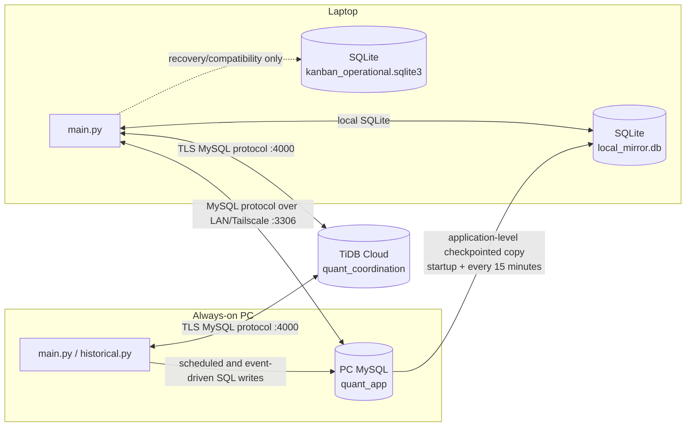

# Database Tables and DB-Only Architecture

Last verified: **2026-08-22**

This document describes only the SQL databases used by the project:

- MySQL on the always-on PC;
- SQLite on the laptop/workspace device;
- TiDB Cloud;
- the direction and timing of database updates and communication.

JSON state, log files, broker/provider internals, Git synchronization, and UI
architecture are outside this document except where a database workflow needs
one short boundary note.

The coordination tables persist the command/order generations required by the
strict passive-entry and cancel-then-replace lifecycle; database authority does
not itself authorize a broker mutation. See
[Current Order Logic](current_order_logic.md).

The inventory below was checked against both the current table definitions and
a read-only inspection of the configured PC MySQL database, the configured TiDB
database, and the two SQLite files in `data/`. No schema or row was changed by
that inspection.

## 1. Database roles and authority

| Store | Default location/configuration | Primary role | Authority |
| --- | --- | --- | --- |
| PC MySQL | `MYSQL_*`; normally database `quant_app` on port `3306` | Shared daily/hourly/intraday history and derived market-data cache | Canonical **market-data** store |
| Laptop market mirror | `data/local_mirror.db` | Offline SQLite copy of selected PC market tables; can also receive laptop-only intraday/fallback refreshes | Read fallback, not a peer market-data authority |
| Local operational SQLite | `data/kanban_operational.sqlite3`, overridable with `OPERATIONAL_DB_PATH` | Per-device recovery/compatibility store for Kanban data | Not the shared authority in a real application window |
| TiDB Cloud | `COORD_DB_*`; normally database `quant_coordination` on port `4000` | Small shared execution, ownership, command, order, readiness, and alert store | Canonical **coordination/execution** store when configured |

Two routing decisions are deliberately independent:

1. **Market-data route:** use PC MySQL when reachable; otherwise use the
   laptop market mirror; otherwise market-cache features have no database.
2. **Coordination route:** use TiDB whenever `COORD_DB_*` is configured. If it
   is configured but unreachable, coordination fails closed. If TiDB is not
   configured, PC MySQL is the legacy shared coordination fallback.

The local operational SQLite database is not silently selected as shared
authority by a normal PC or laptop application window. That prevents two
disconnected devices from becoming independent writable execution authorities.

## 2. DB-only architecture

Important boundaries:

- There is **no database replication link** between PC MySQL and TiDB.
- There is **no market-data copy into TiDB**.
- The PC-to-laptop mirror is implemented by application SQL reads and SQLite
  upserts, not by MySQL replication.
- One-second quote, ORB, and stop calculations remain local and do not write to
  TiDB every second. Only durable state changes are persisted.

## 3. Read-only deployed-schema snapshot

The current inspection found:

| Database | Tables currently present | Notes |
| --- | ---: | --- |
| PC MySQL | 28 | 11 market-data tables plus 17 legacy/shared coordination tables |
| Laptop market mirror | 13 | 11 market-data tables plus 2 mirror-control tables |
| Laptop local operational SQLite | 15 | Local copies of 15 coordination table types; not current shared authority |
| TiDB Cloud | 18 | Complete current coordination schema |

Table presence does not decide authority. In particular, the coordination
tables still present in PC MySQL are legacy/deployment history while TiDB is
configured.

### 3.1 Market and mirror tables currently present

| Table | PC MySQL | Laptop market mirror | TiDB | Local operational SQLite |
| --- | :---: | :---: | :---: | :---: |
| `price_history` | Yes | Yes | No | No |
| `hourly_price_history` | Yes | Yes | No | No |
| `intraday_price_history` | Yes | Yes | No | No |
| `symbol_refresh_failures` | Yes | Yes | No | No |
| `chart_indicators` | Yes | Yes | No | No |
| `chart_indicator_manifests` | Yes | Yes | No | No |
| `scanner_metrics` | Yes | Yes | No | No |
| `scanner_metric_snapshots` | Yes | Yes | No | No |
| `stock_profiles` | Yes | Yes | No | No |
| `earnings_events` | Yes | Yes | No | No |
| `fundamental_sync_state` | Yes | Yes | No | No |
| `local_mirror_handoff_state` | No | Yes | No | No |
| `local_mirror_sync_state` | No | Yes | No | No |

The current code also defines `market_pulse_instruments` and
`market_pulse_snapshots`. They are created on demand/at a schema-ensuring MySQL
initialization, but neither was present in the inspected PC database nor the
laptop mirror at the time of verification.

### 3.2 Coordination tables currently present

| Table | PC MySQL | Laptop market mirror | TiDB | Local operational SQLite |
| --- | :---: | :---: | :---: | :---: |
| `app_state_sync` | Yes | No | Yes | Yes |
| `operator_control_audit` | Yes | No | Yes | No |
| `live_trading_control_audit` | No | No | Yes | No |
| `trade_cards` | Yes | No | Yes | Yes |
| `execution_ownership` | Yes | No | Yes | Yes |
| `operator_commands` | Yes | No | Yes | No |
| `runtime_device_state` | Yes | No | Yes | Yes |
| `app_runtime_status` | Yes | No | Yes | Yes |
| `execution_commands` | Yes | No | Yes | Yes |
| `execution_orders` | Yes | No | Yes | Yes |
| `capital_reservations` | Yes | No | Yes | Yes |
| `discovered_external_orders` | Yes | No | Yes | Yes |
| `emergency_journal_reconciliation` | Yes | No | Yes | Yes |
| `external_alert_incidents` | Yes | No | Yes | Yes |
| `external_alert_delivery_attempts` | Yes | No | Yes | Yes |
| `external_alert_spool_imports` | Yes | No | Yes | Yes |
| `application_heartbeat_attempts` | Yes | No | Yes | Yes |
| `execution_schema_migration` | Yes | No | Yes | Yes |

## 4. Market-data table catalog

These tables are defined in
`src/infrastructure/database/schema.py`. PC MySQL is normally authoritative.

| Table | Primary key / row grain | What it stores | Normal update path |
| --- | --- | --- | --- |
| `price_history` | `(symbol, date, interval)` | Daily OHLCV/adjusted-close history; normally `interval='1d'` | Scheduled/manual 1D history refresh, chart fallback, and Market Pulse raw-bar refresh; upserted in batches |
| `hourly_price_history` | `(symbol, timestamp, source)` | One-hour OHLCV history by provider | Scheduled/manual 1H refresh; routine rolling window or explicit longer backfill |
| `intraday_price_history` | `(symbol, timestamp, interval, source)` | Short-lived 1-minute/5-minute OHLCV cache | UI/background intraday workers write to the currently active market engine and prune data older than seven days |
| `symbol_refresh_failures` | `(symbol, interval)` | Consecutive stale/failure count and last attempt | Updated after 1D/1H refresh outcomes; used to quarantine chronically unavailable symbols from automatic freshness gating |
| `chart_indicators` | `(symbol, date)` | Relative-strength, RS averages/scores, TI65 values, and chart flags | Rebuilt after relevant daily history changes or an explicit forced derived refresh |
| `chart_indicator_manifests` | `symbol` | Source/reference row counts, latest dates, cache version, completion time | Replaced when a symbol's chart-indicator build completes; used to detect stale derived data |
| `scanner_metrics` | `(symbol, date)` | Price, volume, ADR/ATR, returns, trend, breakout, extension, RS, and final scanner score fields | Recomputed from daily history after input changes |
| `scanner_metric_snapshots` | `snapshot_date` | Input fingerprint, metric count, and completion timestamp for a scanner build | Written only after a complete scanner-metric snapshot |
| `stock_profiles` | `symbol` | Company name, provider symbol, exchange, country, sector, industry, and profile-cache status | Seeded during schema setup and progressively enriched during 1D/fundamental refreshes |
| `earnings_events` | `(symbol, event_key)` | Report date/timing, EPS, revenue, surprise, growth, and event status | Upcoming calendar and historical earnings enrichment during the 1D pipeline |
| `fundamental_sync_state` | `(symbol, dataset)` | Positive/negative cache state, provider, fingerprint, last error, and check/success times | Updated whenever profile or earnings provider work succeeds, fails, or returns an empty result |
| `market_pulse_instruments` | `id`; unique `(section, ticker)` | Configured ETF proxies, labels, order, and active flag | Upserted from `config/market_pulse_instruments.json` when Market Pulse refresh runs |
| `market_pulse_snapshots` | `id`; unique `(instrument_id, as_of_date)` | Daily/weekly/monthly returns, 52-week position, status, and refresh source | Upserted by a user-triggered Market Pulse refresh; there is no polling loop |

### 4.1 Laptop mirror-control tables

| Table | Primary key | Purpose | Update path |
| --- | --- | --- | --- |
| `local_mirror_sync_state` | `(table_name, scope_hash)` | Last PC row count, max revision, hourly-symbol scope, and successful sync time | Updated after a successful checkpointed PC-to-laptop copy |
| `local_mirror_handoff_state` | `id` | Single dirty/clean flag proving whether mirrored tables changed after reconciliation | SQLite triggers mark it dirty after mirrored-table inserts/updates/deletes; guarded reconciliation marks it clean |

The normal mirrored set is:

- `price_history`
- `hourly_price_history`
- `chart_indicators`
- `chart_indicator_manifests`
- `scanner_metrics`
- `scanner_metric_snapshots`
- `symbol_refresh_failures`
- `stock_profiles`
- `earnings_events`
- `fundamental_sync_state`

`intraday_price_history` is deliberately not copied from PC MySQL. It can be
created and refreshed locally when the laptop is the active market-data engine.
The Market Pulse tables are also outside the normal mirror set.

## 5. Coordination/execution table catalog

The same SQLAlchemy definitions work on TiDB/MySQL and SQLite. TiDB startup
provisions all 18 tables through `ensure_coordination_schema()`.

| Table | Primary/unique key | What it stores | When it changes |
| --- | --- | --- | --- |
| `app_state_sync` | `state_key` | Versioned shared payloads for `watchlist`, `buylist`, `trade_plans`, `execution_queue`, `__main_device__`, `__operator_control__`, and `__live_trading_control__` | Atomic plan publish, owner/control changes, and explicit control actions; display/revision reads follow typed change tokens with an hourly recovery fallback |
| `operator_control_audit` | `revision` | Previous/new operator device, lock state, actor, and timestamp | Appended whenever Operator Control changes |
| `live_trading_control_audit` | `revision` | Previous/new live-trading enabled state, actor, and timestamp | Appended whenever the shared live-trading switch changes |
| `trade_cards` | `id`; unique `(environment, account_no, symbol)` | Canonical Kanban card status, versioned JSON payload, and update time | Written for durable plan/lifecycle/order/stop/warning changes; price-only display changes stay in memory |
| `execution_ownership` | `id`; unique `(environment, account_no, symbol)` | Per-symbol owner, strategy instance, assigning actor, and version | Assignment/adoption/handoff and ownership changes; also read at broker safety boundaries |
| `operator_commands` | `command_id`; unique `idempotency_key` | Manual command request, payload, requester/executor, lifecycle timestamps, broker ID, and before/after hashes | Inserted immediately by the authorized operator; claimed and advanced by the Execution Owner |
| `runtime_device_state` | `device_id` | Host/device readiness state, schema version, handoff generation/confirmation, details, and heartbeat time | Full write on readiness changes; stable heartbeat every 240 seconds per running device, with a 300-second freshness fence |
| `app_runtime_status` | `(hostname, process_name)` | Legacy/fallback PID and process lifecycle status | Lifecycle/fallback updates only while the guarded runtime's canonical `runtime_device_state` heartbeat is absent |
| `execution_commands` | `id`; unique `idempotency_key` | Low-level broker command journal, lease proof, target order, status, redacted response, and response hash | Recorded immediately before/around broker mutation and updated with the response/outcome |
| `execution_orders` | `id`; unique client/broker identity keys | Canonical order identity, status, origin, recovery state, version, payload, and timestamp | Immediate identity/status/fill/recovery changes; unchanged working-order audit rewrites are coalesced |
| `capital_reservations` | `reservation_id` | Requested/remaining notional, status, version, release and absence evidence | Reserve/release/reconciliation events using versioned conditional writes |
| `discovered_external_orders` | `id`; unique external/broker identity keys | Broker orders not originally known to the application, disposition, payload, and version | Inserted/updated during broker reconciliation and adoption/rejection handling |
| `emergency_journal_reconciliation` | `id`; unique journal sequence/idempotency keys | Proof that a locally recorded emergency request/outcome was folded into canonical state | Appended after the coordination database recovers and emergency evidence is reconciled |
| `external_alert_incidents` | `incident_id`; unique `(alert_type, dedupe_key)` | Deduplicated alert state, occurrence/attempt counts, escalation, acknowledgement, and retry timing | Created or version-updated on alert occurrence, retry, escalation, or acknowledgement |
| `external_alert_delivery_attempts` | `id`; unique `(incident_id, attempt_number)` | Per-attempt delivery status, provider ID, error, and escalation level | Appended for delivery attempts; a successful unacknowledged incident is reminded every six hours rather than every five minutes |
| `external_alert_spool_imports` | `pending_event_id` | Idempotency record connecting an imported offline alert event to its incident | Inserted when an outage-spooled alert is imported after database recovery |
| `application_heartbeat_attempts` | `id` | Compact audit evidence for external watchdog delivery | Failures and transitions are recorded immediately; successful evidence is compacted to roughly one row per hour while the webhook receives a five-second pulse |
| `execution_schema_migration` | `singleton_id` | Source/target schema versions, migration phase, backup/checksum, cutover lease, reconciliation flag, error, and version | Updated only during guarded execution-schema migration, cutover, reconciliation, or rollback |

## 6. How and when each database is updated

### 6.1 PC MySQL

The PC morning routine calls `scripts/run_daily_refresh.py` after the scheduled
PC wake. The current documented schedule starts at approximately **08:00 KST**.
The script checks every scheduled symbol rather than relying on one global
maximum date.

The update order is:

1. Refresh stale 1D rows into `price_history` using a one-year request window.
2. Rebuild stale `chart_indicators` and their manifests.
3. Rebuild stale `scanner_metrics` and write a completed snapshot row.
4. Enrich `stock_profiles`, `earnings_events`, and
   `fundamental_sync_state`.
5. Refresh stale 1H rows into `hourly_price_history` using the normal rolling
   window; an explicit backfill uses a longer window.
6. Record success/failure streaks in `symbol_refresh_failures`.

The same 1D and 1H workflows can be launched manually from the application.
Intraday rows are updated on demand by intraday workers and pruned to seven
days. Market Pulse tables update only when the user requests a Market Pulse
refresh.

When TiDB is not configured, the application also creates/uses coordination
tables in PC MySQL as the legacy shared execution store. When TiDB is
configured, those physically present PC tables are not the selected authority.

### 6.2 Laptop market mirror

Normal update direction is **PC MySQL to laptop SQLite**:

- immediately after startup when PC MySQL is reachable;
- after PC database recovery/reconnection;
- when the PC `main.py` heartbeat changes from unavailable to active;
- every **15 minutes** while the dashboard is connected to PC MySQL;
- manually through `scripts/sync_local_mirror_from_pc.py`.

The normal copy is checkpointed and incremental. It first compares saved row
counts and revision watermarks. If something changed, it copies changed rows or
affected partitions and records a new checkpoint. PC values win conflicts.

If PC MySQL is unavailable, the laptop reads from this SQLite file. A user may
allow the historical refresh process to fetch and write fresh 1D/1H data
directly to the laptop mirror. Intraday workers also write directly to it while
it is the active market engine.

Laptop-to-PC promotion is **not** part of normal synchronization. The explicit
maintenance reconciliation helper can insert only missing, validated raw daily
or hourly keys into PC MySQL; it never overwrites an existing PC key, never
promotes derived tables, then rebuilds PC-derived data and exact-copies the PC
result back to the laptop.

### 6.3 TiDB Cloud

Both running devices connect directly to the same TiDB SQL database over TLS.
There is no PC relay. The principal steady-state database cadences are:

| Coordination activity | Database cadence |
| --- | ---: |
| Operator-command pickup during the regular session | Typed `operator_commands` token; 20-second legacy or 3600-second pulse fallback |
| Lease proof | Typed `app_state_sync` token and every broker mutation; 20-second legacy or 3600-second pulse fallback |
| Protective ownership proof | 30 seconds while positions exist; one bulk read |
| Runtime-readiness heartbeat | 240 seconds per running device; stale after 300 seconds by default |
| `main.py` process heartbeat | Folded into runtime readiness; `app_runtime_status` is a legacy fallback |
| External watchdog pulse | 5 seconds over HTTPS; no TiDB request per pulse |
| Alert queue check | 90 seconds; successful external heartbeat audit compacted to about 1 hour |
| Active/standby card revision check | Typed `trade_cards` token; 180/300-second legacy or 3600-second pulse fallback |
| Buy Board and planning/control display synchronization | Matching typed token; 3600-second pulse fallback |
| Operator-command pickup | Typed command token; legacy 20 seconds in-session/300 seconds off-hours |
| Writable probe fallback | 180 seconds; normally satisfied by the readiness write |
| Account-reconciliation relational comparison refresh | Relevant DML token; 900-second fallback without token delivery |

Event-driven writes do not wait for these timers. Plan publication, control
changes, owner activation/handoff, command insertion/claim, order status/fill
changes, reservations, reconciliation evidence, and alerts are committed when
the event happens.

The local one-second trading loop performs no unconditional one-second TiDB
write. A TradeCard is persisted only when a durable decision changes.
Listener protocol v3 attaches affected table names to its non-secret event ID,
so unrelated consumers remain asleep. A protocol-v2 event remains supported
as a conservative broad invalidation during rolling deployment.

### 6.4 Local operational SQLite

The file is opened on each device and can seed `trade_cards` from recovery
material. Repository table definitions are SQLite-compatible, which is useful
for recovery, migrations, and tests. In a normal real application window,
however, shared ownership and execution state route to TiDB or the legacy PC
MySQL store, not to this private file. It is therefore not synchronized between
the PC and laptop and must not be treated as a third coordination authority.

## 7. Communication paths

| From | To | Transport | Direction and data | Timing |
| --- | --- | --- | --- | --- |
| Laptop application | PC MySQL | MySQL/PyMySQL over TCP `3306`, normally through LAN or Tailscale | Shared market reads; legacy coordination reads/writes only if TiDB is not configured | On demand plus connection/status probes |
| PC refresh/application processes | PC MySQL | Local/host MySQL connection | Market-data batch upserts and reads | Scheduled morning refresh plus manual/event-driven work |
| PC MySQL | Laptop market mirror | Application SQL reads followed by SQLite transactions | Selected market tables, PC-authoritative | Startup/recovery and every 15 minutes |
| Laptop application | Laptop SQLite files | Local SQLite connection with WAL | Offline market reads/writes; private operational recovery access | On demand |
| Laptop application | TiDB Cloud | TLS-authenticated MySQL/PyMySQL, normally port `4000` | Shared coordination reads/writes | Immediate events plus bounded polling/heartbeats |
| PC application | TiDB Cloud | Same TLS SQL connection | Same coordination authority as laptop | Immediate events plus bounded polling/heartbeats |

There is no SQL communication path from TiDB to the laptop mirror and no SQL
communication path from TiDB to the PC market-data tables.

## 8. Failure and recovery behavior

| Failure | Market-data behavior | Coordination behavior |
| --- | --- | --- |
| PC MySQL offline; TiDB online | Laptop switches to `local_mirror.db`; PC market history is unavailable until reconnect | TiDB ownership, commands, cards, orders, and ordinary execution remain available |
| TiDB offline while configured; PC MySQL online | PC market data remains usable | No fallback to PC coordination tables or private SQLite; ordinary coordination/execution mutations fail closed |
| PC MySQL and TiDB both offline | Laptop can still display/use its market mirror | Ordinary shared mutations remain closed |
| PC MySQL recovers | Application switches market reads to PC after a successful connection check and updates the laptop mirror in the background | No change when TiDB is the coordination authority |
| TiDB recovers | No market-data change | Emergency/reconciliation evidence is folded into canonical tables and full broker reconciliation is required before ordinary execution reopens |

## 9. Schema ownership in the code

| Concern | Main code owner |
| --- | --- |
| Market table definitions | `src/infrastructure/database/schema.py` |
| PC MySQL engine and market schema initialization | `src/infrastructure/database/engine.py` |
| Laptop mirror engine, table set, and routing | `src/infrastructure/database/mirror_engine.py` |
| PC-to-laptop mirror copy/checkpoints | `src/infrastructure/database/mirror_copy.py` |
| Explicit guarded reconciliation | `src/infrastructure/database/mirror_reconciliation.py` |
| TiDB TLS engine | `src/infrastructure/database/coordination_engine.py` |
| TiDB coordination schema provisioning | `src/services/coordination_schema.py` |
| Local operational SQLite engine | `src/infrastructure/database/operational_engine.py` |
| Individual coordination table definitions | Repository modules under `src/services/` |
| Scheduled historical refresh | `scripts/run_daily_refresh.py` and `historical.py` |
