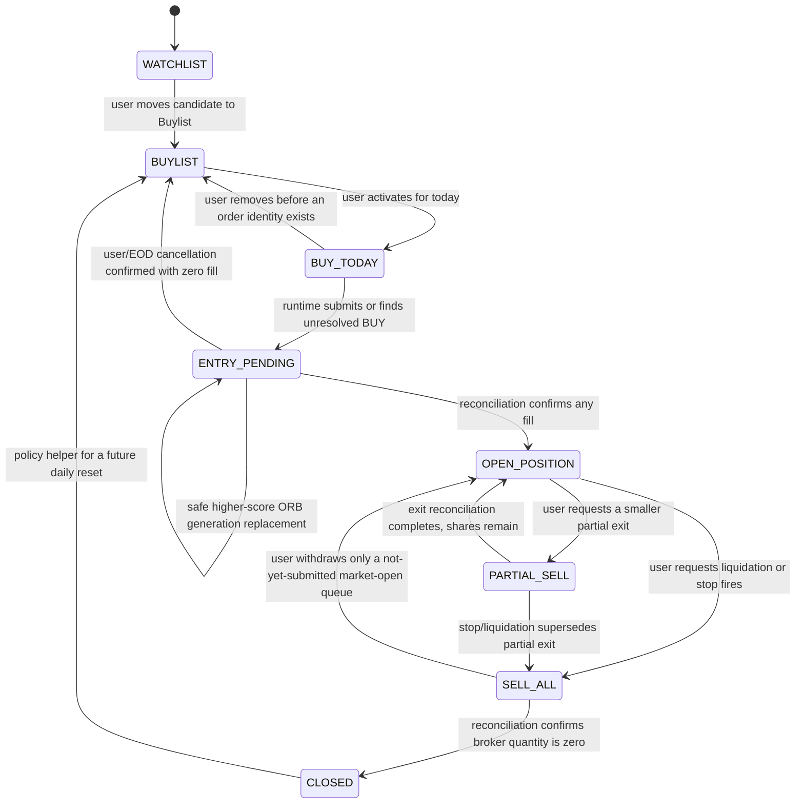
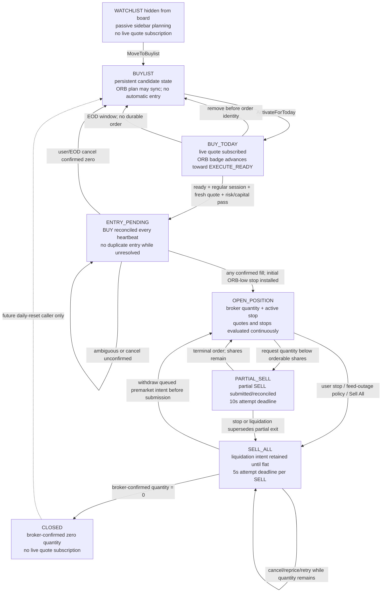
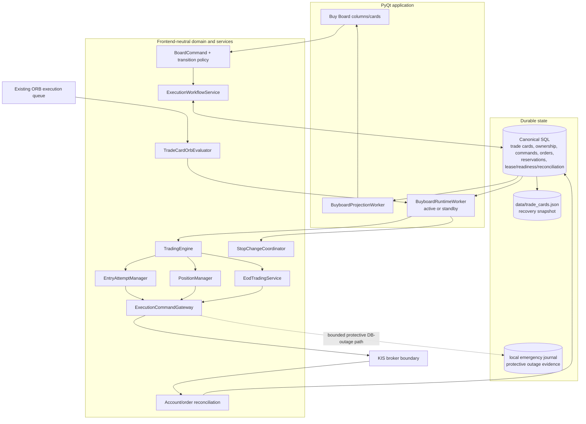

# Kanban Buy Board: Logic Flow and Architecture

This document explains the implemented Kanban Buy Board: what a card represents, how cards move, how a UI request becomes durable intent, how the background runtime reaches the broker, and which boundaries keep the workflow fail-closed.

For the application-wide maintenance map, see [PROJECT_ARCHITECTURE.md](../PROJECT_ARCHITECTURE.md). For the exact implemented entry and replacement rules, see [Current Order Logic](current_order_logic.md). For exhaustive rollout invariants and production evidence requirements, see [kanban_production_readiness.md](kanban_production_readiness.md).

## Design Summary

The Buy Board is a projection of durable domain and broker state. It is not an independent order-entry client.

The central rules are:

1. One production `(environment, account_no, symbol)` has at most one `TradeCardState`.
2. `board_status` alone selects the visible column. Entry, order, position, stop, retry, ownership, and warning state remain separate fields.
3. Drag/drop and context-menu actions create typed, revision-fenced commands. They do not call KIS and do not optimistically relocate widgets.
4. `ExecutionWorkflowService` validates and persists the request. The UI then reloads a read-only projection.
5. `BuyboardRuntimeWorker` consumes durable intent only when its action-specific readiness checks pass.
6. Every Kanban submit/cancel/replace crosses `ExecutionCommandGateway` with source `KANBAN_BOARD` and a matching durable execution owner.
7. Broker acceptance is not a fill. Reconciliation is the only authority for filled quantities, position facts, and broker-confirmed terminal columns.

## Card State Model

`src/core/trade_card_state.py` defines the aggregate. Its identity is:

```text
PROD : account_no : symbol
```

The model currently rejects non-production trade cards. The SQL repository also enforces a unique constraint on `(environment, account_no, symbol)`.

The aggregate deliberately separates these concerns:

| State group | Examples | Purpose |
|---|---|---|
| Visible lifecycle | `board_status`, `previous_board_status`, memberships | Chooses the Kanban column and return behavior |
| Entry plan | breakout, ORB window/high/low, trigger, risk, planned quantity | Stores the existing execution queue's selected ORB plan |
| Entry runtime | forming/armed/ready/pending badges, attempt IDs, retry time, cancel state | Drives and recovers entry attempts without inventing extra columns |
| Broker position | broker/orderable quantity, average price, remaining target | Holds reconciled broker truth |
| Stop protection | active and pending stop type/price/quantity | Separates requested protection from protection installed in the live feed |
| Exit runtime | partial quantity, sell-all flags, exit IDs, retries, cancel state | Tracks durable liquidation intent and working exit attempts |
| Safety/correlation | capital reservation, market-data outage facts, warnings | Preserves cross-service evidence and operator-visible failures |
| Concurrency | `version`, ownership revision, readiness generation | Rejects stale UI and cross-device actions |

`EntryRuntimeStatus` and `PositionRuntimeStatus` are badges/substates; they never choose a column.

## Operator-facing and hidden lifecycle

The board renders six columns in this order:

1. Buylist
2. Buy Today
3. Entry Pending
4. Open Positions
5. Partial Sell
6. Sell All

There is no dedicated Watchlist tab or Watchlist board column. `WATCHLIST`
remains a real, hidden, non-executable planning stage exposed through the stock
sidebar, Scanner, and TradingView actions. `CLOSED` is also durable but hidden;
closed trades belong to history/reporting rather than the live execution view.
Neither hidden value receives live quote monitoring.

The implemented lifecycle is:



`ENTRY_PENDING` is a visible system-only drop target. `CLOSED` is reached only
from broker-confirmed flat state and is not rendered. A user cannot drag a
working entry back to Buylist; `CancelEntry` records a cancellation request and
waits for terminal broker evidence.

The graph in `src/core/kanban_transitions.py` protects user-facing transitions. Verified system actors such as reconciliation, `TradingEngine`, and `EodTradingService` may perform additional guarded transitions, including zero-fill cancellation back to Buylist.

The `CLOSED -> BUYLIST` arrow is currently policy, not an active scheduled transition. `restore_closed_card_membership()` returns `BUYLIST` when `return_to_buylist_after_close` is set, but the current production runtime does not call that helper. Until a daily-reset caller is wired, a closed card remains in `CLOSED`.

## Detailed Lifecycle: Heartbeats, Deadlines, and Expiry

This section describes the six visible columns plus the two hidden durable
states operationally. Defaults below come from `src/core/execution_config.py`
unless stated otherwise. Most timing values are loaded from environment
variables when the process starts, so the running deployment may differ from
the defaults shown here.

### What the heartbeat is

The **engine heartbeat** is one complete background runtime cycle. Its default delay is `ENGINE_HEARTBEAT_SECONDS=1` second. It is not a KIS broker heartbeat, not the three-second UI refresh, and not a guarantee that a cycle finishes every exact second.

The worker performs network and database work, records `last_heartbeat_at` after a successful cycle, and then sleeps for the configured interval. Consequently, effective start-to-start cadence is approximately:

```text
time spent reconciling/draining/evaluating/persisting + heartbeat delay
```

An active cycle does the following:

```mermaid
flowchart LR
    Load[Load canonical cards] --> Account[Refresh account/broker state when due]
    Account --> Reload[Reload reconciled cards]
    Reload --> Plan[Copy existing ORB queue plans]
    Plan --> Feed[Sync quote subscriptions and stop rules]
    Feed --> Drain[Drain execution-grade market events]
    Drain --> Quotes[Evaluate stops and entry-trigger events]
    Quotes --> Stages[Run ordered trading stages]
    Stages --> Rotate[Install changed stop rules and recheck detached events]
    Rotate --> Persist[Compare-and-swap changed cards]
    Persist --> Notify[Refresh board and emit critical alerts]
```



The ordered trading stages recover retryable entries, evaluate Buy Today entries, reconcile working entries, complete partial entries, submit/reconcile partial exits, process queued market-open sells, reconcile/retry Sell All, detect stale position data, and run end-of-day cleanup.

The worker runs the cycle in observation-only mode until startup reconciliation, lease, database, market-data, and device readiness are satisfied. A standby worker may keep projections and readiness current, but its read-only broker prevents mutation.

There are three other “heartbeat-like” cadences that should not be confused with the trading heartbeat:

- The Buy Board projection refreshes every **3 seconds** and after material runtime changes. This only redraws canonical state.
- The optional external watchdog publisher sends an application heartbeat every **30 seconds** by default. An external process, not this app, detects a missing watchdog heartbeat.
- The main window's liveness check normally trusts a cycle whose start is no older than **45 seconds**. Its fallback for workers without a cycle-start marker uses a **15-second** maximum completed-heartbeat age. These are health/suppression thresholds, not order expiries.

### Detailed lifecycle diagram



### Column-by-column behavior

| Column | How it is entered | What the heartbeat does | How it leaves | Lifetime / expiry behavior |
|---|---|---|---|---|
| `WATCHLIST` (hidden from board) | User adds a Scanner, sidebar, or TradingView candidate; a passive Buylist card may also be moved back here | Appears in the lightweight Watchlist sidebar. It never subscribes the symbol for execution quotes and cannot place an order. | The user explicitly moves it to Buylist. | No automatic expiry; membership persists and synchronizes until promoted or removed. |
| `BUYLIST` | User move, safe entry withdrawal, all-window ORB rejection, zero-fill user/EOD cancellation, migration | Does not subscribe the symbol for Buy Today execution and never attempts an entry. An automatic ORB rejection return displays a durable memo with each window's reason. | User activates it for today or explicitly removes it from the queue. | No automatic expiry. |
| `BUY_TODAY` | `ActivateForToday`, or an eligible routing/configuration retry | Subscribes live quotes, syncs account-matched current-session ORB candidates, latches a fresh trade strictly above both ORB high and breakout, and submits a passive limit only while last trade and ask remain above its execution price and every ownership/risk/capital/readiness gate passes. The same symbol cannot be active here in two accounts because the compatibility ORB queue is symbol-scoped. | Submission/duplicate/ambiguous result moves it to Entry Pending; a pre-identity user removal, ordinary definitive rejection, all-window ORB rejection, or EOD cleanup moves it to Buylist. `APBK0656` stays Buy Today for corrected-route retry. | Today's authorization ends in the EOD window, **60 seconds before regular close by default**. With no durable order it resets to Buylist. If a durable order exists, it becomes Entry Pending instead of being discarded. |
| `ENTRY_PENDING` | A submitted, duplicate, discovered, or ambiguous BUY identity | Reconciles the tracked entry every heartbeat, applies/protects fills, and blocks a second BUY while identity/status is unresolved. A completely unfilled `WORKING` order may upgrade to a later, strictly higher-scoring ORB only through confirmed cancel-then-replace with full pre/post-cancel revalidation. | Any fill moves the visible card to Open Position; confirmed zero-fill user/EOD cancel moves to Buylist; a successful replacement remains Entry Pending under the new generation. | New passive entry orders have **no 15-second auto-cancel/reprice deadline**. They remain pending until broker fill/cancel/expiry/rejection, safe replacement, or EOD cleanup; ambiguous state has no invented local expiry. |
| `OPEN_POSITION` | Any confirmed entry fill or broker holding discovery | Keeps broker quantity/orderable quantity reconciled, evaluates the active stop on execution-grade regular-session events, flags stale/outage data, and may retry an incomplete entry target while safe. | User requests Partial Sell/Sell All; stop or outage policy initiates Sell All; broker reconciliation can update lifecycle facts. | No position expiry. At EOD the engine stops trying to complete any remaining entry target, but the existing position and protection remain open. |
| `PARTIAL_SELL` | User requests a positive quantity below current orderable shares | Submits one partial SELL when no conflicting sell is working, reconciles it each heartbeat, and escalates to cancel after its attempt deadline. A stop cancels/supersedes the partial path before full liquidation. | Terminal reconciliation returns to Open Position with refreshed shares; stop/liquidation moves to Sell All. | Each partial-exit attempt has a **10-second** deadline. The deadline requests cancel; it does not assume completion. Rejected/error submissions wait **5 seconds** before retry. |
| `SELL_ALL` | User request, stop breach, data-outage policy, or escalation from Partial Sell | Cancels conflicting entry completion, refreshes sellable quantity, submits/reconciles SELL attempts, and continues cancel/reprice/retry until broker quantity is zero. | Broker-confirmed flat moves to Closed. A queued premarket Sell All can return to Open Position only before an execution identity/order exists. | Each Sell All attempt has a **5-second** deadline. Rejected/error submissions wait **5 seconds** before retry. There is no overall liquidation expiry; intent remains until flat or explicit operator resolution. |
| `CLOSED` | Reconciliation confirms broker quantity is zero | Records the flat/closed state and clears active stop, entry/exit correlation, exit-retry, and outage state. It is not subscribed for live quotes. | No active runtime transition. A policy helper can return eligible cards to Buylist once a future daily-reset caller is implemented. | No automatic expiry or deletion in the current runtime. |

### Timing and deadline reference

| Setting / check | Default | Operational meaning |
|---|---:|---|
| `ENGINE_HEARTBEAT_SECONDS` | 1 s | Delay after one runtime cycle; not a hard wall-clock scheduling guarantee |
| Buy Board projection refresh | 3 s | Read-only UI refresh; does not drive trading |
| `ENTRY_ATTEMPT_TTL_SECONDS` | 15 s | Legacy compatibility setting; new confirmed-breakout passive entries persist `attempt_deadline_at=None` and do not use it |
| `ENTRY_RETRY_COOLDOWN_SECONDS` | 3 s | Retry delay after a retryable pre-broker failure or KIS routing/configuration rejection such as `APBK0656` |
| `MAX_ENTRY_ATTEMPTS_PER_SYMBOL_PER_MINUTE` | 4 | Per-symbol entry-attempt cap; the fifth waits until the oldest attempt leaves the one-minute window |
| `PARTIAL_EXIT_ATTEMPT_TTL_SECONDS` | 10 s | Working partial SELL deadline before cancel escalation |
| `SELL_ALL_ATTEMPT_TTL_SECONDS` | 5 s | Working liquidation SELL deadline before cancel/reprice escalation |
| `EXIT_RETRY_COOLDOWN_SECONDS` | 5 s | Backoff after rejected/erroring partial or full-exit submission |
| `EXIT_CANCEL_CONFIRMATION_TIMEOUT_SECONDS` | 10 s | After this much unconfirmed cancel time, add `EXIT_CANCEL_STALLED` and raise a critical alert; still do not assume cancellation |
| `ACTIVE_ACCOUNT_REFRESH_SECONDS` | 5 s | Buying-power refresh cadence for an account with Buy Today/Entry Pending cards |
| `IDLE_ACCOUNT_REFRESH_SECONDS` | 20 s | Buying-power refresh cadence for other accounts |
| `FULL_RECONCILIATION_SECONDS` | 60 s | Maximum age before a full account position/order reconciliation is due |
| `EOD_ENTRY_CLEANUP_SECONDS_BEFORE_CLOSE` | 60 s | Start idempotent daily cleanup for Buy Today, Entry Pending, and incomplete entry targets |
| `BROKER_EVENT_STALE_SECONDS` | 3 s | Maximum broker-event age for live execution readiness |
| `LOCAL_RECEIVE_STALE_SECONDS` | 3 s | Maximum local-receive age for live execution readiness |
| `KIS_WS_SUBSCRIPTION_ACK_TIMEOUT_SECONDS` | 5 s | Subscription acknowledgement wait before the feed setup fails closed |
| `AMBIGUOUS_SUBMISSION_CANDIDATE_WINDOW_SECONDS` | 60 s | Maximum submission-time distance for matching an ambiguous local order to a broker candidate |
| `MIN_ABSENCE_CONFIRMATION_INTERVAL_SECONDS` | 60 s | Minimum separation between two complete broker snapshots before absence can become terminal/manual-intervention evidence |
| `MARKET_DATA_OUTAGE_GRACE_SECONDS` | 15 s | High-risk open-position outage grace before Sell All is initiated |
| `MARKET_DATA_OUTAGE_MAX_HOLD_SECONDS` | 120 s | Maximum default outage hold before Sell All, including initially low-risk outages |
| `EMERGENCY_LEASE_ALLOWANCE_SECONDS` | 30 s | Bounded age of the last canonical lease verification for eligible protective DB-outage mutations |
| External watchdog publish interval | 30 s | Application heartbeat sent to the configured out-of-process watchdog |

### What “expiry” does and does not mean

The implementation has no blanket “card expires after N seconds” rule. It does not use `board_status_updated_at` to time out a column. Hidden compatibility, Buylist, Open Position, and Closed cards persist until a command or reconciled fact changes them.

Where a lifecycle uses an order-attempt deadline, it is stored as
`attempt_deadline_at`. New passive entry generations deliberately store no
deadline; exit attempts still use their configured deadlines. Retry timing is
stored separately in `next_retry_at` or `next_exit_retry_at`; cancellation and
replacement tracking use explicit in-flight flags, generation identities, and
request timestamps. This separation survives restart and prevents a UI column
timestamp from being mistaken for broker evidence.

When an applicable exit/legacy attempt deadline passes:

1. The next eligible heartbeat requests cancellation exactly once.
2. The card/order remains unresolved while cancellation is in flight.
3. Later heartbeats keep reconciling broker truth.
4. Only broker-confirmed terminal evidence releases reservations and chooses retry, Buylist, Open Position, or Closed behavior.

An ambiguous submission, unknown broker identity, or unconfirmed cancellation has no forced local expiry. It stays fenced and visible until reconciliation or explicit operator action resolves it. This is intentional: inventing a timeout-based terminal state could duplicate an order or leave a real fill unprotected.

## UI Command Flow

### Gesture mapping

| UI action | Typed command | Durable effect |
|---|---|---|
| Drop into Buylist | `MoveToBuylist` or `CancelEntry` | Move when safe; otherwise request cancellation |
| Drop into Buy Today | `ActivateForToday` | Authorize today's entry monitoring |
| Draw/set a chart breakout | `SetBreakoutPrice(price)` | Create or revise the canonical Buylist target for the selected account; a premarket Buy Today revision clears old ORB geometry and must be rebuilt |
| Clear a chart breakout | `ClearBreakoutPrice` | Clear a passive target, or premarket remand a zero-evidence Buy Today card to Buylist while atomically removing executable entry fields |
| Drop queued Sell All into Open Positions | `CancelQueuedSellAll` | Withdraw a local premarket sell-at-open intent before submission |
| Drop into Partial Sell | `RequestPartialSell(quantity)` | Persist partial-exit intent; quantity at/above orderable shares becomes Sell All |
| Drop into Sell All | `RequestSellAll` | Persist liquidation intent; premarket requests may queue for market open |
| Context: Cancel Entry | `CancelEntry` | Remove local monitoring or request broker cancellation |
| Buy Today context: `ORB Combinations...` | None (read-only) | Show all 24 risk/window cases without changing selection or execution state |
| Buy Today context: `Refresh / Select ORB Plans...` | Premarket queue refresh/window lock, or no command in read-only mode | Review the three optimized candidates; only the verified Operator Control device may refresh or change selection before market open, and every device is read-only during the regular session |
| Context: ORB/breakeven/manual stop | `SetOrbStop`, `SetBreakevenStop`, `SetManualStop` | Persist a pending stop change; it is not active yet |
| Context: priority up/down | `ReorderCard` | Update `kanban_priority`; higher values render and compete first |
| Explicit external-order action | `AdoptExternalOrder` | Audited restricted adoption; never implied by drag/drop |

### Request sequence

Each draggable card carries the card version, ownership owner/version/strategy identity, and runtime readiness generation from the projection that rendered it.

```text
card gesture
  -> construct immutable BoardCommand
  -> ExecutionWorkflowService.request_board_action()
  -> reload card and reject a stale expected_card_version
  -> reject ambiguous/cancelling/external/unlinked order conflicts
  -> apply runtime and ownership fences required by the action
  -> lock current card and ownership rows in one transaction
  -> optionally transfer LEGACY -> KANBAN ownership for durable Kanban intent
  -> mutate domain intent and compare-and-swap the card version
  -> update the local recovery snapshot
  -> rebuild the UI from BoardCardProjection
```

The service makes no broker call in this sequence. If validation fails, the widget never moves; the board refreshes from canonical state and shows the rejection.

`SetBreakoutPrice` and `ClearBreakoutPrice` require verified Operator Control.
If market-session state cannot be determined, they fail closed. Passive Buylist
planning may be changed during the regular session because it is not executable;
a published Buy Today target is immutable from the open until the regular
session ends. Any entry order, reservation, cancellation, or broker-position
evidence also blocks target replacement or removal. The execution bridge
requires the queue target to match the canonical card exactly, so an older local
queue cannot restore a cleared target or execute after a target revision.

## Read Projection Flow

The UI refreshes asynchronously and periodically, and the runtime emits immediate refresh signals after material changes.

Before projection, `trade_card_bootstrap` creates only missing cards from already-loaded Watchlist/Buylist state. It never overwrites an existing Kanban lifecycle. While the runtime is not running, a fresh cached KIS account snapshot may update broker-derived holdings; once the runtime starts, normal account reconciliation becomes the sole broker-truth projector.

`ExecutionWorkflowService.list_board_projections()` combines:

- a copied `TradeCardState`;
- execution owner, ownership version, and strategy instance;
- readiness generation and account restrictions;
- linked active execution-order status;
- ambiguous/cancellation warnings;
- active unlinked owned orders; and
- active unowned external broker orders.

External or unlinked orders without a card remain visible as standalone, non-draggable audit rows. The account selector filters the visual projection without changing canonical data.

## Runtime Architecture



There is deliberately no `Board -> KIS` edge.

### Composition and threading

`src/services/buyboard_runtime.py` is the composition root. It injects the real gateway/broker, market data, capital repository, risk checks, order lookup/reconciliation callbacks, market calendar, execution lease, and durable pre-broker card persistence into broker-neutral services.

`src/ui/buyboard/runtime_worker.py` owns the background `QThread`. The main window starts it only when the engine flag is enabled, a canonical database engine exists, and a device role is known:

- The main device with a current execution lease can progress to `ACTIVE` and open its mutation gate.
- Other devices run as standby/read-only. Their broker is wrapped in `ReadOnlyBroker` even if higher-level code is invoked accidentally.
- Role changes stop and recompose the worker while retaining market-data handoff so an unacknowledged stop breach is not discarded.

### Cross-device operator commands

Execution ownership and human input ownership are independent. The Execution
Owner is the only runtime that may mutate canonical live state or reach KIS.
The Operator Control device may submit idempotent human requests, but never
applies them directly. During the regular session, Buy Today activation,
entry cancellation, partial/sell-all, and stop changes use the append-only
`operator_commands` table. A locked Operator Control rejects new inserts but
does not stop existing automatic execution or protection.

The Execution Owner claims and applies requests exactly once. Pending requests
may follow a safe owner transfer. A transfer is fenced while a request is
already accepted or later in its nonterminal lifecycle, so no executor change
can strand in-flight human intent. Pre-market **Publish Today's Plan** remains
a separate atomic four-document publish and is disabled during the regular
session. See [execution_operator_control.md](execution_operator_control.md)
for the operator workflow and troubleshooting checklist.

### Startup and readiness

Before mutation, the worker performs startup reconciliation for every discovered account. Its readiness value exposes independent facts:

- execution lease is current;
- startup reconciliation completed without account errors;
- the relevant account reconciliation is fresh and complete enough for the requested action;
- KIS WebSocket is connected;
- critical trade and quote subscriptions are acknowledged;
- critical quotes are fresh;
- the market-data accumulator is draining within budget;
- the canonical database is writable; and
- the device is active.

Readiness is action-specific. A new entry needs complete new-entry evidence, a known cancel needs evidence for that known order, and a protective exit needs complete holdings plus safe sell-exposure evidence. An unrelated account failure does not erase observation or automatically transfer ownership to the legacy engine.

### One runtime cycle

An active cycle performs this high-level sequence:

1. Load canonical cards, verified mutation budgets, and emergency ownership proofs.
2. If active, claim and apply queued operator commands, then reload canonical cards.
3. Refresh account/order state when due and persist reconciliation results.
4. Reload cards so subsequent decisions use the newest broker truth.
5. Copy the existing execution queue's ORB candidate into pre-entry cards; return conclusively rejected all-window plans to Buylist.
6. Select action-ready cards while continuing quote observation for every relevant position.
7. Synchronize quote subscriptions and stop rules.
8. Drain execution-grade market events; evaluate active stops, pending-stop handoff, and ready entries.
9. Run the trading heartbeat stages.
10. Rotate any newly changed stop rules and immediately evaluate detached events.
11. Persist changed cards with optimistic versions, acknowledge only durable stop breaches, emit board refreshes, and raise critical alerts.

The heartbeat stages are ordered:

```text
recover retryable entries
  -> evaluate Buy Today entries
  -> reconcile entry orders
  -> complete partially filled entries
  -> submit partial exits
  -> reconcile partial exits
  -> process queued market-open sells
  -> reconcile Sell All orders
  -> retry incomplete Sell All
  -> detect stale position quotes
  -> run EOD cleanup when due
```

Each stage isolates failures per card and the outer heartbeat isolates failures per stage, so one malformed symbol does not suppress protective work for every other card.

## Entry Logic

1. `ActivateForToday` moves a safe Buylist card to `BUY_TODAY` and records monitoring intent.
2. `TradeCardOrbEvaluator` copies complete current-session 1m/5m/30m queue candidates into the card. Candidate status maps to badges such as `ORB_FORMING`, `WAITING_BREAKOUT`, `ARMED`, `EXECUTE_READY`, or `RISK_INVALID`.
3. A candidate is executable only when `max(breakout_price, orb_low) < execution_price <= orb_high`; automatic plans use ORB high, while a compatible manual execution price is preserved exactly.
4. After that range closes, a fresh KIS trade strictly above `max(breakout_price, orb_high)` latches breakout confirmation. Automatic mode selects the highest-scoring crossed candidate; an equal score favors the earlier timeframe, and a manual window lock stays exact.
5. Once all three supported windows are present and terminal-invalid, a pre-identity card returns to Buylist, clears its live entry plan, releases its execution feed subscription, and records one rejection memo. Missing, unavailable, stale, or forming data cannot trigger this return.
6. Ready entries receive the highest new-entry subscription priority; armed/waiting-breakout entries rank next; still-forming Buy Today plans rank after them. Working orders, open positions, and protective exits always remain ahead of new entries.
7. The runtime submits during the regular session only while the execution-grade trade and ask are both fresh and strictly above the configured execution price. The resulting BUY limit is placed at that exact price below the current market; reaching the breakout does not mean fill.
8. Current account equity/buying power and the frozen planned quantity feed a fresh `PreTradeRiskDecision` matching the complete submitted order fingerprint.
9. Attempt group, attempt number, client order ID, parent intent, generation, and capital reservation correlation are persisted before crossing the broker boundary.
10. `EntryAttemptManager` serializes the symbol, applies capital and mutation-budget controls, and submits through the shared gateway without the legacy 15-second entry deadline.
11. Submitted, duplicate, or ambiguous outcomes move the card to `ENTRY_PENDING`; ambiguous state blocks resubmission until reconciled. An ordinary definitive rejection returns a zero-position card to Buylist. `APBK0656` keeps it in Buy Today under retry cooldown because the failure is routing/configuration, not strategy.
12. While Entry Pending, a later timeframe with the same score version and a strictly higher score may qualify only if the active order is `WORKING`, completely unfilled, unchanged in quantity, and every quote/risk/capital gate passes. The gateway persists the replace intent, cancels the old order, waits for authoritative zero-fill cancellation, revalidates, and only then submits one linked replacement generation.
13. Any old-order fill, rejected/uncertain cancellation, or failed post-cancel revalidation blocks the replacement. Restart recovery resumes only a proven post-cancel submit leg and never overlaps two BUY orders.
14. Reconciliation applies cumulative fill evidence. The first confirmed fill moves the card to `OPEN_POSITION`, freezes the filling generation's ORB facts, and installs its ORB-low protection. Remaining target quantity may continue only under the guarded entry-completion policy.
15. A broker-confirmed zero-fill user/EOD cancellation returns the card to `BUYLIST`. A cancellation request or local timeout alone never does.

See [Current Order Logic](current_order_logic.md) for formulas, examples, and
the complete replacement failure matrix.

## Position, Stop, and Exit Logic

### Stops

A stop menu action writes `pending_stop_*`. It does not immediately replace `active_stop_*`. `StopChangeCoordinator` locks the card while the runtime overlays the durable request, rotates the per-symbol feed rule, evaluates events detached from the old generation, and only then acknowledges the pending change as active.

Stop changes may tighten protection but cannot widen it below the current allowed minimum. The ORB-low action uses the frozen entry ORB low; breakeven includes the configured fee/slippage buffer; manual stops are validated against the minimum protective price.

### Partial Sell

`RequestPartialSell` is valid from `OPEN_POSITION`. A positive quantity smaller than broker-confirmed orderable shares moves the card to `PARTIAL_SELL` and persists the requested quantity. A quantity at or above orderable shares becomes `SELL_ALL`.

The runtime submits and reconciles the exit. If shares remain, the card returns to `OPEN_POSITION` with updated broker truth. A stop or liquidation request during a partial exit escalates to `SELL_ALL` without overlapping cancel and replacement calls.

### Sell All

`RequestSellAll` persists `exit_all_required`. Outside the regular session it may set `sell_all_at_market_open` and remain a withdrawable local queue until submission starts. During execution the runtime cancels conflicting entry work, refreshes orderable quantity, submits/reprices conservatively, and reconciles the result.

Only a broker-confirmed quantity of zero moves the card to `CLOSED`. A configured membership flag may return a closed card to Buylist during the next daily restore.

## Ownership, Concurrency, and Conflicts

### Execution ownership

Every account/symbol resolves to one owner:

- `LEGACY`: default when no durable assignment exists;
- `KANBAN`: requires a nonblank strategy instance ID; or
- `MANUAL`: application automation cannot claim it implicitly.

A durable Kanban intent may atomically claim a `LEGACY` symbol for `KANBAN_STRATEGY_INSTANCE_ID`. It cannot take `MANUAL` ownership or another Kanban strategy's assignment. The gateway rechecks ownership at the destructive boundary; UI checks alone are not trusted.

### Revision fences

Three revisions protect different races:

- Card `version` prevents a stale projection from overwriting newer card state.
- Ownership `version` and strategy identity prevent a stale frontend from acting after ownership transfer.
- Readiness `generation` prevents action based on an obsolete device/runtime readiness view.

The final card and ownership check occurs under one database transaction with row locking and a card compare-and-swap update.

### Conflict fences

Execution-affecting actions are rejected while any of these are unresolved:

- an ambiguous submission or ambiguous broker identity;
- an entry or exit cancellation in flight;
- a previous pending stop change;
- an active unowned external order;
- an active owned order not linked to the card; or
- an already working conflicting buy/sell lifecycle.

External adoption is explicit and audited. It does not silently make an order safe to cancel/replace or fabricate a missing card.

## Persistence and Recovery

Canonical SQL state is authoritative whenever reachable. The Kanban path uses row-oriented data for cards, execution ownership, commands, order records, reservations, discovered orders, reconciliation, leases, and runtime readiness.

Every successful standalone card write updates `data/trade_cards.json` using the application's atomic write and rolling `.bak` behavior. The snapshot is a recovery/migration tier, not a peer database and not normal runtime authority.

During a canonical-database outage, normal entry mutation is closed. The narrowly bounded emergency path permits only eligible protective work with a recently verified lease/ownership proof and durable local emergency-journal evidence. Recovery requires reconciliation before the canonical mutation gate reopens.

Strict runtime reads propagate database failure instead of converting it to an
empty TradeCard collection. If MySQL disappears between the write probe and a
cycle read, the worker preserves its last canonical card cache, marks the
gateway offline immediately, and stops database heartbeat/incident-table calls
until recovery. This keeps the cycle available for bounded protection rather
than spending it on repeated connection timeouts. Known-offline critical alerts
are fsynced to the local spool without retrying the database or waiting on a
webhook from the execution thread; the independent watchdog observes the
missing heartbeat, and the spool is imported after database recovery.

Execution ownership does not relocate the database. In the documented
two-machine deployment, Laptop-as-Execution-Owner still depends on MySQL hosted
by the PC. The local SQLite market-data mirror and TradeCard recovery snapshot
are intentionally not writable peer authorities. Continuous operation with
either trading device powered off requires an independent highly available
canonical MySQL deployment.

Shutdown is ordered: close command acceptance, flush journals, perform final read-only reconciliation, close market data, and persist the final device state. Failed shutdown preparation remains visible instead of pretending the runtime stopped cleanly.

## Activation and Operational Gates

The guarded board runtime defaults on so Kanban lifecycle monitoring and
protection remain available. `BUYBOARD_ENGINE_ENABLED` selects that runtime;
it does not satisfy or bypass any broker-mutation gate. Set
`KIS_LIVE_EXECUTION_MODE=DISABLED` to keep the engine running while all real
production submit/sell/cancel calls are rejected at the broker boundary.

Production mutation additionally depends on, among other configuration and runtime evidence:

- the administrative/session trading switch;
- `KIS_LIVE_EXECUTION_MODE`, persisted active Trade Cards, and the controlled-live notional limit when applicable;
- a nonblank `KANBAN_STRATEGY_INSTANCE_ID`;
- verified KIS WebSocket protocol manifest, symbol keys, and measured subscription capacity;
- verified submit/cancel/replace mutation budgets and spacing;
- fresh account balance/reconciliation evidence;
- active device role and current execution lease;
- writable canonical storage, with only the documented protective outage exception; and
- external critical-alert/heartbeat delivery for unattended operation.

Keep the engine available, but keep the live-execution envelope disabled until
the evidence and operational steps in
[kanban_production_readiness.md](kanban_production_readiness.md) and the
[controlled-live pilot runbook](controlled_live_pilot_runbook.md) are complete.

## Module Map

| Layer | Modules | Responsibility |
|---|---|---|
| UI | `src/ui/buyboard/board.py`, `columns.py`, `card.py`, `dialogs.py` | Render cards, collect user input, translate gestures |
| UI orchestration | `src/ui/buyboard/controller.py` | Async projection refresh and command dispatch |
| Runtime thread | `src/ui/buyboard/runtime_worker.py` | Startup/failover, readiness, reconciliation, feed drain, heartbeat, persistence, alerts |
| Domain | `src/core/trade_card_state.py`, `kanban_transitions.py`, `board_workflow.py` | Aggregate, pure transition rules, typed commands/projections |
| Workflow boundary | `src/services/execution_workflow_service.py` | Shared command validation, ownership claim/check, conflicts, durable intent |
| Runtime composition | `src/services/buyboard_runtime.py` | Inject real gateway, broker, market data, lease, risk, calendar, repositories |
| Trading decisions | `trading_engine.py`, `entry_attempt_manager.py`, `position_manager.py`, `eod_trading_service.py` | Entry, retry, reconciliation, stop/exit, EOD state machines |
| ORB adapter | `src/services/trade_card_orb_bridge.py` | Copy existing execution queue output into cards |
| Coordination | `src/services/stop_change_coordinator.py` | Atomic durable-stop-to-live-feed handoff |
| Persistence | `trade_card_repository.py`, execution/ownership/reservation/reconciliation repositories | Canonical state, optimistic concurrency, recovery snapshot |
| Broker boundary | `execution_command_gateway.py`, `execution_workflow_service.py`, `broker.py` | Ownership/lease/idempotency/mutation gates and KIS adapter isolation |

## Verification

Focused regression suites include:

```text
pytest tests/test_kanban_transitions.py -q
pytest tests/test_trade_card_state.py tests/test_trade_card_repository.py -q
pytest tests/test_buyboard_board.py tests/test_buyboard_controller.py -q
pytest tests/test_buyboard_runtime.py tests/test_buyboard_runtime_worker.py -q
pytest tests/test_ws13_kanban_workflow.py tests/test_ws13_legacy_kanban_parity.py -q
pytest tests/test_gate1_model_state_exploration.py -q
```

Run the full suite before changing lifecycle, risk, ownership, persistence, or broker-boundary behavior:

```text
pytest -q
```
