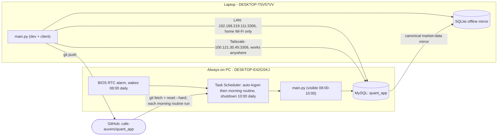

# Two-PC Data Sync: Always-On PC as the Data Server

Status: **built and verified working end-to-end**, including a real
BIOS-wake → auto-login → morning-routine → auto-shutdown cycle, and remote
access confirmed from a mobile hotspot (genuinely off the home network).

## Roles

- **Laptop** (`DESKTOP-T5V57VV`) — where development happens (edits,
  commits, `git push`). `main.py` normally reads from the shared database and
  keeps an offline SQLite market-data mirror in `data/local_mirror.db` for the
  periods when the PC cannot be reached.
- **Always-on PC** (`DESKTOP-E42GSKJ`) — never used for development. Two
  jobs only:
  1. Host the single shared MySQL database (`quant_app`) that both machines
     read from.
  2. Run `historical.py` on a schedule to keep that database's price
     history, hourly bars, chart indicators, and scanner metrics fresh.

There is exactly **one canonical database**, living on the PC. The laptop's
SQLite file is an offline market-data mirror rather than a peer database:
cross-machine application state, ownership, runtime heartbeats, and intraday
trading data continue to use only PC MySQL. Normal synchronization is PC to
laptop, and laptop market data is never promoted back to the PC. Startup and
reconnect wait only for a successful MySQL connection check, then use the PC
database immediately. The SQLite safety backup is disposable and updates in
the background; it never blocks PC routing. Full hourly backup is limited to
SPY and symbols in scanner results, watchlist, or buylist.

The normal dashboard backup is checkpointed and incremental. A successful
SQLite transaction records each table's PC row count, latest revision, and
hourly-symbol scope. Startup and the 15-minute timer first compare those small
signatures. An unchanged mirror is reported as already up to date without a
row scan. When data changed, only rows at or after the saved revision boundary
are replayed. A remaining count/revision mismatch (including a deletion or a
laptop-only row) uses SQL partition summaries and exact-copies only the
affected symbols/partitions. The older full-content verifier remains the
fallback for explicit integrity and handoff workflows; it is not the normal
dashboard restart path.

## Architecture



## Daily workflow (as actually configured)

```
08:00 KST  BIOS RTC alarm wakes the PC (day=0/daily, hour=08, minute=00)
           -> Windows auto-login (registry AutoAdminLogon)
           -> Task Scheduler "QuantApp_MorningRoutine" (AtLogOn trigger) runs pc_morning_routine.ps1:
                1. git fetch + reset --hard origin/master
                2. venv python -m pip install -r requirements.txt (keeps
                   dependencies in sync with the laptop, not just code)
                3. scripts/run_daily_refresh.py: checks every symbol and
                   both daily/1H tables against the dashboard's expected
                   latest NYSE trading date (including regular holidays),
                   then runs only stale historical.py modes; a multi-day gap
                   self-heals because historical.py refetches a wide window
                   (1y), not just "yesterday"
                4. launches main.py so the dashboard is visible if you check in
                5. launches pc_remote_control_listener.py for remote shutdown
10:00 KST  "Automatic-PC-Shutdown" waits for any live historical refresh,
           then shuts the PC down; after its configured wait limit it exits
           safely without killing a partial refresh
```

Note: the `AtLogOn` trigger fires on *any* logon, not only the scheduled
08:00 one -- a manual `Restart-Computer` at any time of day re-runs the same
morning routine as a side effect. Harmless (the freshness check behaves the
same regardless of when it runs), just worth knowing.

Live trading/monitoring is out of scope for this machine -- the PC is off
for the entire US trading session, so it can only ever refresh the prior
completed session's data, never watch positions in real time.

## What's built

- `scripts/pc_morning_routine.ps1` — the full chain above (git sync, pip
  sync, DB-freshness-gated refresh, launch `main.py`). Logs to
  `data/logs/pc_morning_routine.log`; `main.py`'s own stdout/stderr are
  captured separately to `data/logs/main_py_stdout.log` /
  `main_py_stderr.log`. The routine sets `QUANT_LOCAL_MIRROR_ENABLED=0` so a
  MySQL outage fails visibly on the authoritative PC instead of being masked
  by a machine-local fallback there.
- `scripts/run_daily_refresh.py` — the DB-freshness gate.
- `scripts/sync_local_mirror_from_pc.py` — repeatable PC-to-laptop mirror
  top-up and before/after report. The dashboard also runs this sync quietly
  in the background whenever it starts with PC MySQL available and the local
  mirror is clean. Dirty/local-only changes are sent through guarded recovery
  instead of being overwritten by the background copy.
- `scripts/setup_pc_autologin.ps1` — configures Windows `AutoAdminLogon`.
- `scripts/setup_pc_morning_task.ps1` — registers the `AtLogOn` Task
  Scheduler task.
- `scripts/setup_mysql_lan_access.ps1` — LAN firewall rule (scoped to
  `LocalSubnet`) + prints the `my.ini`/`GRANT` steps for the
  `quant_remote@192.168.219.%` account.
- `scripts/setup_mysql_tailscale_access.ps1` — firewall rule scoped to the
  Tailscale network adapter specifically (not a broad IP range) + prints the
  `GRANT` step for a second, Tailscale-IP-scoped account.
- `scripts/setup_pc_winrm_tailscale_access.ps1` (PC) /
  `scripts/setup_laptop_winrm_trust.ps1` (laptop) — one-time WinRM setup so
  the laptop can remotely tail logs (`scripts/tail_pc_log.ps1`) and, later,
  launch scripts on the PC. See "Remote log access" below.
- `scripts/Configure-AutomaticShutdown.ps1` — the 10:00 shutdown. Lives here
  (not only in the standalone `PC-Automation` folder) specifically so the
  PC's `git fetch`/`reset --hard` step can actually reach it.
- BIOS wake instructions — `PC-Automation/docs/BIOS-Startup-Instructions.md`.

## Remote access: LAN vs. Tailscale

Two independent paths reach the same database, each with its own firewall
rule and MySQL grant, so either works whenever it's relevant:

| Path | Address | Works when | Firewall scope |
|---|---|---|---|
| LAN | `192.168.219.111:3306` | Laptop on the same home Wi-Fi | `LocalSubnet` only |
| Tailscale | `100.121.30.45:3306` | Anywhere with internet | Tailscale adapter only |

[Tailscale](https://tailscale.com) creates a private encrypted network
("tailnet") between only the devices signed into the account
(`tonyhdkim@gmail.com`), giving each a stable `100.x.x.x` address regardless
of physical network. On the same LAN it typically routes directly (same
speed as the plain LAN path); off it, it tunnels through NAT/firewalls
automatically, without opening any port on the router or exposing MySQL to
the public internet. **Key expiry is disabled** on both machines in the
Tailscale admin console (default is 6 months, which would otherwise
silently break the connection).

`.env`'s `MYSQL_HOST` is set to the Tailscale address permanently (not
switched depending on location) -- confirmed working both on the home LAN
and from a mobile hotspot genuinely off the home network.

The dashboard reports three independent runtime signals. `PC: On` means
either MySQL or the listener responded; `DB` reports whether shared data is
usable; `Listener` reports remote-shutdown availability. Each running
`main.py` also writes a short heartbeat to MySQL, so the laptop can report the
database PC's `main.py` state even when the listener is stopped. A missing
heartbeat is `Unknown`; an explicit stop or a heartbeat older than 60 seconds
is `Off`.

## Remote log access from the laptop (WinRM over Tailscale)

Status: **scripted, not yet run** — `setup_pc_winrm_tailscale_access.ps1`
must be run once on the PC and `setup_laptop_winrm_trust.ps1` once on the
laptop before this works.

The PC's own logs (`quant_app.log`, `pc_morning_routine.log`,
`main_py_stdout.log`/`main_py_stderr.log`,
`pc_remote_control_listener.log`, all under `data/logs/`) only ever existed
on the PC's disk — nothing shipped them to the laptop. PowerShell Remoting
(WinRM) closes that gap using the same Tailscale trust already relied on
for MySQL and the remote-shutdown listener, scoped to the Tailscale adapter
the same way.

Setup (once):
1. On the PC (as Administrator): `.\scripts\setup_pc_winrm_tailscale_access.ps1`
   — enables WinRM, adds a firewall rule for TCP 5985 scoped to the
   Tailscale adapter only (mirrors the MySQL/remote-control Tailscale
   rules).
2. On the laptop (as Administrator): `.\scripts\setup_laptop_winrm_trust.ps1`
   — adds the PC's Tailscale IP to the laptop's WinRM `TrustedHosts` (NTLM
   auth, since the two machines aren't in a shared Windows domain).

Usage from the laptop:
```powershell
.\scripts\tail_pc_log.ps1                              # tails data\logs\quant_app.log
.\scripts\tail_pc_log.ps1 -LogName pc_morning_routine.log
```
Or directly, for anything beyond log tailing:
```powershell
$cred = Get-Credential DESKTOP-E42GSKJ\<pc-username>
Invoke-Command -ComputerName 100.121.30.45 -Credential $cred -ScriptBlock { ... }
```

WinRM traffic is plain HTTP (port 5985); that's acceptable here because
Tailscale already encrypts everything on that adapter (WireGuard) — same
trust model already used for MySQL over Tailscale in this project. Unlike
`pc_remote_control_listener.py`'s single-purpose token check, WinRM
authenticates with a real Windows account and then allows arbitrary
PowerShell execution as that user — a broader capability than the listener,
so treat that account's password with the same care as any other admin
credential. This same WinRM setup is also the intended path for launching
scripts on the PC from the laptop (a later step); nothing further needs to
be configured for that once these two setup scripts have been run.

## Known gotchas hit during setup (fixed, documented so they don't recur)

- **`zoneinfo.ZoneInfo(...)` needs the `tzdata` PyPI package on Windows** --
  the OS doesn't ship an IANA timezone database the way Linux/macOS do.
  Missing this crashed `main.py` on import (`US_MARKET_ZONE = ZoneInfo(...)`
  is a module-level constant) with no obvious error pointing at the cause.
  Added to `requirements.txt`.
- **`mplfinance>=0.12.0` in `requirements.txt` could never actually
  resolve** -- every real PyPI release past 0.12.0 is tagged as a
  pre-release (beta), which `pip install -r requirements.txt` excludes by
  default, so the *entire* install would silently fail (pip aborts the
  whole file if any one requirement can't resolve). It also turned out to
  be unused anywhere in `src/`, so it was removed rather than pinned.
- **A fresh venv's `python` isn't what `Get-Command python` resolves to
  inside a Task Scheduler process** -- packages installed into the venv
  aren't visible to a bare `python` call in a process that never activated
  it. `pc_morning_routine.ps1` explicitly targets `venv\Scripts\python.exe`.
- **MySQL's reserved word `interval`** needs backtick-quoting in raw SQL
  (`` `interval`='1d' ``) -- it's a column name in `price_history`, and
  unquoted it's parsed as the SQL `INTERVAL` keyword instead.

## How do I make sure the PC is running the latest code and dependencies?

**Via git** (`origin` -> `https://github.com/cafe-auvers/quant_app.git`) for
code, and `pip install -r requirements.txt` (also run automatically each
morning) for dependencies:

1. Develop and commit on the laptop as normal, `git push` when ready.
2. Every morning, `pc_morning_routine.ps1` does `git fetch origin` then
   `git reset --hard origin/master` on the PC's clone -- deliberately a hard
   reset, not a merge/pull, since the PC's clone is a deployment target
   (nobody edits code on it), so this guarantees an exact, reproducible copy
   of GitHub rather than risking a stuck merge conflict in an unattended run.
3. It then runs `pip install -r requirements.txt` against the venv, so a
   dependency added on the laptop (like `tzdata` above) shows up on the PC
   the very next morning too, not just code changes.
4. **Prerequisite**: non-interactive git auth on the PC (Git Credential
   Manager signed in once, cached via Windows Credential Manager) -- a
   scheduled task has no one there to answer a login prompt.

## What happens if the PC doesn't work one day?

- **The laptop's `main.py` doesn't crash.** It falls back to
  `data/local_mirror.db`, while keeping PC-only state synchronization and
  runtime coordination disabled. Scanner and chart cache reads continue to
  work from the mirror.
- **Staleness is explicit.** If the mirror is current through the latest
  completed market session, the dashboard uses it silently. If it is stale,
  the dashboard asks whether to refresh the laptop copy directly from Yahoo
  Finance; declining continues with the stale mirror.
- **Recovery is automatic once the PC is back.** `historical.py` pulls `1y`
  for daily data and the rolling D-10 window for hourly data, while
  `run_daily_refresh.py` checks every scheduled symbol in both tables rather
  than trusting one global latest date. Routine hourly gaps inside D-10
  self-heal on the next successful run; older hourly repairs use the explicit
  one-time D-200 script below.
- **Switching is connection-gated only.** Once `SELECT 1` succeeds, the status
  becomes green `DB: PC` and market-data reads use MySQL immediately. The app
  does not compare PC and laptop market tables before switching.
- **The active-PC safety copy is exact and atomic.** Full keys and values are
  compared for daily/derived data, including old corrections and PC-side
  removal of derived/operational rows. Hourly comparison is deliberately
  limited to relevant scanner/watchlist/buylist symbols. It runs in a worker
  after the dashboard is usable, is strictly PC-to-local, and treats MySQL as
  authoritative even when the laptop cache has local changes. Backup failure
  is logged and retried without changing active database routing.
- **Backup progress is visible.** The dashboard progress line identifies the
  current PC-read, laptop-update, or verification phase in plain language. It
  first checks the saved checkpoint. Unchanged data reports already up to date;
  changed data shows changed records processed out of total, percentage, and a
  rolling ETA. Closing requests a cooperative cancellation; if the atomic
  transaction is still rolling back, the close warning names the laptop safety
  backup and its current phase.
- **Root causes worth checking**: BIOS RTC alarm didn't fire (power/PSU
  prerequisites), Windows didn't auto-login, or a step in
  `pc_morning_routine.ps1` failed -- check `data/logs/pc_morning_routine.log`
  first, it logs every step's outcome.

## If I run `historical.py` (or `run_daily_refresh.py`) manually on the laptop, is that valid?

Yes. When PC MySQL is reachable, a manual run writes to the authoritative
tables there. When it is unreachable, `historical.py` and
`scripts/run_daily_refresh.py` resolve the local SQLite mirror instead and
refresh that copy. When the PC becomes reachable again, those laptop-only
daily or hourly bars are not uploaded to MySQL. The dashboard switches to the
PC immediately, and its background backup eventually replaces the laptop
cache with authoritative PC data. Prefer
`python scripts\run_daily_refresh.py` over
calling `historical.py` directly because it checks per-symbol freshness and
runs only the necessary modes.

## How do I run the one-time D-200 hourly repair?

Run this manually and directly on the PC that hosts MySQL:

```powershell
.\venv\Scripts\python.exe scripts\backfill_hourly_history_200d_once.py
```

The script verifies that the local Windows hostname matches the MySQL server
hostname, so a laptop connected to PC MySQL is rejected. It re-pulls 200 days
for the complete refresh universe and upserts the returned 1-hour bars. A
successful-completion marker under `data/` prevents accidental repeat runs;
`--force` is available only for a deliberate repair rerun. This script is not
called by `pc_morning_routine.ps1`.

Run `python scripts\sync_local_mirror_from_pc.py` while the PC is reachable
to force an immediate mirror top-up and print per-table row counts and
watermarks. The local database and its WAL/SHM sidecars are runtime data and
must not be committed.
