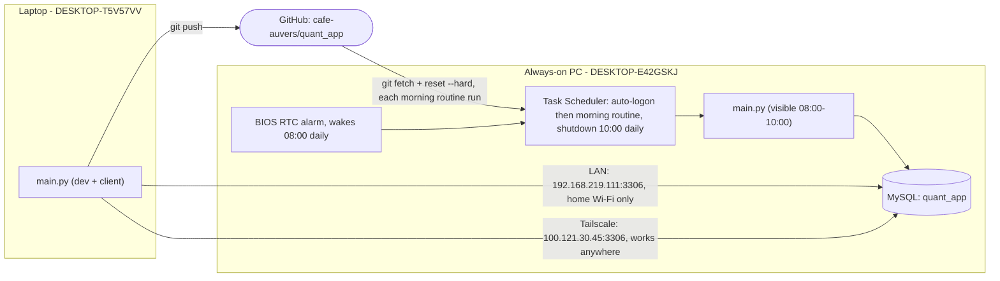

# Two-PC Data Sync: Always-On PC as the Data Server

Status: **built and verified working end-to-end**, including a real
BIOS-wake → auto-login → morning-routine → auto-shutdown cycle, and remote
access confirmed from a mobile hotspot (genuinely off the home network).

## Roles

- **Laptop** (`DESKTOP-T5V57VV`) — where development happens (edits,
  commits, `git push`). Also a normal client of the app: `main.py` runs here
  and reads from the shared database, same as it would run on the PC.
- **Always-on PC** (`DESKTOP-E42GSKJ`) — never used for development. Two
  jobs only:
  1. Host the single shared MySQL database (`quant_app`) that both machines
     read from.
  2. Run `historical.py` on a schedule to keep that database's price
     history, hourly bars, chart indicators, and scanner metrics fresh.

There is exactly **one** database, living only on the PC. The laptop does
not have its own local copy — its `.env` `MYSQL_HOST` points at the PC, so
"the data" and "the PC's data" are the same thing, always, regardless of
which network path is used to reach it (see below).

## Architecture



## Daily workflow (as actually configured)

```
08:00 KST  BIOS RTC alarm wakes the PC (day=0/daily, hour=08, minute=00)
           -> Windows auto-login (registry AutoAdminLogon)
           -> Task Scheduler "QuantApp_MorningRoutine" (AtLogOn trigger) runs pc_morning_routine.ps1:
                1. git fetch + reset --hard origin/master
                2. venv python -m pip install -r requirements.txt (keeps
                   dependencies in sync with the laptop, not just code)
                3. scripts/run_daily_refresh.py: checks every symbol and
                   both daily/1H tables against the dashboard's expected
                   latest NYSE trading date (including regular holidays),
                   then runs only stale historical.py modes; a multi-day gap
                   self-heals because historical.py refetches a wide window
                   (1y), not just "yesterday"
                4. launches main.py so the dashboard is visible if you check in
10:00 KST  "Automatic-PC-Shutdown" waits for any live historical refresh,
           then shuts the PC down; after its configured wait limit it exits
           safely without killing a partial refresh
```

Note: the `AtLogOn` trigger fires on *any* logon, not only the scheduled
08:00 one -- a manual `Restart-Computer` at any time of day re-runs the same
morning routine as a side effect. Harmless (the freshness check behaves the
same regardless of when it runs), just worth knowing.

Live trading/monitoring is out of scope for this machine -- the PC is off
for the entire US trading session, so it can only ever refresh the prior
completed session's data, never watch positions in real time.

## What's built

- `scripts/pc_morning_routine.ps1` — the full chain above (git sync, pip
  sync, DB-freshness-gated refresh, launch `main.py`). Logs to
  `data/logs/pc_morning_routine.log`; `main.py`'s own stdout/stderr are
  captured separately to `data/logs/main_py_stdout.log` /
  `main_py_stderr.log`.
- `scripts/run_daily_refresh.py` — the DB-freshness gate.
- `scripts/setup_pc_autologin.ps1` — configures Windows `AutoAdminLogon`.
- `scripts/setup_pc_morning_task.ps1` — registers the `AtLogOn` Task
  Scheduler task.
- `scripts/setup_mysql_lan_access.ps1` — LAN firewall rule (scoped to
  `LocalSubnet`) + prints the `my.ini`/`GRANT` steps for the
  `quant_remote@192.168.219.%` account.
- `scripts/setup_mysql_tailscale_access.ps1` — firewall rule scoped to the
  Tailscale network adapter specifically (not a broad IP range) + prints the
  `GRANT` step for a second, Tailscale-IP-scoped account.
- `scripts/Configure-AutomaticShutdown.ps1` — the 10:00 shutdown. Lives here
  (not only in the standalone `PC-Automation` folder) specifically so the
  PC's `git fetch`/`reset --hard` step can actually reach it.
- BIOS wake instructions — `PC-Automation/docs/BIOS-Startup-Instructions.md`.

## Remote access: LAN vs. Tailscale

Two independent paths reach the same database, each with its own firewall
rule and MySQL grant, so either works whenever it's relevant:

| Path | Address | Works when | Firewall scope |
|---|---|---|---|
| LAN | `192.168.219.111:3306` | Laptop on the same home Wi-Fi | `LocalSubnet` only |
| Tailscale | `100.121.30.45:3306` | Anywhere with internet | Tailscale adapter only |

[Tailscale](https://tailscale.com) creates a private encrypted network
("tailnet") between only the devices signed into the account
(`tonyhdkim@gmail.com`), giving each a stable `100.x.x.x` address regardless
of physical network. On the same LAN it typically routes directly (same
speed as the plain LAN path); off it, it tunnels through NAT/firewalls
automatically, without opening any port on the router or exposing MySQL to
the public internet. **Key expiry is disabled** on both machines in the
Tailscale admin console (default is 6 months, which would otherwise
silently break the connection).

`.env`'s `MYSQL_HOST` is set to the Tailscale address permanently (not
switched depending on location) -- confirmed working both on the home LAN
and from a mobile hotspot genuinely off the home network.

## Known gotchas hit during setup (fixed, documented so they don't recur)

- **`zoneinfo.ZoneInfo(...)` needs the `tzdata` PyPI package on Windows** --
  the OS doesn't ship an IANA timezone database the way Linux/macOS do.
  Missing this crashed `main.py` on import (`US_MARKET_ZONE = ZoneInfo(...)`
  is a module-level constant) with no obvious error pointing at the cause.
  Added to `requirements.txt`.
- **`mplfinance>=0.12.0` in `requirements.txt` could never actually
  resolve** -- every real PyPI release past 0.12.0 is tagged as a
  pre-release (beta), which `pip install -r requirements.txt` excludes by
  default, so the *entire* install would silently fail (pip aborts the
  whole file if any one requirement can't resolve). It also turned out to
  be unused anywhere in `src/`, so it was removed rather than pinned.
- **A fresh venv's `python` isn't what `Get-Command python` resolves to
  inside a Task Scheduler process** -- packages installed into the venv
  aren't visible to a bare `python` call in a process that never activated
  it. `pc_morning_routine.ps1` explicitly targets `venv\Scripts\python.exe`.
- **MySQL's reserved word `interval`** needs backtick-quoting in raw SQL
  (`` `interval`='1d' ``) -- it's a column name in `price_history`, and
  unquoted it's parsed as the SQL `INTERVAL` keyword instead.

## How do I make sure the PC is running the latest code and dependencies?

**Via git** (`origin` -> `https://github.com/cafe-auvers/quant_app.git`) for
code, and `pip install -r requirements.txt` (also run automatically each
morning) for dependencies:

1. Develop and commit on the laptop as normal, `git push` when ready.
2. Every morning, `pc_morning_routine.ps1` does `git fetch origin` then
   `git reset --hard origin/master` on the PC's clone -- deliberately a hard
   reset, not a merge/pull, since the PC's clone is a deployment target
   (nobody edits code on it), so this guarantees an exact, reproducible copy
   of GitHub rather than risking a stuck merge conflict in an unattended run.
3. It then runs `pip install -r requirements.txt` against the venv, so a
   dependency added on the laptop (like `tzdata` above) shows up on the PC
   the very next morning too, not just code changes.
4. **Prerequisite**: non-interactive git auth on the PC (Git Credential
   Manager signed in once, cached via Windows Credential Manager) -- a
   scheduled task has no one there to answer a login prompt.

## What happens if the PC doesn't work one day?

- **The laptop's `main.py` doesn't crash.** `init_mysql_engine()` catches
  connection failures and returns `None`; the app logs "MySQL cache
  disabled" and keeps running with database-backed features degraded.
  Per-symbol chart lookups still work via a live Yahoo Finance fallback
  (`download_price_history` in `chart_data_controller.py`); bulk/cache-wide
  features (scanner, indicators across the whole universe) don't have an
  equivalent fallback and just have no data until the PC's back.
- **Data goes stale for however many days the PC is down**, silently -- no
  staleness banner exists in the UI.
- **Recovery is automatic once the PC is back**, no manual backfill needed
  -- `historical.py` pulls a wide window each run (`1y` daily, `730d`
  hourly), and `run_daily_refresh.py` checks every scheduled symbol in both
  tables rather than trusting one global latest date. Any gap (a missed wake,
  a failed mode, several days off) self-heals on the next successful run.
- **Root causes worth checking**: BIOS RTC alarm didn't fire (power/PSU
  prerequisites), Windows didn't auto-login, or a step in
  `pc_morning_routine.ps1` failed -- check `data/logs/pc_morning_routine.log`
  first, it logs every step's outcome.

## If I run `historical.py` (or `run_daily_refresh.py`) manually on the laptop, is that valid?

Yes, **as long as the PC/MySQL is reachable when you do it** (LAN or
Tailscale) -- the laptop's `.env` points at the same central database, so a
manual run writes to the exact same tables the PC's scheduled run does.
Prefer `python scripts\run_daily_refresh.py` over calling `historical.py`
directly -- it checks the DB's actual freshness first and skips cleanly if
already up to date, instead of always re-fetching.

This can't serve as an offline fallback while the PC is fully down --
without Tailscale/LAN reachability there's no database for the laptop to
write to either, same degraded state as above. There's still no
laptop-local mirror of the data; that would be a separate design decision
(true MySQL replication vs. a periodic dump-and-restore) if ever needed --
discussed and deliberately deferred, since the actual update cadence here
(once daily) doesn't justify the operational complexity of either approach
today.
