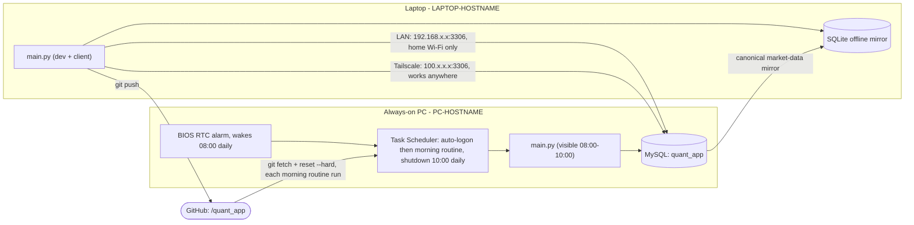

# Two-PC Data Sync: Always-On PC as the Data Server

Status: **built and verified working end-to-end**, including a real
BIOS-wake → auto-login → morning-routine → auto-shutdown cycle, and remote
access confirmed from a mobile hotspot (genuinely off the home network).

> **Placeholders used in this doc** (real values live only in each machine's
> local `.env`/OS config, never in git): `<LAPTOP-HOSTNAME>`, `<PC-HOSTNAME>`
> for the two Windows machine names; `192.168.x.x` / `192.168.x.%` for the
> home LAN address/subnet; `100.x.x.x` for Tailscale addresses (always in
> that CGNAT range, so the shape alone isn't identifying); `<tailscale-account-email>`
> for the Tailscale admin login. Swap in your own machines' real values when
> following these steps.

## Roles

- **Laptop** (`<LAPTOP-HOSTNAME>`) — where development happens (edits,
  commits, `git push`). `main.py` normally reads from the shared database and
  keeps an offline SQLite market-data mirror in `data/local_mirror.db` for the
  periods when the PC cannot be reached.
- **Always-on PC** (`<PC-HOSTNAME>`) — never used for development. Two
  jobs only:
  1. Host the single shared MySQL database (`quant_app`) that both machines
     read from.
  2. Run `historical.py` on a schedule to keep that database's price
     history, hourly bars, chart indicators, and scanner metrics fresh.

There are two deliberately separate database roles. PC MySQL is the canonical
historical-data source. When `COORD_DB_*` is configured, the small canonical
execution-coordination store lives in TiDB Cloud; without it, PC MySQL remains
the legacy coordination fallback. The laptop's SQLite file is an offline
market-data mirror rather than a peer authority. Normal historical
synchronization is PC to laptop, and laptop market data is never promoted back
to the PC. Historical reconnect waits only for a successful MySQL connection
check, then uses the PC
database immediately. The SQLite safety backup is disposable and updates in
the background; it never blocks PC routing. Full hourly backup is limited to
SPY and symbols in scanner results, watchlist, or buylist.

The normal dashboard backup is checkpointed and incremental. A successful
SQLite transaction records each table's PC row count, latest revision, and
hourly-symbol scope. Startup and the 15-minute timer first compare those small
signatures. An unchanged mirror is reported as already up to date without a
row scan. When data changed, only rows at or after the saved revision boundary
are replayed. A remaining count/revision mismatch (including a deletion or a
laptop-only row) uses SQL partition summaries and exact-copies only the
affected symbols/partitions. The older full-content verifier remains the
fallback for explicit integrity and handoff workflows; it is not the normal
dashboard restart path.

Trading-device duties are assigned independently of these storage roles.
**Execution Owner** selects the only process allowed to execute; **Operator
Control** selects the only device allowed to create new manual live commands,
or can be Locked. Locking Operator Control does not stop already-authorized
Buy Today monitoring or position protection. Pre-market full-plan publish and
market-open operator commands are different workflows. See
[Execution Owner and Operator Control](execution_operator_control.md) for the
exact handoff, retry, and Buy Today rules.

These execution roles do not move storage roles. With TiDB coordination
configured on both devices, powering off the PC removes only the historical
source: the laptop mirror continues display while TiDB remains the writable execution
authority. If TiDB is not configured, the legacy PC-hosted coordination path
still closes new entries and operator commands until PC MySQL returns.

## Architecture



## Daily workflow (as actually configured)

```
08:00 KST  BIOS RTC alarm wakes the PC (day=0/daily, hour=08, minute=00)
           -> Windows auto-login (registry AutoAdminLogon)
           -> Task Scheduler "QuantApp_MorningRoutine" (AtLogOn trigger) runs pc_morning_routine.ps1:
                1. git fetch + reset --hard origin/master
                2. venv python -m pip install -r requirements.txt (keeps
                   dependencies in sync with the laptop, not just code)
                3. scripts/run_daily_refresh.py: checks every symbol and
                   both daily/1H tables against the dashboard's expected
                   latest NYSE trading date (including regular holidays),
                   then runs only stale historical.py modes; a multi-day gap
                   self-heals because historical.py refetches a wide window
                   (1y), not just "yesterday"
                4. launches main.py so the dashboard is visible if you check in
                5. launches pc_remote_control_listener.py for remote shutdown
10:00 KST  "Automatic-PC-Shutdown" waits for any live historical refresh,
           then shuts the PC down; after its configured wait limit it exits
           safely without killing a partial refresh
```

Note: the `AtLogOn` trigger fires on *any* logon, not only the scheduled
08:00 one -- a manual `Restart-Computer` at any time of day re-runs the same
morning routine as a side effect. Harmless (the freshness check behaves the
same regardless of when it runs), just worth knowing.

Live trading/monitoring was originally out of scope for this machine, since
it used to be off for the entire US trading session. **This changed** with
the automatic laptop↔PC handoff feature below -- the PC now also sleeps
(S3) instead of fully powering off, and wakes for the market session too, so
it can actually take over monitoring/trading when the laptop shuts down. See
"Automatic laptop↔PC trading handoff" further down for the full picture; the
original 08:00-10:00 KST BIOS-driven window described above is kept as the
data-refresh leg of one continuous overnight-into-morning awake span, not
replaced.

## What's built

- `scripts/pc_morning_routine.ps1` — the full chain above (git sync, pip
  sync, DB-freshness-gated refresh, launch `main.py`). Logs to
  `data/logs/pc_morning_routine.log`; `main.py`'s own stdout/stderr are
  captured separately to `data/logs/main_py_stdout.log` /
  `main_py_stderr.log`. The routine sets `QUANT_LOCAL_MIRROR_ENABLED=0` so a
  MySQL outage fails visibly on the authoritative PC instead of being masked
  by a machine-local fallback there.
- `scripts/run_daily_refresh.py` — the DB-freshness gate.
- `scripts/sync_local_mirror_from_pc.py` — repeatable PC-to-laptop mirror
  top-up and before/after report. The dashboard also runs this sync quietly
  in the background whenever it starts with PC MySQL available and the local
  mirror is clean. Dirty/local-only changes are sent through guarded recovery
  instead of being overwritten by the background copy.
- `scripts/setup_pc_autologin.ps1` — configures Windows `AutoAdminLogon`.
- `scripts/setup_pc_morning_task.ps1` — registers the `AtLogOn` Task
  Scheduler task.
- `scripts/setup_mysql_lan_access.ps1` — LAN firewall rule (scoped to
  `LocalSubnet`) + prints the `my.ini`/`GRANT` steps for the
  `quant_remote@192.168.x.%` account.
- `scripts/setup_mysql_tailscale_access.ps1` — firewall rule scoped to the
  Tailscale network adapter specifically (not a broad IP range) + prints the
  `GRANT` step for a second, Tailscale-IP-scoped account.
- `scripts/setup_pc_winrm_tailscale_access.ps1` (PC) /
  `scripts/setup_laptop_winrm_trust.ps1` (laptop) — one-time WinRM setup so
  the laptop can remotely tail logs (`scripts/tail_pc_log.ps1`) and, later,
  launch scripts on the PC. See "Remote log access" below.
- `scripts/Configure-AutomaticShutdown.ps1` — the 10:00 shutdown. Lives here
  (not only in the standalone `PC-Automation` folder) specifically so the
  PC's `git fetch`/`reset --hard` step can actually reach it.
- BIOS wake instructions — `PC-Automation/docs/BIOS-Startup-Instructions.md`.

## Remote access: LAN vs. Tailscale

Two independent paths reach the same database, each with its own firewall
rule and MySQL grant, so either works whenever it's relevant:

| Path | Address | Works when | Firewall scope |
|---|---|---|---|
| LAN | `192.168.x.x:3306` | Laptop on the same home Wi-Fi | `LocalSubnet` only |
| Tailscale | `100.x.x.x:3306` | Anywhere with internet | Tailscale adapter only |

[Tailscale](https://tailscale.com) creates a private encrypted network
("tailnet") between only the devices signed into the account
(`<tailscale-account-email>`), giving each a stable `100.x.x.x` address regardless
of physical network. On the same LAN it typically routes directly (same
speed as the plain LAN path); off it, it tunnels through NAT/firewalls
automatically, without opening any port on the router or exposing MySQL to
the public internet. **Key expiry is disabled** on both machines in the
Tailscale admin console (default is 6 months, which would otherwise
silently break the connection).

`.env`'s `MYSQL_HOST` is set to the Tailscale address permanently (not
switched depending on location) -- confirmed working both on the home LAN
and from a mobile hotspot genuinely off the home network.

The dashboard reports three independent runtime signals. `PC: On` means
either MySQL or the listener responded; `DB` reports whether shared data is
usable; `Listener` reports remote-shutdown availability. Each running
`main.py` also writes a short heartbeat to MySQL, so the laptop can report the
database PC's `main.py` state even when the listener is stopped. A missing
heartbeat is `Unknown`; an explicit stop or a heartbeat older than 60 seconds
is `Off`.

## Remote log access from the laptop (WinRM over Tailscale)

Status: **scripted, not yet run** — `setup_pc_winrm_tailscale_access.ps1`
must be run once on the PC and `setup_laptop_winrm_trust.ps1` once on the
laptop before this works.

The PC's own logs (`quant_app.log`, `pc_morning_routine.log`,
`main_py_stdout.log`/`main_py_stderr.log`,
`pc_remote_control_listener.log`, all under `data/logs/`) only ever existed
on the PC's disk — nothing shipped them to the laptop. PowerShell Remoting
(WinRM) closes that gap using the same Tailscale trust already relied on
for MySQL and the remote-shutdown listener, scoped to the Tailscale adapter
the same way.

Setup (once):
1. On the PC (as Administrator): `.\scripts\setup_pc_winrm_tailscale_access.ps1`
   — enables WinRM, adds a firewall rule for TCP 5985 scoped to the
   Tailscale adapter only (mirrors the MySQL/remote-control Tailscale
   rules).
2. On the laptop (as Administrator): `.\scripts\setup_laptop_winrm_trust.ps1`
   — adds the PC's Tailscale IP to the laptop's WinRM `TrustedHosts` (NTLM
   auth, since the two machines aren't in a shared Windows domain).

Usage from the laptop:
```powershell
.\scripts\tail_pc_log.ps1                              # tails data\logs\quant_app.log
.\scripts\tail_pc_log.ps1 -LogName pc_morning_routine.log
```
Or directly, for anything beyond log tailing:
```powershell
$cred = Get-Credential <PC-HOSTNAME>\<pc-username>
Invoke-Command -ComputerName 100.x.x.x -Credential $cred -ScriptBlock { ... }
```

WinRM traffic is plain HTTP (port 5985); that's acceptable here because
Tailscale already encrypts everything on that adapter (WireGuard) — same
trust model already used for MySQL over Tailscale in this project. Unlike
`pc_remote_control_listener.py`'s single-purpose token check, WinRM
authenticates with a real Windows account and then allows arbitrary
PowerShell execution as that user — a broader capability than the listener,
so treat that account's password with the same care as any other admin
credential. This same WinRM setup is also the intended path for launching
scripts on the PC from the laptop (a later step); nothing further needs to
be configured for that once these two setup scripts have been run.

## Known gotchas hit during setup (fixed, documented so they don't recur)

- **`zoneinfo.ZoneInfo(...)` needs the `tzdata` PyPI package on Windows** --
  the OS doesn't ship an IANA timezone database the way Linux/macOS do.
  Missing this crashed `main.py` on import (`US_MARKET_ZONE = ZoneInfo(...)`
  is a module-level constant) with no obvious error pointing at the cause.
  Added to `requirements.txt`.
- **`mplfinance>=0.12.0` in `requirements.txt` could never actually
  resolve** -- every real PyPI release past 0.12.0 is tagged as a
  pre-release (beta), which `pip install -r requirements.txt` excludes by
  default, so the *entire* install would silently fail (pip aborts the
  whole file if any one requirement can't resolve). It also turned out to
  be unused anywhere in `src/`, so it was removed rather than pinned.
- **A fresh venv's `python` isn't what `Get-Command python` resolves to
  inside a Task Scheduler process** -- packages installed into the venv
  aren't visible to a bare `python` call in a process that never activated
  it. `pc_morning_routine.ps1` explicitly targets `venv\Scripts\python.exe`.
- **MySQL's reserved word `interval`** needs backtick-quoting in raw SQL
  (`` `interval`='1d' ``) -- it's a column name in `price_history`, and
  unquoted it's parsed as the SQL `INTERVAL` keyword instead.

## How do I make sure the PC is running the latest code and dependencies?

**Via git** (`origin` -> the repo's GitHub URL) for
code, and `pip install -r requirements.txt` (also run automatically each
morning) for dependencies:

1. Develop and commit on the laptop as normal, `git push` when ready.
2. Every morning, `pc_morning_routine.ps1` does `git fetch origin` then
   `git reset --hard origin/master` on the PC's clone -- deliberately a hard
   reset, not a merge/pull, since the PC's clone is a deployment target
   (nobody edits code on it), so this guarantees an exact, reproducible copy
   of GitHub rather than risking a stuck merge conflict in an unattended run.
3. It then runs `pip install -r requirements.txt` against the venv, so a
   dependency added on the laptop (like `tzdata` above) shows up on the PC
   the very next morning too, not just code changes.
4. **Prerequisite**: non-interactive git auth on the PC (Git Credential
   Manager signed in once, cached via Windows Credential Manager) -- a
   scheduled task has no one there to answer a login prompt.

## What happens if the PC doesn't work one day?

- **The laptop's `main.py` doesn't crash.** It falls back to
  `data/local_mirror.db`. Scanner and chart cache reads continue from the
  mirror. TiDB-backed state synchronization and runtime coordination remain
  available; the legacy PC-hosted coordination path is disabled until MySQL
  returns.
- **Staleness is explicit.** If the mirror is current through the latest
  completed market session, the dashboard uses it silently. If it is stale,
  the dashboard asks whether to refresh the laptop copy directly from Yahoo
  Finance; declining continues with the stale mirror.
- **Recovery is automatic once the PC is back.** `historical.py` pulls `1y`
  for daily data and the rolling D-10 window for hourly data, while
  `run_daily_refresh.py` checks every scheduled symbol in both tables rather
  than trusting one global latest date. Routine hourly gaps inside D-10
  self-heal on the next successful run; older hourly repairs use the explicit
  one-time D-200 script below.
- **Switching is connection-gated only.** Once `SELECT 1` succeeds, the status
  becomes green `DB: PC` and market-data reads use MySQL immediately. The app
  does not compare PC and laptop market tables before switching.
- **The active-PC safety copy is exact and atomic.** Full keys and values are
  compared for daily/derived data, including old corrections and PC-side
  removal of derived/operational rows. Hourly comparison is deliberately
  limited to relevant scanner/watchlist/buylist symbols. It runs in a worker
  after the dashboard is usable, is strictly PC-to-local, and treats MySQL as
  authoritative even when the laptop cache has local changes. Backup failure
  is logged and retried without changing active database routing.
- **Backup progress is visible.** The dashboard progress line identifies the
  current PC-read, laptop-update, or verification phase in plain language. It
  first checks the saved checkpoint. Unchanged data reports already up to date;
  changed data shows changed records processed out of total, percentage, and a
  rolling ETA. Closing requests a cooperative cancellation; if the atomic
  transaction is still rolling back, the close warning names the laptop safety
  backup and its current phase.
- **Root causes worth checking**: BIOS RTC alarm didn't fire (power/PSU
  prerequisites), Windows didn't auto-login, or a step in
  `pc_morning_routine.ps1` failed -- check `data/logs/pc_morning_routine.log`
  first, it logs every step's outcome.

## If I run `historical.py` (or `run_daily_refresh.py`) manually on the laptop, is that valid?

Yes. When PC MySQL is reachable, a manual run writes to the authoritative
tables there. When it is unreachable, `historical.py` and
`scripts/run_daily_refresh.py` resolve the local SQLite mirror instead and
refresh that copy. When the PC becomes reachable again, those laptop-only
daily or hourly bars are not uploaded to MySQL. The dashboard switches to the
PC immediately, and its background backup eventually replaces the laptop
cache with authoritative PC data. Prefer
`python scripts\run_daily_refresh.py` over
calling `historical.py` directly because it checks per-symbol freshness and
runs only the necessary modes.

## How do I run the one-time D-200 hourly repair?

Run this manually and directly on the PC that hosts MySQL:

```powershell
.\venv\Scripts\python.exe scripts\backfill_hourly_history_200d_once.py
```

The script verifies that the local Windows hostname matches the MySQL server
hostname, so a laptop connected to PC MySQL is rejected. It re-pulls 200 days
for the complete refresh universe and upserts the returned 1-hour bars. A
successful-completion marker under `data/` prevents accidental repeat runs;
`--force` is available only for a deliberate repair rerun. This script is not
called by `pc_morning_routine.ps1`.

Run `python scripts\sync_local_mirror_from_pc.py` while the PC is reachable
to force an immediate mirror top-up and print per-table row counts and
watermarks. The local database and its WAL/SHM sidecars are runtime data and
must not be committed.

## Automatic laptop↔PC trading handoff

> **Status: implemented and unit-tested, but never run against
> a real PC, real S3 sleep/wake cycle, or real KIS credentials.** Follow the
> runbook below and the verification checklist before trusting this with a
> live position. Leave `AUTO_ARM_TRADING_ON_HANDOFF` off for the first
> several real cycles even after the wake/sleep mechanics are confirmed
> working.

### What it does

Activate a buylist item's monitoring on the laptop, then turn the laptop
off (or it loses power/network) -- the PC automatically claims main-device
status, reconciles against the broker (never trusting synced state alone),
and resumes monitoring/live order submission. No confirmation dialog on
either machine.

### Software pieces (all in this repo, already tested)

- **Fenced ownership claim**: `state_sync.claim_main_device_if_stale` /
  `claim_main_device_if_unclaimed` atomically re-verify the expected owner
  (or that the row is still genuinely unclaimed) inside the same row lock
  that transfers ownership -- closing the check-then-claim race a naive
  "check heartbeat, then claim" sequence would have.
- **Lease fencing at the broker boundary**: every claim mints a fresh
  `lease_token`; `src/services/execution_authority.py`'s
  `ExecutionAuthority.require_current_lease` re-verifies it live inside
  `submit_guarded_overseas_order`, immediately before the non-idempotent
  broker call -- not just at the UI-level "am I main" check.
  `_state_sync_allows_order_submission` also gained a bounded-age
  requirement (fails closed if the last successful reconcile is >90s old)
  as defense in depth against network partition.
- **`execution_queue` is now a 4th synced state key** (alongside watchlist/
  buylist/trade_plans) -- a valid automated entry is queue-backed since
  legacy `ACTIVE` entry automation was retired, so the queue has to cross
  machines too. A synced `EXECUTE_READY` is never trusted directly.
- **Broker-truth reconciliation before resuming** (`src/services/
  handoff_reconciliation.py`): the moment a device becomes main, every
  in-flight PROD item's runtime pending flags are forced to "assume
  something might be pending" (closing the gap where a freshly-synced
  `BuylistItem` silently defaults to "nothing pending"). Independently of
  that synchronized state, every configured PROD account is then queried
  for completeness-aware, account-wide regular open/history and
  **reserved-order** discovery plus `Broker.get_positions(...)`. Missing or
  unconfigured accounts, incomplete pagination, partial endpoint failures,
  malformed results, any open order, or any nonzero holding without a local
  `BOUGHT` item all fail closed for the entire account. This also catches an
  order/position omitted by a failed final publication or a stale snapshot.
  Both domestic and overseas balance calls follow every KIS continuation
  page; a continuation without a cursor or one that exceeds the page limit
  raises instead of returning a partial position snapshot. Malformed nonempty
  PROD account settings likewise block the handoff rather than silently
  disappearing from the account inventory.
  Monitoring/trading only resume once every configured account clears
  unambiguously **and** the broker-corrected state has been synchronously
  saved and strictly republished. Explicit **Execution Owner** transfer uses
  the same reconciliation fence and never auto-arms live trading.
- **Strict shutdown ordering**: `closeEvent` now finishes the final local
  save, strictly re-publishes buylist + execution_queue to MySQL
  (`publish_handoff_snapshot` -- returns failure, not just a log line, if
  the push didn't actually land), persists the local pull-only role, disables
  the remote writer binding, and only then releases the lease. If the final
  local save, strict publication, local demotion, or writer fencing fails,
  ownership is retained; the next device must wait for the stale-heartbeat
  fenced takeover path rather than seeing a false clean handoff.
- **Kill switch auto-arm is a separate, stricter gate**
  (`_auto_arm_trading_kill_switch`) from the claim itself -- requires its
  own `AUTO_ARM_TRADING_ON_HANDOFF` flag, a currently-held lease, a reachable
  database, and a clean reconciliation pass. `TRADING_ENABLED`'s existing
  environment hard-lock is untouched and always wins.
- **Health tab**: a new "Main-device handoff" check shows lease age,
  pull-only owner, reconciliation-in-progress, and any blocked symbols.

### `.env` flags (PC only -- never set these on the laptop)

```
AUTO_CLAIM_MAIN_ON_HANDOFF=0
EXPECTED_AUTO_CLAIM_HOSTNAME=<the PC's exact hostname>
AUTO_ARM_TRADING_ON_HANDOFF=0
```

`EXPECTED_AUTO_CLAIM_HOSTNAME` must match `platform.node()` exactly on the
PC or auto-claim silently stays off -- cheap insurance against an
accidentally copy-pasted `.env`. The laptop deliberately never auto-reclaims
on startup; assign it explicitly with the **Execution Owner: Laptop** control
when required. Keep both automation flags at `0` until the physical S3/wake and
post-resume MySQL/KIS checks below pass. Enable auto-claim first; leave
auto-arm off through several supervised handoffs.

### Wake/sleep model: S3 instead of full shutdown

The BIOS RTC wake alarm only fires once per day and requires a full
power-off (S5) beforehand -- it can't add a second wake window for market
hours. Moving to sleep (S3) lets Windows' own Task Scheduler `WakeToRun`
handle multiple daily wake times instead.

**New/changed scripts** (all in `scripts/`):

| Script | Purpose |
|---|---|
| `Invoke-GuardedSleep.ps1` | New. The sleep guard -- mirrors `Invoke-GuardedShutdown.ps1`'s historical.py guard, adds a second guard reading `data/sleep_readiness.json` (written every 30s by `MainWindow`, see `src/services/sleep_readiness.py`), then calls Win32 `SetSuspendState` instead of `shutdown.exe`. |
| `Configure-AutomaticSleep.ps1` | New. Registers the `Automatic-PC-Sleep` task (10:00 KST daily) running the guard above. Separate task/file from `Configure-AutomaticShutdown.ps1` so the old shutdown task can stay registered-but-disabled as a rollback path. |
| `Configure-MarketHoursWake.ps1` | New. Registers `QuantApp_EveningWake` (~21:45 KST daily, `WakeToRun`) running `pc_wake_healthcheck.ps1`. |
| `pc_wake_healthcheck.ps1` | New. Runs on the evening wake. Deliberately does **no** git/pip updates (would risk a mixed-version runtime under an already-running `main.py`) -- only confirms `main.py`/the remote listener are alive, relaunching only if a forced reboot broke the S3 resume. |
| `setup_pc_morning_task.ps1` | Modified. Added a second `Daily @ 08:00 WakeToRun` trigger alongside the existing `AtLogOn` one -- a normal S3 resume does not fire `AtLogOn`, so without this the 08:00 data refresh would stop firing except after a genuine reboot. `AtLogOn` is kept as that reboot-case fallback. |

**Window shape**: one continuous overnight-into-morning awake span --
wake ~21:45 KST → through the DST-bracketed session (widest case 22:00-06:00
KST) → straight into the existing 08:00-10:00 data-refresh window → sleep at
10:00 KST. No second sleep/wake cycle for the ~90-minute gap between session
end and 08:00 -- that would double the daily wake-failure surface for
negligible power savings. Actual order-submission gating always comes from
the app's own session-open logic, never from PC wake timing, so DST drift in
the wake time itself is harmless idle time either way.

### Manual runbook (Administrator, on the PC)

1. `powercfg /availablesleepstates` -- confirm S3 is offered on this board
   (unverified on this specific motherboard; flag it if S3 isn't listed).
2. `powercfg /change standby-timeout-ac 0` -- disable Windows' own idle-sleep
   timer so only the scheduled task controls sleeping.
3. Leave the existing BIOS RTC 08:00 wake alarm enabled -- it's a harmless,
   useful fallback for the one case S3 can't recover from itself: a genuine
   full power-off (S3 has no standby power to resume from that).
4. `git pull`, then:
   ```powershell
   .\scripts\Configure-AutomaticSleep.ps1 -SleepTime 10:00 -DaysOfWeek Everyday
   .\scripts\Configure-MarketHoursWake.ps1 -WakeTime 21:45
   .\scripts\setup_pc_morning_task.ps1        # re-run to add the Daily 08:00 WakeToRun trigger
   .\scripts\Configure-AutomaticShutdown.ps1 -DisableTask   # keep the old task registered but inert
   ```
5. Set the three `.env` flags above (PC only).

### Verification checklist (do this before trusting it with a live position)

- [ ] `(Get-ScheduledTask -TaskName 'QuantApp_EveningWake').Settings.WakeToRun -eq $true`
- [ ] `.\scripts\Configure-AutomaticSleep.ps1 -TestMode` -- physically confirm
      true S3 (fans off, blinking power LED), not S4/hibernate.
- [ ] Let the PC sleep overnight for real at least once; confirm the
      scheduled wake actually resumes it (check remotely via Tailscale
      `pc_remote_control_listener` PING).
- [ ] `Get-Process -Name python | Select Id,StartTime` before and after the
      sleep -- same PID/StartTime proves a true resume, not a relaunch.
- [ ] Check `data\logs\pc_wake_healthcheck.log` and confirm MySQL/KIS
      connections actually recover post-resume in the live app log (no
      existing test coverage for connection behavior across a real S3
      resume -- this is the biggest unverified assumption in the whole
      feature).
- [ ] Run the two-process dry run from the implementation plan (a throwaway
      test engine + a **stub** broker, never real KIS credentials) end to
      end before ever enabling `AUTO_ARM_TRADING_ON_HANDOFF` against a real
      account.
- [ ] Once software behavior is trusted, enable `AUTO_ARM_TRADING_ON_HANDOFF`
      and watch the Health tab's "Main-device handoff" check closely for the
      first several real handoffs.

### Known residual risks (accepted, not solved by this design)

- Broker API outage during handoff: reconciliation retries with backoff and
  refuses to trade until it gets an unambiguous snapshot -- correct
  fail-safe, but the position is unprotected until it (or KIS) recovers.
- Shared-coordination outage while a device is main: new entries and ordinary
  mutations fail closed immediately. An already-active executor may use its
  cached exact lease/ownership proof and fsynced local journal for eligible
  protective cancellation/SELL work for 30 seconds by default. After that
  emergency allowance, **all** KIS submissions fail closed, including
  stop-loss and other protective exits. A cold-started executor has no offline
  allowance. This is the intentional split-brain policy.
  Treat a coordination-database CRITICAL result during a live position as a high-
  severity operational alert and be prepared to manage the position directly
  in KIS until coordination recovers.
- The dashboard remote-shutdown button refuses to power off the PC during live
  trading only when that PC MySQL instance is still the selected legacy
  coordination authority. With TiDB coordination online, PC shutdown affects
  historical-data freshness but not ordinary execution authority.
- `orders.json`/`event_journal.jsonl` stay local-only per device. Broker-truth
  discovery makes this a completeness gap for the PC's own order-history
  view, not a correctness problem for reconciliation itself.
- Configured KIS accounts are treated as dedicated dashboard accounts during
  handoff. A discretionary holding or order that is not represented by the
  synchronized buylist blocks the handoff. Do not enable unattended auto-arm
  for a shared account unless a synchronized exposure registry/allowlist is
  added first.
- A forced reboot during the sleep window (e.g. Windows Update) is recovered
  via the retained `AtLogOn` fallback and the stale-heartbeat claim path
  rather than the clean-release path -- the less-clean of the two, but still
  fully gated by broker reconciliation before anything trades.
