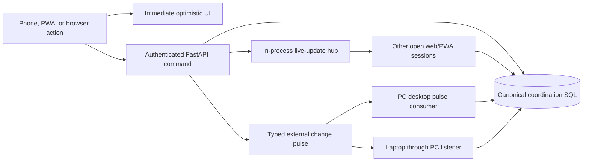

# Web/PWA Operator Synchronization

This document defines how the authenticated web/PWA controller stays aligned
with the PC and laptop desktop applications. It covers Watchlist, Buylist,
breakout, Buy Today, Buy Board, Operator Control, and runtime-readiness
projection changes. It does not grant execution authority.

## User-visible contract

- An allowed planning or Buy Today action updates the initiating browser
  immediately and is shown as pending while the request is saved.
- The server revalidates authentication, CSRF, the operation allowlist,
  environment/account scope, expected revision, lifecycle rules, and Operator
  Control where required.
- A successful response replaces the optimistic state with a fresh canonical
  projection. A rejected or failed request removes the optimistic state,
  restores canonical truth, and displays the reason.
- Other open web/PWA sessions and running desktop applications refresh from
  canonical state automatically. Routine operation does not require a manual
  page reload or desktop refresh.
- `QUEUED` confirms durable human intent only. It does not mean the command was
  executed, an order was accepted, or a fill occurred.

## Notification flow

The WebSocket message is a small invalidation event, not a trusted state
payload. Each receiving browser refetches the affected canonical projection.
The typed external pulse names the affected scope, such as `trade_cards`,
`operator_commands`, or `app_state_sync`. The PC desktop checks its local
inbound pulse every second; the existing listener exposes the outbound pulse
to the laptop. Canonical revision polling and initial startup reads remain the
missed-event and offline-recovery fallback.

## Desktop projection refresh

The Buy Board runtime emits a projection refresh whenever its device state or
canonical-database writability actually changes. This includes transitions
such as `STARTING` to `STANDBY`, `STANDBY_READY`, `ACTIVE`, or `FAILED`, and
database writable/unwritable recovery. The board therefore removes stale
messages such as `Device state is STARTING` or `operational store is not
confirmed writable` without waiting for an unrelated card revision.

Remote typed pulses also trigger one scoped canonical read pass. Trade-card,
order, ownership, and external-order pulses refresh the Buy Board; planning,
runtime, and operator-command pulses refresh the relevant shared controls and
state. Periodic revision checks remain recovery mechanisms, not the normal
user workflow.

## Authority and safety boundaries

Synchronization and execution readiness are separate:

- **Operator Control** identifies the device allowed to create the next manual
  instruction. The web/PWA may act only when either its stable `Mobile Web`
  identity or the exact hosting-desktop identity owns that role and the
  operation is explicitly allowlisted.
- The desktop Operator Control row exposes `PC`, `Laptop`, `Mobile`, and
  `Locked`. Selecting Mobile assigns the stable `Mobile Web` identity; both
  PyQt desktops highlight Mobile when that shared value is current.
- **Execution Owner** identifies the one runtime allowed to cross the broker
  boundary. Mobile ownership of Operator Control does not make the browser an
  executor.
- A permitted Buy Today activation uses the same canonical workflow as the
  desktop and, when eligible, claims `KANBAN` ownership for that symbol. A
  passive card may otherwise continue to display `LEGACY` ownership.
- Broker mutation still requires a live execution lease, `ACTIVE` runtime,
  writable canonical store, fresh reconciliation, healthy execution-grade
  market data, matching per-symbol ownership, live-trading permission, and all
  order/risk/capital gates.
- `STANDBY_READY` means ready to receive a lease; it is intentionally not
  executable. `STARTING`, `FAILED`, no owner, an unwritable store, or
  `LEGACY` ownership for a Kanban action remains restricted.

The web process never creates a broker, starts the trading runtime, transfers
the execution lease, or interprets optimistic UI state as execution approval.

## When a manual reload is appropriate

A manual page reload is not required after Watchlist, Buylist, breakout,
Buy Today, Operator Control, runtime-state, or database-writability changes.
Reload only for browser/session recovery, after deployment of new frontend
assets, or as a diagnostic when the WebSocket and fallback revision checks are
both unavailable. A desktop restart is likewise not part of normal state
synchronization; startup performs a canonical read if a process was offline
when a notification was emitted.

## Verification expectations

Regression coverage must prove:

- optimistic planning and Buy Today state is rendered before the save awaits;
- failure rolls back to canonical state;
- authenticated WebSocket clients receive invalidations and refetch state;
- connected mutations publish typed desktop change pulses;
- desktop state/writability transitions emit `board_changed` only on change;
- queued commands remain distinct from completed commands and broker facts;
- no web route can create a broker, claim the execution lease, or bypass an
  execution gate.
