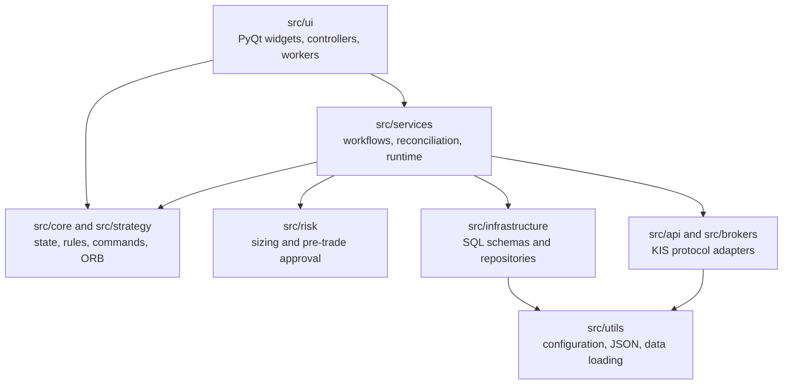

# Architecture

The code is layered so UI gestures cannot become broker mutations by accident.

## Entry path

`main.py` synchronizes the environment schema, loads `.env` without overriding
OS variables, configures logging/Qt handling, creates `QApplication`, imports
`MainWindow`, and starts the event loop.

## Responsibility boundaries

- `src/ui`: presentation, interaction routing, and background worker lifecycle.
- `src/core`: immutable models, transitions, scanner rules, commands, and
  execution contracts.
- `src/strategy`: strategy-neutral contracts and the built-in ORB strategy.
- `src/risk`: position sizing and final pre-trade decisions.
- `src/services`: orchestration, persistence, synchronization, leases,
  reconciliation, journals, and broker workflow boundaries.
- `src/infrastructure/database`: SQLAlchemy schemas, engines, repositories,
  refresh, and mirror copy/reconciliation.
- `src/api` and `src/brokers`: KIS request/response and broker protocol adapters.

Slow external work normally belongs in QThread or background workers. The
remaining chart UI-thread limitation is documented in
[Performance Audit](https://github.com/cafe-auvers/quant_app/blob/master/docs/performance-audit.md).

The active broker path uses immutable ORB order generations: a fresh confirmed
breakout submits a passive limit, and a later higher-score generation can be
submitted only after the prior zero-fill order is authoritatively cancelled.
See [Current Order Logic](https://github.com/cafe-auvers/quant_app/blob/master/docs/current_order_logic.md).
