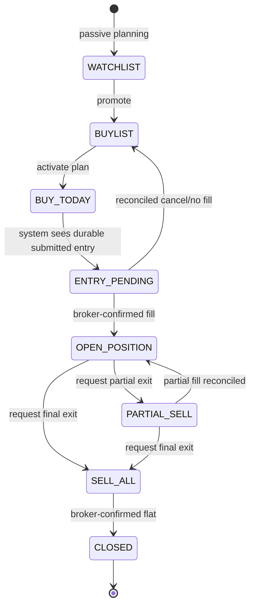

# Buy Board and Kanban States

The six visible operator columns are projections of canonical card, ownership,
and order state. Watchlist and Closed are hidden lifecycle stages.

## Column ownership

- Buylist and Buy Today accept authorized planning commands.
- Entry Pending and Closed are system-owned; operators must not force them.
- Open Position, Partial Sell, and Sell All reflect guarded intents plus broker
  evidence.
- External/unlinked broker orders remain visible and observation-only until an
  explicit adoption workflow succeeds.

## Drag and command behavior

A drag carries the card revision and interaction fingerprint. The UI marks that
card pending immediately, queues database work outside the UI thread, and then
reloads canonical projections. A stale fingerprint or revision is rejected.
No drag calls KIS directly.

The engine remains read-only when disabled, when this device lacks the lease,
or when any action-specific readiness gate fails.
