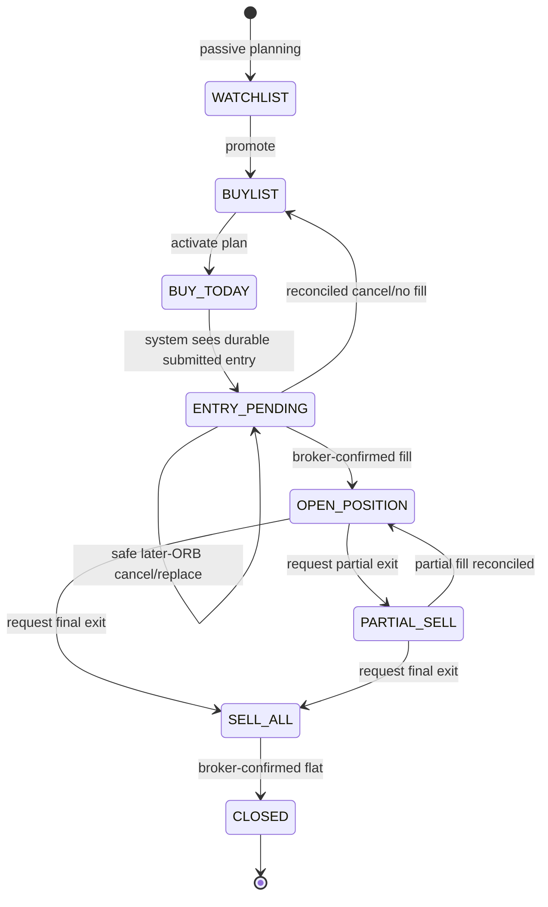

# Buy Board and Kanban States

The six visible operator columns are projections of canonical card, ownership,
and order state. Watchlist and Closed are hidden lifecycle stages.

```mermaid
stateDiagram-v2
    [*] --> WATCHLIST: passive planning
    WATCHLIST --> BUYLIST: promote
    BUYLIST --> BUY_TODAY: activate plan
    BUY_TODAY --> ENTRY_PENDING: system sees durable submitted entry
    ENTRY_PENDING --> ENTRY_PENDING: safe later-ORB cancel/replace
    ENTRY_PENDING --> OPEN_POSITION: broker-confirmed fill
    ENTRY_PENDING --> BUYLIST: reconciled cancel/no fill
    OPEN_POSITION --> PARTIAL_SELL: request partial exit
    PARTIAL_SELL --> OPEN_POSITION: partial fill reconciled
    OPEN_POSITION --> SELL_ALL: request final exit
    PARTIAL_SELL --> SELL_ALL: request final exit
    SELL_ALL --> CLOSED: broker-confirmed flat
    CLOSED --> [*]
```

## Column ownership

- Buylist and Buy Today accept authorized planning commands.
- Entry Pending and Closed are system-owned; operators must not force them.
- Open Position, Partial Sell, and Sell All reflect guarded intents plus broker
  evidence.
- External/unlinked broker orders remain visible and observation-only until an
  explicit adoption workflow succeeds.

## Drag and command behavior

The deployed canonical card state is in Supabase's private PostgreSQL schema. Mobile Buylist
removal waits for authoritative confirmation instead of optimistically hiding the row;
failures and revision conflicts remain visible. It is not a broker order or cancellation.
See [Supabase Deployment](Supabase-Deployment).

A drag carries the card revision and interaction fingerprint. The UI marks that
card pending immediately, queues database work outside the UI thread, and then
reloads canonical projections. A stale fingerprint or revision is rejected.
No drag calls KIS directly.

The engine remains read-only when disabled, when this device lacks the lease,
or when any action-specific readiness gate fails.

Connected web/PWA actions may update their initiating screen immediately while
the canonical request is pending. That visual state is not confirmation. A
failure rolls back; a success publishes browser invalidation and typed desktop
pulses so every running surface refetches canonical state automatically.
Runtime device-state and database-writability transitions also refresh desktop
restrictions without waiting for a card revision or manual refresh.

## Buy Today and Entry Pending

Buy Today is monitoring intent, not an order. After a current-session ORB
closes, a fresh KIS trade strictly above both ORB high and breakout confirms the
candidate. The system then submits a passive BUY limit at ORB high by default
while last trade and ask remain above that limit.

Entry Pending means a durable submitted/discovered/ambiguous BUY identity
exists. It does not mean filled. New passive entries have no 15-second
auto-cancel/reprice deadline. A zero-fill working order may upgrade to a later,
strictly higher-scoring ORB only by cancelling and authoritatively confirming
the old order before submitting the linked replacement. Any fill blocks the
upgrade and moves broker-confirmed quantity to Open Position.

See [Current Order Logic](https://github.com/cafe-auvers/quant_app/blob/master/docs/current_order_logic.md).
See also [Web/PWA Operator Synchronization](https://github.com/cafe-auvers/quant_app/blob/master/docs/web_operator_sync.md).

## Mobile stage details

Stage headers count stocks and total target/held shares; unsized plans are
identified. Cards and detail sheets show the same stage facts:

| Stage | Details |
| --- | --- |
| Today | Target shares, ORB window, breakout/trigger, entry price, planned stop/risk and block/retry reason |
| Entry | Entry plan, held/target shares and average fill |
| Open | Held/sellable shares, average entry, active/pending stop and stop shares, estimated P&L and distance to stop |
| Partial | Position details, requested sell and working remaining shares |
| Sell All | Position details, working remaining shares, submit/cancel state and exit/retry reason |

Prices reuse existing Monitor or PC observations. The source, KST timestamp,
age and stale status are visible. Yahoo prices are indicative, not execution
permission. Estimated P&L and distance to stop require a dated observation
within the display freshness threshold; actual KIS execution gates are unchanged.
