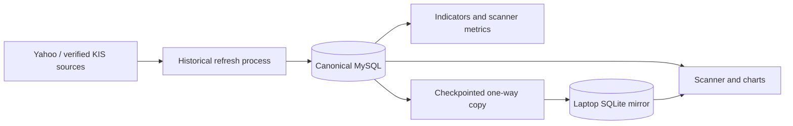

# Market Data and Database

## Database roles

- PC MySQL: canonical market history, indicators, scanner metrics,
  fundamentals, Market Pulse, and alignment data in the two-machine setup.
- Laptop SQLite mirror: offline, pull-only copy of supported market tables.
- Operational/coordination SQL: small durable control, card, command, order,
  lease, and synchronized-state records according to configuration.
- Local JSON: shutdown-safe compatibility/planning state and local order ledger.

## Main tables

- `price_history`, `hourly_price_history`, `intraday_price_history`
- `chart_indicators`, `scanner_metrics`, refresh manifests/failures
- `stock_profiles`, `earnings_events`, `fundamental_sync_state`
- `market_pulse_*`, `stock_market_alignment_daily`, alignment batches
- trade cards, execution commands/orders/ownership, alerts, and runtime state
  in the operational schema

## Data flow

The `(interval, date)` price-history index supports global freshness
watermarks. Database reads return empty/unavailable results conservatively when
the optional cache cannot be reached; execution workflows have stricter
fail-closed database requirements.

Mirror Health deliberately evaluates two scopes. Daily coverage uses the full
configured stock universe. Hourly coverage uses only symbols currently relevant
to Scanner, Watchlist, and Buylist workflows, matching the selective hourly
copy policy. A symbol outside that hourly scope does not make the mirror look
unhealthy.
