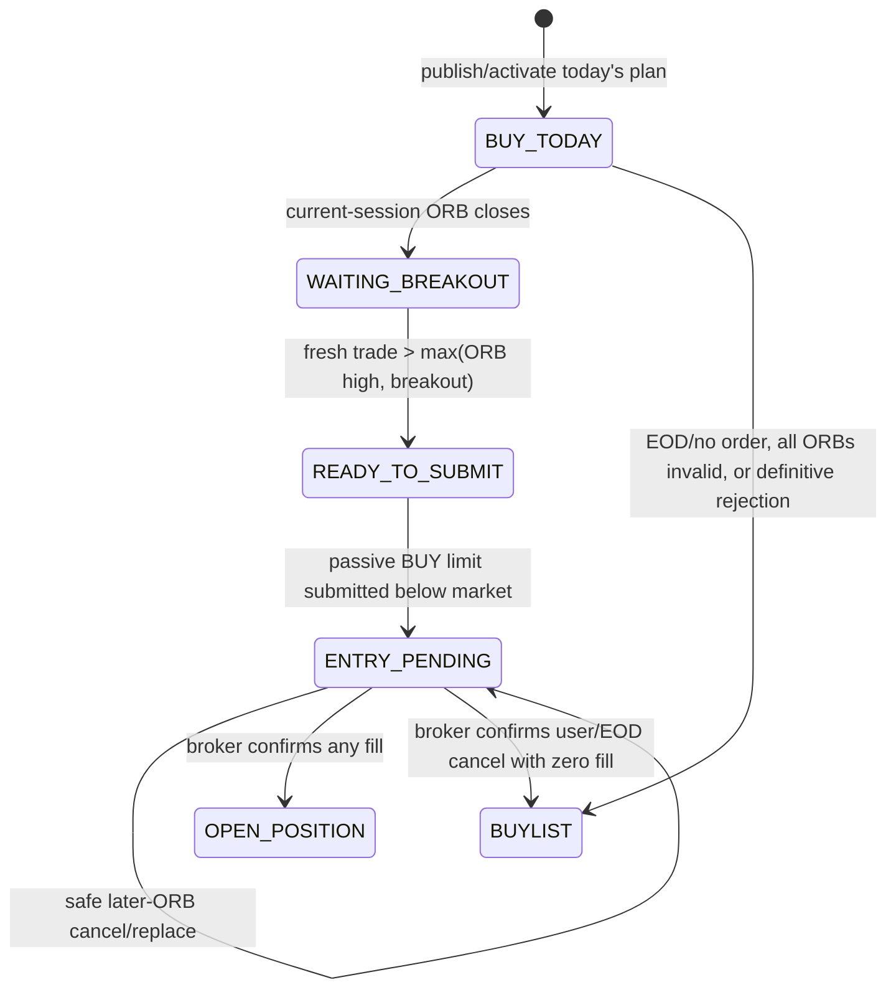
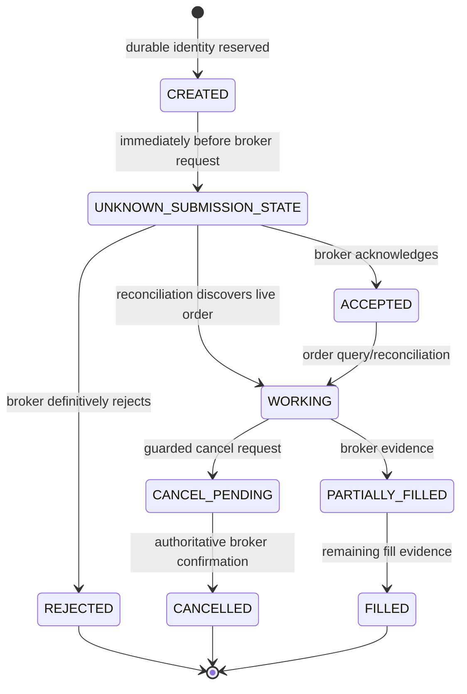

# Order Lifecycle

This is the operator summary. The formula-level source is
[Current Order Logic](https://github.com/cafe-auvers/quant_app/blob/master/docs/current_order_logic.md).

## From breakout to position

The active strategy is a confirmed-breakout, passive-pullback entry:



The automatic execution price is the selected ORB high. A configured manual
price is permitted only inside:

```text
max(breakout price, ORB low) < execution price <= ORB high
```

After the range closes, a fresh KIS trade must be strictly above both the ORB
high and breakout price. The system then submits the limit immediately while
last trade and best ask remain above the limit. It does not wait for the market
to pull back before submitting. The pullback is what may fill the resting
order later.

## Durable broker-order states



Exact internal enums differ between the compatibility local ledger and guarded
SQL records, but the safety semantics are the same.

## Submission

An entry requires a fresh matching risk decision plus durable command, order
identity, ownership, lease, mutation budget, capital reservation, reconciliation,
release, market-data, and idempotency gates. State is made ambiguous before the
broker request so a crash cannot make an unknown outcome look safe to retry.

Broker acknowledgement is not a fill. New passive entry orders have no
15-second automatic cancel/reprice deadline; they may remain working until
fill, explicit/EOD cancellation, broker expiry/rejection, or a safe ORB
replacement.

## Higher-score ORB replacement

A zero-fill working 1m order may upgrade to 5m or 30m, and a zero-fill 5m order
may upgrade to 30m, only when the later candidate's range and breakout are
complete and its score is strictly higher under the same score version.

Replacement is always:

```text
prevalidate later candidate
  -> cancel old order
  -> confirm CANCELLED with zero fills from KIS
  -> revalidate quote/session/risk/capital
  -> submit one linked replacement order with the same quantity
```

There is no automatic downgrade. Equal/lower score leaves the active order
unchanged. A fill during cancellation aborts replacement and uses the old
generation's ORB low for protection. Rejected or uncertain cancellation never
authorizes the new BUY. Restart recovery never cancels twice and resumes only a
durably proven post-cancel submit leg.

## Reconciliation and stops

Order/history/position evidence applies fills conservatively.
`applied_filled_quantity` prevents the same partial fill from being applied
twice. Incomplete or ambiguous evidence remains pending/working and blocks a
duplicate order.

The stop comes from the ORB generation that filled: a 1m fill uses the 1m ORB
low; a successful 5m/30m replacement fill uses that replacement's ORB low.
Only confirmed filled quantity is protected.

## Rejections and end of day

- Ordinary definitive rejection: no working order exists; zero-position card
  returns to Buylist with a memo.
- KIS `APBK0656`: routing/configuration failure; clear the rejected identity,
  keep the plan in Buy Today, and retry after cooldown when routing is valid.
- Ambiguous submit/cancel: stay fenced in Entry Pending and reconcile.
- Buy Today with no order: return to Buylist after its scheduled session.
- Entry Pending at EOD: request cancellation and wait for confirmation. Zero
  fill goes to Buylist, any fill to Open Position, uncertainty stays pending.

## Exits

Liquidation is not blocked by entry risk rules. Outside the U.S. regular
session, eligible manual production partial/full exits use the persisted KIS
market-on-open reservation policy. Broker acceptance still requires later
reconciliation.
