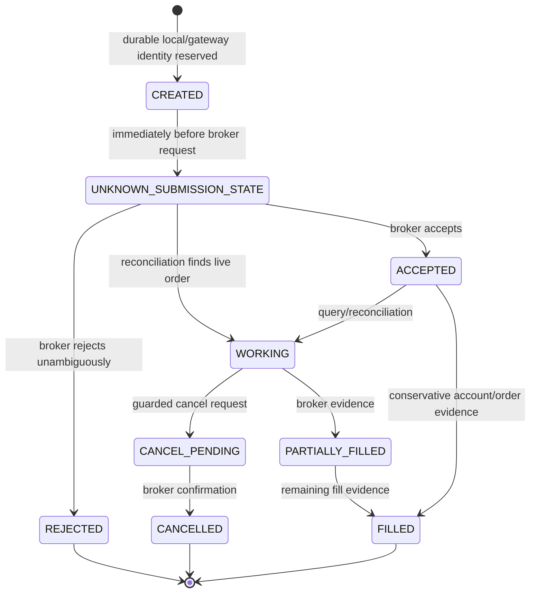

# Order Lifecycle

Exact internal enums differ between the legacy local ledger and guarded SQL
records, but the safety semantics are the same.

## Submission

An entry requires a fresh matching pre-trade risk decision. Durable command,
order identity, ownership, lease, mutation budget, capital reservation, and
idempotency checks occur before the broker call. The state is marked ambiguous
before sending so a crash cannot make an unknown outcome look retryable.

## Reconciliation

Broker acceptance does not update shares or cost. Order/history/position
evidence applies fills conservatively. `applied_filled_quantity` prevents the
same partial fill from being applied twice. Incomplete/ambiguous evidence
remains pending or working.

## Exits

Liquidation is not blocked by entry risk rules. Outside the U.S. regular
session, eligible manual PROD partial/full exits use the persisted KIS
market-on-open reservation policy. Broker acceptance still requires later
reconciliation.
