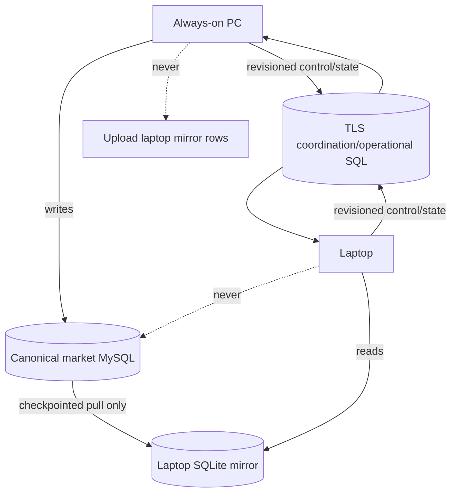

# Synchronization

Quant App has two distinct synchronization concerns: large market-data copies
and small operational/planning state.

## Market data

The mirror is strictly PC-to-laptop. Laptop-only data is never uploaded to
canonical MySQL. Copy workers use checkpoints/watermarks and tolerate restarts.

## Planning and execution state

Watchlist, Buylist, trade plans, execution queue, device role, operator control,
and Live Trading control are revision/fence aware. Writer ownership is explicit;
stale devices remain pull-only.

## Handoff

Automatic PC ownership claim is optional and off by default. It requires the
expected hostname and a stale/unclaimed fenced claim. After ownership changes,
account-wide broker reconciliation and strict persistence/publication must
complete before the runtime resumes. Handoff never changes the canonical Live
Trading switch.

See [Operations and Monitoring](Operations-and-Monitoring) before enabling
physical sleep/wake automation.
