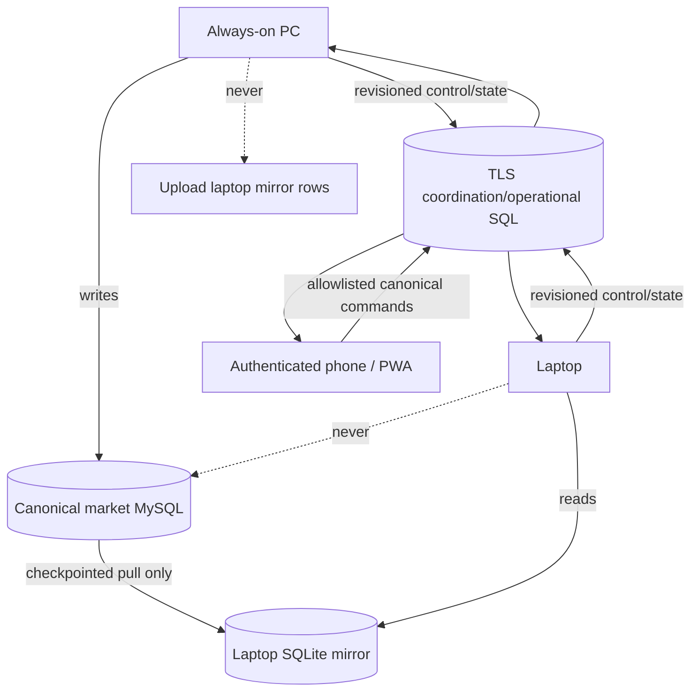

# Synchronization

Quant App has two distinct synchronization concerns: large market-data copies
and small operational/planning state.

```mermaid
flowchart TB
    PC[Always-on PC] -->|writes| MySQL[(Canonical market MySQL)]
    MySQL -->|checkpointed pull only| Mirror[(Laptop SQLite mirror)]
    Laptop[Laptop] -->|reads| Mirror

    PC -->|revisioned control/state| Coord[(TLS coordination/operational SQL)]
    Laptop -->|revisioned control/state| Coord
    Web[Authenticated phone / PWA] -->|allowlisted canonical commands| Coord
    Coord --> PC
    Coord --> Laptop
    Coord --> Web

    PC -. never .-> Upload[Upload laptop mirror rows]
    Laptop -. never .-> MySQL
```

## Market data

The mirror is strictly PC-to-laptop. Laptop-only data is never uploaded to
canonical MySQL. Copy workers use checkpoints/watermarks and tolerate restarts.

## Planning and execution state

Watchlist, Buylist, trade plans, execution queue, Execution Owner, Operator
Control, Live Trading control, TradeCards, commands, and orders use shared,
revision/fence-aware operational state. Writer ownership is explicit; stale
devices remain pull-only.

Machine identity and local permission are intentionally not synchronized.
`data/device_role.json`, each machine's `.env` (including its
`TRADING_ENABLED` lock), and chart drawings remain local files. The 1D/1H
"drawing sync" means the two split panes inside one running app share the same
drawing; it is not laptop-to-PC drawing replication.

## Web/PWA notifications

The initiating browser renders an allowed action immediately as pending. The
server then accepts canonical persistence or returns an error; an error rolls
the browser back to canonical truth. Successful writes produce two small
notifications:

- an authenticated in-process WebSocket invalidation for other open web/PWA
  clients; and
- a typed inbound/outbound coordination pulse for PC/laptop desktops.

Notifications carry scope/revision hints, not authoritative TradeCard data.
Every receiver refetches canonical state. The PC checks its local inbound pulse
every second and its listener exposes the outbound pulse to the laptop. Startup
reads and bounded revision polling recover missed/offline events. Manual reload
is not required for normal operation.

Runtime device-state and canonical-store writability changes independently
emit desktop board refreshes, so stale readiness restrictions clear without an
unrelated card change. None of these refresh paths grants an execution lease or
bypasses ownership, reconciliation, market-data, live-mode, risk, capital, or
broker checks.

## Handoff

Automatic PC ownership claim is optional and off by default. It requires the
expected hostname and a stale/unclaimed fenced claim. After ownership changes,
account-wide broker reconciliation and strict persistence/publication must
complete before the runtime resumes. Handoff never changes the canonical Live
Trading switch.

See [Operations and Monitoring](Operations-and-Monitoring) before enabling
physical sleep/wake automation.
