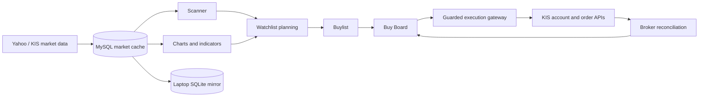

# System Overview

Quant App combines five operational areas:

1. research and scanning;
2. Watchlist and Buylist planning;
3. chart review and ORB plan selection;
4. account, position, and broker reconciliation;
5. a guarded Buy Board execution runtime.

## Implemented

- Daily/hourly/intraday cache and scanner workflows.
- TradingView Lightweight Charts with drawings, ORB markers, fundamentals,
  earnings, Leadership, and Market Context overlays.
- Cross-device planning and execution ownership controls.
- Buy Board runtime availability by default, with broker mutations still
  blocked by independent live-execution, ownership, readiness, and risk gates.
- Durable order/card/command state, conservative reconciliation, event journal,
  Health tab, and guarded KIS integration.
- Confirmed-breakout passive BUY limits and strict zero-fill, higher-score ORB
  cancel-then-replace generations.

## Optional

- Canonical MySQL market-data cache and laptop SQLite mirror.
- TLS-only coordination SQL store for independent-device control.
- KIS credentials, real-time market data, external alerting, and cloud backup.

## Disabled by default

- Live Trading administrative permission.
- Controlled/full-live broker mutation envelopes.
- KIS intraday mappings until the capability is verified.
